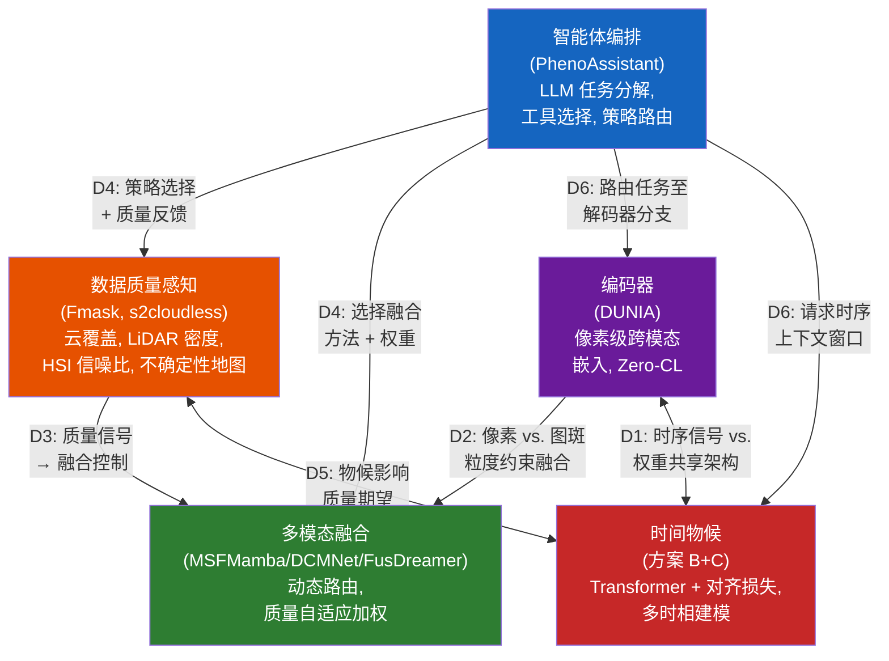

# AI 时代的遥感植被表型分析：方法、基准与森林迁移挑战

## 摘要

2023 至 2026 年间，AI 驱动的植被表型分析方法论在多个前沿方向取得了快速进展：像素级对比表示学习（contrastive representation learning）、动态多模态融合（dynamic multimodal fusion）、基于大语言模型（LLM）的智能体编排（agent orchestration）以及时间物候建模（temporal phenology modeling）。这些方法主要在农业和城市基准数据集上进行了验证——Houston2013、Trento、PASTIS、Auto-Arborist 以及个别街景行道树数据集。然而，它们在自然森林环境中的表现几乎未经检验。本综述对 2023–2026 年的方法论图景进行了分析性回顾，随后系统识别了五类将森林表型分析与农业表型分析区分开的物理障碍：(1) 多层冠层遮挡（multi-layer canopy occlusion），将单木检测 F1 压低至 0.45–0.72；(2) 混交林冠层复杂性，相较于纯林导致分类精度下降约 21%；(3) LiDAR 生物量在 300 Mg/ha 以上的饱和效应；(4) 坡度超过 30°时由地形引起的 5–12% 精度损失；(5) 跨站点泛化能力下降 20–40%。第六个障碍——极端长尾物种分布（long-tail species distributions），即前三种物种占据了 42% 的训练样本——进一步加剧了上述物理挑战。每个障碍均以来自近期林业、遥感和生态学文献的定量证据为基础。本文并非提出一个集成路线图，而是明确了现有方法在森林场景中能做什么和不能做什么，并勾勒了弥合差距所需的研究方向——其中首要任务是构建一个面向森林场景的多模态基准数据集。

---

## 1. 引言

全球森林每年固碳约 76 亿吨 CO₂，调节区域水文循环，并庇护着 80% 的陆地生物多样性 [1]。精确且可扩展的森林表型分析——即对树种组成、结构参数（树高、胸径、冠层覆盖度）和生理状态（叶面积指数、物候阶段、胁迫指标）进行定量刻画——是气候变化减缓、精准林业和生物多样性保护的基础。然而，当前业务范式严重依赖野外调查，其覆盖面积不足全球森林面积的 1%，且更新周期为 5–10 年 [2]。

遥感已部分弥补了这一差距。卫星星座（Sentinel-1/2、Landsat、PlanetScope）提供了 10–30 m 分辨率的全覆盖观测；机载激光扫描（airborne laser scanning, ALS）项目（如法国的 Lidar HD 计划）提供了超过 40 pts/m² 的点密度 [3]；搭载 RGB、多光谱、高光谱（hyperspectral imagery, HSI）和热红外传感器的无人机系统（UAV）则实现了厘米级单木树冠（individual tree crown, ITC）观测。挑战不再在于数据稀缺，而在于*数据整合*：如何将异质模态——每种具有不同的空间分辨率（0.05 m UAV 到 250 m MODIS）、光谱范围（可见光到短波红外）和时间节律（每日到每十年）——组合成一个连贯的表型分析管线。

一个关键进展出现在 2026 年 4 月，Chen 等人在《Nature Communications》上发表了 PhenoAssistant，展示了一个基于大语言模型的多智能体系统能够以 100% 的工具选择准确率编排计算机视觉工具、统计分析和自然语言解释，用于植物表型任务 [4]。PhenoAssistant 标志着基于智能体的编排进入了植物科学领域；然而，其评估——与本综述所评述的几乎所有方法一样——完全是在精心构建的农业和城市数据集上进行的。这些方法已经在这些领域内得到了验证；跨领域迁移到自然森林，甚至在不同森林类型之间（例如从纯人工林到混交天然林），尚未使用 2023–2026 年的 SOTA 方法进行过系统性检验。非森林基准上的方法论进展与森林领域验证的缺失之间的差距，界定了本综述的问题空间。

这一局限是更广泛碎片化的症候。若梳理 2023 至 2026 年的文献，可观察到先前工作的时序分析所称的"四条并行的河流"：

- **河流 A（基础模型, Foundation Models）**：CLIP (2021)、MAE (2022)、SAM (2023) 和 DINOv2 (2023) 持续提供了预训练范式——对比跨模态对齐、掩码重建和自监督视觉特征——下游遥感模型愈发依赖这些范式进行权重初始化和少样本迁移。
- **河流 B（遥感多模态融合, RS Multimodal Fusion）**：从 MSFMamba 的静态选择性状态空间融合（Houston2013 OA 92.86%, 2024）[5]，经 DCMNet 的数据驱动动态路由（Houston2013 OA 95.11%, Trento OA 98.96%, 2025）[6]，到 IFGNet 的基于 Kolmogorov-Arnold Network（KAN）的隐式频率聚合（Houston2013 OA 99.37%, 2026）[7]，融合策略已从设计者指定演进为数据依赖，近期更趋向函数化。
- **河流 C（对比表示学习, Contrastive Representation Learning）**：DUNIA 的像素级跨模态对比框架 [8] 实现了零样本树高估计 RMSE 2.0 m（r = 0.93），超越了监督学习的 SOTA 5.2 m [8]。TaxoNet 的双边界对比损失（dual-margin contrastive loss）解决了长尾植物分类问题，在 Google Auto-Arborist 上获得了 +5.1 pp 的宏召回增益 [9]。
- **河流 D（智能体编排, Agent Orchestration）**：PhenoAssistant (2026) 展示了 LLM 编排的多智能体工具链 [4]；SAGE (2026) 证明了免训练的、基于源知识库的推理将作物病害诊断精度平均提升 16.2 个百分点 [10]；LEMON (2026) 引入了反事实强化学习用于优化多智能体编排规范 [11]。

每条河流都产生了最先进的组件，但没有一条同时满足全部五项需求：(a) 像素级跨模态表示，(b) 数据质量自适应的动态融合，(c) 时间物候感知，(d) 长尾物种平衡，以及 (e) 基于智能体的编排。各组件各自已经成熟，但在架构上彼此孤立。

本综述通过系统性分析来填补这一空白。贡献有三：

1. **一份结构化的方法论综述**，涵盖对比表示学习、动态多模态融合、基于 LLM 的智能体编排、时间物候建模和数据质量感知——所有性能声明以原始论文中的定量比较为支撑。
2. **对六类森林特有的迁移障碍的系统性刻画**（多层遮挡、混交林退化、LiDAR 饱和、地形效应、跨站点泛化、长尾分布），每类障碍以来自林业、遥感和生态学文献的定量证据为基础。
3. **一组研究方向**，指出 AI 表型分析在自然森林环境中变得可行所需弥合的方法论差距，其中构建面向森林场景的多模态基准被确定为首要优先行动。

---

## 2. 背景：森林表型分析的任务与模态

### 2.1 核心任务

森林表型分析涵盖三类任务：(i) **树种识别**（species identification）——将分类标签（种或属级）分配给单木或均质林斑块；(ii) **结构参数提取**（structural parameter extraction）——估计树高、冠径、胸径（diameter at breast height, DBH）、冠层覆盖度和植物面积指数（plant area index, PAI）；以及 (iii) **物候监测**（phenological monitoring）——追踪季节转换（萌芽、展叶、峰值绿度、衰老、落叶）并检测由干旱、虫害暴发或病原入侵引起的异常。

自然森林中的树种识别尤其具有挑战性。PureForest 是最大的基于 ALS 的树种数据集，覆盖法国南部 339 km² 范围内的 18 个树种 [3]。PlantD（人工林）在全球尺度上覆盖 64 个种/属，但缺乏 LiDAR 覆盖 [12]。两者均表现出严重的类别不平衡：在 PureForest 中，橡木（Quercus spp.）和山毛榉（Fagus sylvatica）占主导地位，而稀有树种如板栗（Castanea sativa）的样本量低数个数量级。在 PlantD 中，油棕（21%）、火炬松（9%）和桉树（12%）三者合计占据了 42% 的样本。

结构参数提取从 ALS 中受益最大。DUNIA 的零样本检索使用 KNN=50 和仅 50K 标记像素的检索数据库，实现了树高 RMSE 2.0 m（r = 0.93）、冠层覆盖度 RMSE 11.7%（r = 0.89）和 PAI RMSE 0.71（r = 0.75）[8]。微调进一步将树高 RMSE 降至 1.3 m（r = 0.95）。这些数字与——且在零样本设置下超越了——专用监督方法如 FORMS（树高 RMSE 5.2 m）。

物候监测仍是三者中自动化程度最低的任务。现有物候数据集极为稀疏：DeepPhenoTree 提供了四个欧洲站点苹果树在三个物候阶段（开花、幼果、果实）的 RGB 图像 [13]；PASTIS 提供了法国地块级的作物类型标签，但非物候阶段标签 [14]；卫星衍生的物候产品（MCD12Q2、MODIS phenology）以 500 m 分辨率运行，远粗于森林表型分析所需的 ITC 尺度。

### 2.2 核心模态与互补性

五种遥感模态构成了森林表型分析的传感器组合，每种具有独特的物理原理和互补的信息内容：

**RGB / 甚高分辨率（Very High Resolution, VHR）光学影像**（0.05–0.5 m，来自 UAV 或机载平台）捕捉单木树冠的细粒度纹理和形态学特征。PureForest 的 ORTHO HR 影像（0.2 m, NIR-R-G-B 波段）通过冠形、分支模式和阴影几何支持视觉树种判别。然而，仅靠 RGB 是不够的：在 PureForest VHR 影像上训练的 ResNet-18 仅达到 73.1% OA，而带高程元数据的 LiDAR 达到 83.6% [3]。

**多光谱影像（Multispectral Imagery, MSI）**来自 Sentinel-2（10–20 m, 10 波段）和 Landsat（30 m），将光谱范围扩展到红边和短波红外区域，对植被健康评估至关重要。从 MSI 时间序列中导出的归一化植被指数（NDVI）、增强型植被指数（EVI）和归一化火烧比（NBR）是物候阶段检测的主力指标。PlantD 证明，在 Sentinel-2 时间堆栈上使用带 3D 图块嵌入的视频视觉 Transformer（Video Vision Transformer）可实现 64 类树种识别约 62% 的宏 F1 [12]。

**高光谱影像（Hyperspectral Imagery, HSI）**采集数百个连续窄光谱波段，能够区分具有细微光谱差异的树种。基于 HSI 的融合方法（DCMNet、DFFNet、IFGNet）一直是动态融合研究的主要试验床，Houston2013 和 Trento 数据集作为标准基准 [6], [7]。主要限制在于传感器可用性：星载 HSI（PRISMA、EnMAP、DESIS）提供 30 m 分辨率和 14–27 天重访周期，而机载 HSI 航测属于研究级数据，空间覆盖稀疏。

**LiDAR**（机载激光扫描、地基激光扫描，或星载如 GEDI）提供直接的三维结构测量。PureForest 中 ALS 点云（40 pts/m² 密度）可实现精确的树高、树冠勾画和垂直分层。GEDI 的全波形 LiDAR（约 25 m 足印间距，覆盖南北纬 51.6° 之间的全球范围）已成为跨模态表示学习的主要训练信号：DUNIA 的 Zero-CL 损失将 Sentinel-1/2 像素嵌入与 GEDI 波形对齐，将垂直结构信息编码到像素级表示中 [8]。根本限制在于时间稀疏性——GEDI 采用非重复轨道，对任意给定位置存在多年重访间隔。

**合成孔径雷达（Synthetic Aperture Radar, SAR）**来自 Sentinel-1（C 波段, 10 m）和 ALOS-2（L 波段, 30 m），提供全天候、昼夜成像能力。SAR 后向散射（VV、VH 极化）对冠层结构、地表粗糙度和介电特性（含水量）敏感。SAR 的穿透云层能力使其成为光学影像被遮挡时的首要备用模态——PlantD 的多源分类和 MSFMamba 的 HSI-SAR 融合实验（Berlin OA 76.92%, Augsburg OA 91.38%）均利用了此能力 [5]。

### 2.3 现有基准数据集

表 1 总结了三个最大的公开森林/人工林数据集。

| 数据集 | 规模 | 物种数 | 模态 | 时序 | 主要局限 |
|---------|-------|---------|------------|----------|----------------|
| PureForest [3] | 339 km², 135K 图斑 | 18（13 类别） | ALS (40 pts/m²) + VHR (0.2 m) | 单时相 | 无卫星数据，无时序 |
| PlantD [12] | 全球, 2.26M 样本 | 64 种/属 | S-1, S-2, L-7, ALOS-2, MODIS | 多年时序 | 无 LiDAR |
| CitrusFarm [15] | 1.3 TB, 7.5 km 遍历 | 3 个柑橘品种 | 9 种传感器 (RGB, NIR, 热红外, LiDAR, IMU, GNSS-RTK) | 单次遍历 | 无语义标签 |

浮现出三个关键数据空白：(1) 没有任何数据集在 ITC 分辨率上同时提供卫星时间序列、ALS 点云和实测树种标签；(2) PhenoCam 风格的多年时序标签（萌芽日期、落叶日期）在所有三个数据集中均缺失；(3) 生理实测数据（叶片叶绿素含量、水势、光合速率）未与遥感采集在空间上进行协同配准。

---

## 3. 植被表型分析方法的系统综述

我们沿五个分析维度组织 2023–2026 年的方法论图景。对每个维度，我们编目候选架构选择，在定量基准上进行比较，并识别与森林迁移能力最相关的验证空白。

### 3.1 编码器设计

编码器（encoder）将原始多模态传感器数据（多光谱像素、SAR 后向散射、LiDAR 点云或波形）转换到统一的表示空间。对森林表型分析而言，编码器需同时满足多项要求：像素级空间粒度（用于 ITC 级分析）、跨模态对齐（至少 MSI + SAR + LiDAR）、零样本或少样本能力（森林实测数据稀缺），以及——在理想情况下——时间物候感知。

#### 3.1.1 候选方法

DUNIA 论文 [8] 在统一的实验设置下评估了七种编码器范式（在 836K Sentinel-1/2 图斑 + 19M GEDI 波形上预训练, 250K 步, 相同的下游任务）。表 2 呈现了与森林相关的下游任务的关键定量比较。

| 维度 | DUNIA [8] | AnySat [16] | CROMA [17] | SatMAE [18] | DOFA [19] | Scale-MAE [20] | DeCUR [21] |
|-----------|-----------|-------------|------------|-------------|-----------|---------------|------------|
| 发表渠道 | arXiv 2025 | CVPR 2025 | NeurIPS 2023 | NeurIPS 2022 | arXiv 2024 | ICCV 2023 | AAAI 2024 |
| 预训练 | 对比 + 重建 | 多模态融合 | 对比 + MAE | 掩码重建 | MAE + 动态权重 | MAE + 尺度嵌入 | 对比（解耦） |
| 模态 | S-1+S-2+GEDI | S-1+S-2+VHR+时序 | S-1+S-2 | S-2 | 任意光学 | 多分辨率光学 | S-1+S-2 |
| 粒度 | 像素级 (10 m) | 图斑级 | 图斑级 (8×8) | 图斑级 (8×8) | 图斑级 | 图斑级 | 图斑级 |
| 微调树高 (RMSE) | **1.3 m** (r=0.95) | 2.8 m (r=0.89) | 3.5 m (r=0.78) | 10.5 m (r=0.52) | 11.0 m (r=0.51) | — | 11.0 m (r=0.55) |
| 微调树种 (wF1, PF) | 82.2 | **82.3** | 80.5 | 78.8 | 79.8 | — | 78.9 |
| 20% 标签 树高 (RMSE) | **1.4 m** (r=0.93) | 2.8 m (r=0.89) | 3.6 m (r=0.76) | 10.5 m (r=0.52) | 11.2 m (r=0.50) | — | 11.1 m (r=0.52) |
| 时序支持 | 单景中值合成 | 原生多时序 | 静态 | 时序掩码 | 静态 | 多尺度空间 | 静态 |
| 推理 (20 km²) | **4.22 s** | 177 s | — | — | — | — | — |
| 开源 | 是 | 是 | 是 | 是 | 是 | 是 | 是 |

DUNIA 的零样本性能对地面测量有限的森林场景尤为重要。使用 KNN=50 和 50K 标记像素的检索数据库（约 31 km²，约为监督方法所需数据的 0.25%），DUNIA 实现了：树高 RMSE 2.0 m（r = 0.93）vs. 监督 SOTA FORMS 的 5.2 m（r = 0.77）；冠层覆盖度 RMSE 11.7%（r = 0.89）vs. FORMS 的 22.1%（r = 0.54）；PAI RMSE 0.71（r = 0.75）vs. FORMS 的 1.5（r = 0.35）；以及树种 wF1 76.0%（KNN=5）vs. 监督 SOTA 的 74.6% [8]。

#### 3.1.2 比较观察

DUNIA 在树高 RMSE 上取得最低值（微调 1.3 m，零样本 2.0 m），且在 20 km² 上推理仅需 4.22 s——是本比较中唯一的像素级编码器。AnySat 在 PureForest 上取得最高物种分类精度（wF1 82.3），但为图斑级且推理速度慢 40 倍。其他方法的树高 RMSE 显著更高（≥3.5 m），均为图斑级。单个编码器能否同时实现像素级跨模态对齐和时间物候感知，仍是森林应用的核心开放问题。

#### 3.1.3 已识别的空白：时间物候

DUNIA 最显著的局限是依赖单片展叶季中值合成图像作为输入。在 PASTIS 上，这导致零样本与监督 SOTA 之间有 28 pp 的差距（OA 56.2% vs. 84.2%），以及与 AnySat 多时序输入之间 24.9 pp 的差距（81.1%）。对于落叶林物候分析，展叶/落叶光谱对比是首要判别特征，这一局限是结构性的而非偶然的。DUNIA 的多时序自编码器（UNet + ConvLSTM, 3 个时间步）是一个辅助重建模块——而非物候敏感的表示学习器——且其时序平均池化丢弃了区分早展叶橡木和晚展叶白蜡树所必需的排序信息。

---

### 3.2 多模态融合策略

给定来自多模态（HSI、LiDAR、SAR、MSI）的编码特征，融合模块将它们组合成联合表示，用于下游分类或回归。核心设计问题是：*融合策略最好是设计为静态的（设计时固定）、数据驱动的（从特征统计中学习），还是上下文依赖的（由外部信号如数据质量、物候阶段或任务规范决定）？*

#### 3.2.1 候选方法

表 3 在定量基准上比较了五种领先的融合范式。所有数字来自原始论文；"*"表示少样本设置（约 20 样本/类）；其余结果为全监督（约 150–200 样本/类）。注意 IFGNet 未在 Trento 上评估；FusDreamer 在少样本设置下评估。

| 方法 | 年份 | 核心机制 | Houston2013 OA | Houston2013 Kappa | Trento OA | 参数量 | 推理时间 |
|--------|------|---------------|----------------|-------------------|-----------|--------|-----------|
| **MSFMamba** [5] | 2024 | 选择性 SSM + 双输入交叉参数化 | 92.86 | 92.25 | — | 1.53M | 0.175 s |
| **DCMNet** [6] | 2025 | 3 层动态路由 + 双线性注意力 | 95.11 | 94.69 | **98.96** | 3.83M | 0.010 s |
| **DFFNet** [22] | 2025 | 动态频域滤波核 + 通道混洗 | 92.35 | 91.70 | — | 1.28M | 0.239 s |
| **FusDreamer** [23] | 2025 | 潜在扩散 + CLIP 引导提示对齐 | 89.24* | 90.15* | 96.36* | 大 | 16–67 s |
| **IFGNet** [7] | 2026 | KAN B 样条隐式空间-频率聚合 | **99.37** | **99.32** | — | 轻量 | 快速 |

*注：推理时间如原论文所述，因硬件（GPU 型号、批大小）和软件实现（框架、优化级别）差异可能不直接可比。将其作为部署可行性评估的数量级参考而非精确基准比较。*

**MSFMamba (2024)** 将选择性状态空间模型（Mamba）引入多模态融合，通过跨模态 SSM 参数化（Fus-Mamba）实现线性 O(n) 复杂度。在 Houston2018 上 OA 92.38%；Augsburg (HSI+SAR) 91.38% [6]。

**DCMNet (2025)** 标志着从静态融合到动态融合的转型，使用三层路由空间（BSAB、BCAB、ICB 模块），由路由门从特征统计中生成路径概率。Trento OA 达到 98.96%，Kappa 98.61% [6]。

**DFFNet (2025)** 和 **IFGNet (2026)** 构成频域融合家族。DFFNet 应用 2D FFT 与动态频率核生成（GAP+MLP+Softmax），在 1.28M 参数下达到 Houston2013 OA 92.35% [22]。IFGNet 通过 KAN B 样条隐式频率聚合进一步扩展，达到 OA 99.37%（Kappa 99.32%），但代码未开源 [7]。

**FusDreamer (2025)** 引入潜在扩散（LaMG）与 CLIP 引导提示对齐，实现文本提示驱动的融合——是唯一在少样本设置下测试的方法（13–18 样本/类, Trento OA 96.36%）。文本提示接口适用于智能体控制 [23]。

#### 3.2.2 比较观察

五种融合范式呈现出清晰的精度递进：MSFMamba (OA 92.86%) → DFFNet (92.35%) → DCMNet (95.11%) → IFGNet (99.37%)，而 FusDreamer 在少样本条件（96.36%）下占据独特位置。所有五种方法均在城市 HSI-LiDAR 基准（Houston2013、Trento）上评估；无一在具有重叠冠层、混交林或地形起伏超过 20° 的森林场景中测试。一个共有的空白是缺乏外部质量信号注入：融合决策完全由内部特征统计驱动，而非由云量或 LiDAR 点密度等采集条件驱动（第 3.5 节）。

#### 3.2.3 已识别的空白：外部质量信号注入

所有五种方法的融合决策均基于内部特征统计（DCMNet 的门控输入为 F_h + F_l + X；DFFNet 的核使用输入特征的 GAP；MSFMamba 的 SSM 参数从配对模态的特征生成）。没有一个方法接收关于采集条件的外部质量信号——云量、LiDAR 密度、SAR 相干性或噪声水平。这一空白是结构性的：并非个别方法的失败，而是质量评估层与融合层之间缺少接口。

---

### 3.3 智能体编排

智能体编排器（agent orchestrator）接收用户对表型分析任务的自然语言描述，将其分解为可执行的子任务，选择合适的视觉模型和分析工具，监控执行过程，并聚合结果。核心设计张力在于*可靠性*（保证正确的工具选择和执行）与*适应性*（处理开放式、前所未见任务规范的能力）之间。

#### 3.3.1 候选方法

在植物/林业领域已展示了三种智能体范式，其中两种具有定量评估结果：

**PhenoAssistant (2026)** [4] 采用集中式多智能体架构：管理智能体（Manager Agent, GPT-4o, temperature = 0.1）接收自然语言指令，生成分步计划，并将任务分发给包含视觉模型库（Mask2Former、仅叶片 SAM、带 LoRA 微调的 DINOv2-base）、表型提取工具、代码编写器、数据可视化器、图表分析器（基于 Pandas AI）、表格分析器、RAG 智能体以及确定性统计模块（ANOVA、Tukey-Kramer 事后检验）的工具箱。工具通过结构化模式（名称、描述、参数、I/O 格式）暴露，基于 AutoGen 框架构建。在 20 个手动设计的任务上评估得：工具链合理性 4.25/5（带批评智能体 4.35/5），工具存在性 5.00/5，工具适当性 4.65/5（带批评智能体 4.90/5），参数正确性 4.30/5（带批评智能体 4.40/5）。视觉模型类型推荐达到 100% 准确率（50/50 任务）；视觉模型精确匹配达到 100% 准确率（20/20 任务）。数据分析任务达到 85% 准确率（17/20）；所有三个失败归因于图表分析器的细粒度视觉推理——LLM 误读了图表元素，表明基于 LLM 的视觉推理仍是主要瓶颈 [4]。

**SAGE (2026)** [10] 采用免训练的智能体推理管线用于作物病害诊断：器官识别 → 解剖索引过滤 → 基于知识库（KB）的症状匹配 → 带有限预算 k 的序列参考图像比较 → 带完整推理轨迹的预测。完整管线（KB + k=8 参考图像）将诊断准确率平均提升 16.2 个百分点 [10]。

**LEMON (2026)** [11] 引入了反事实强化学习用于优化多智能体编排规范——这是一条潜在路径，可以在多变的数据质量下学习智能体策略，而非硬编码编排规则。

#### 3.3.2 比较观察

PhenoAssistant 的 100% 工具选择准确率和 SAGE 的 +16.2 pp 诊断提升表明，当感知任务委托给专用视觉模型时，LLM 可以可靠地编排科学工具链。PhenoAssistant 的失败分析显示所有错误源于细粒度 LLM 视觉推理，而工具选择完美无瑕——表明 LLM 的角色最好限定于编排而非感知。SAGE 的解剖索引过滤模式在概念上可迁移至林业：一个按物候、地理和分类索引的知识库可以在调用视觉分类器之前缩小候选物种范围。所有三种智能体范式均在农业或通用基准上验证；无一在森林表型分析任务上验证。

#### 3.3.3 已识别的空白：从工具编排到融合策略编排

PhenoAssistant 编排的是*哪个工具*处理*哪个子任务*，但不调整多模态数据*如何*被融合。管理智能体选择 Mask2Former 进行分割、DINOv2 进行分类，但不能指示融合模块在检测到云覆盖时加权 LiDAR 而非 HSI，或在分析物候转换时调用频域滤波。这一空白源于架构：管理智能体没有与融合模块决策层的接口，融合模块也没有暴露接受外部控制信号的参数。

---

### 3.4 时间物候建模

森林物候——生物事件的季节性循环（萌芽、展叶、光合活动峰值、衰老、落叶）——为温带和寒带森林的树种判别提供了信息量最丰富的时间信号。在夏季高峰期光谱几乎相同的落叶树种（如 Quercus robur vs. Quercus petraea）表现出截然不同的时间轨迹：萌芽日期（通常 1–3 周差异）、展叶速率和衰老起始时间的差异在具备时间上下文时形成可分离的签名。

#### 3.4.1 为何时间建模至关重要

时间信息对树种判别具有决定性作用。AnySat 利用原生多时序输入实现 PASTIS 分类 wF1 81.1，而 DUNIA——仅使用单片中值合成——在零样本下仅达到 56.2% [8]。"绿色荒漠"现象（光谱恢复的冠层掩盖结构退化）只能通过时间分析检测 [24]。Gauli 等人证明在复杂森林地形中进行时间机器学习是可行的，跨生态区 R² = 0.683–0.757 [25]。

#### 3.4.2 候选方法

文献中已探索了三种时间编码策略：

**方案 A：输入级多时序拼接。**多景 Sentinel-2 图像沿通道维度拼接，形成 [B, T×C, H, W] 张量送入标准空间编码器。这是 AnySat [16] 采用的方法。优点：架构改动最小，重用现有编码器权重。局限：模型对时间顺序不敏感（打乱图像日期产生几乎相同的表示）；没有时间距离概念；没有显式位置编码。

**方案 B：编码器内部时序 Transformer。**每个时间步由共享权重的空间编码器独立编码，生成每步图斑嵌入 z_t。添加一年中的日序（Day-of-Year, DOY）正弦位置编码：PE(DOY, 2i) = sin(DOY/365 × 10000^{2i/d}), PE(DOY, 2i+1) = cos(DOY/365 × 10000^{2i/d})。在时间维度上应用多头自注意力：Attention(Q, K, V) = softmax(QK^T/√d_k + M)V，其中 M 为时间掩码。TSP-Former (2025) 展示了这一方法用于烟草制图 [26]；一项 2026 年的工作应用了 3D 图块嵌入与时序位置编码进行全周期植被物候分析 [27]。

**方案 C：后置时间对齐损失。**编码器保持不变；时间信息仅通过辅助损失函数注入。三个组成部分构成损失：(i) 平滑损失 L_smooth = Σ_t ||e_t − e_{t+1}||² · exp(−α·|DOY_t − DOY_{t+1}|)；(ii) 周期损失 L_cyclic = ||e_1 − e_T||² · exp(−α·(365 − |DOY_T − DOY_1|))；(iii) 身份损失 L_identity = Σ_t ||e_t − mean(e)||²。几何解释为嵌入空间中的"物候管"：每个冠层的季节轨迹被约束在其身份中心周围半径 τ 的管内，同时不同物种的管保持分离。

表 4 在关键设计维度上比较三种方案。

| 维度 | 方案 A：输入拼接 | 方案 B：时序 Transformer | 方案 C：时间对齐损失 |
|-----------|----------------------|-------------------------------|----------------------------------|
| 编码器修改 | 无（仅输入） | 大（新增时间模块） | 无（仅损失） |
| 时间依赖建模 | 隐式（CNN 局部） | 显式（全局注意力） | 无（仅损失级） |
| 变长序列 | 否 | 是 | 是 |
| 计算开销 | ~1×（基线） | ~1.5–4×（取决于 T） | ~1× |
| 时序感知 | 否 | 是（DOY PE） | 部分（通过损失） |
| 与 DUNIA Zero-CL 的兼容性 | 是 | 是（需适配） | 是（并行使用） |

#### 3.4.3 比较观察

输入级拼接（方案 A）最简单但不提供时间顺序感知。时序 Transformer（方案 B）提供显式 DOY 编码和全局时间注意力，但需要架构修改。后置对齐损失（方案 C）作为正则化器使用，但不能补偿单景预训练。尚无现有方法同时提供像素级跨模态对齐和时间物候感知。

#### 3.4.4 已识别的空白：没有方法同时做到跨模态像素对齐和时间物候

DUNIA 实现了像素级跨模态对齐但时序上是静态的；AnySat 是多时序的但是图斑级的。没有任何方法同时提供像素级跨模态嵌入、时间物候感知和零样本参数估计。弥合这一空白需要在保留 Zero-CL 和双解码器架构的同时，用时序 Transformer 扩展 DUNIA。

---

### 3.5 数据质量感知

遥感数据质量本质上是可变且不可预测的。在热带和温带地区，云覆盖可使 30–70% 的光学像素不可用；LiDAR 点密度随飞行参数、地形和冠层郁闭度变化；SAR 相干性在水体和地表快速变化区域退化；HSI 推扫式传感器可能出现条纹伪影。部署在精心构建的基准数据集之外的森林表型分析系统，需要对输入质量进行推理并相应地调整其融合策略。

#### 3.5.1 已有的：成熟的质量评估组件

数据质量评估的单个构建模块已达到生产就绪水平：云和云阴影检测（Fmask [28] 在 85–90% F1, s2cloudless 在 88–92%, 基于 DeepLabV3+ 的方法在 92–96%, 时空方法在 94–97%）；LiDAR 质量指标（点密度、回波次数分布、扫描角、地面点比例）在 LAS/LAZ 元数据中标准化，GEDI 提供逐足印质量标志；HSI 噪声估计（HSI-SDeCNN 用于去条纹, HyMiNoR 用于混合高斯+条纹+脉冲噪声）；以及通过 UnCRtainTS [29] 进行的不确定性量化，生成可作为质量输入的逐像素不确定性地图。关键发现是现有论文均未将数据质量评估连接到自适应融合策略选择——这是文献空白，非组件可用性空白。

#### 3.5.2 已有的：缺失模态和质量自适应训练

缺失模态（Missing Modality, MM）社区提供了最近的技术先例：ActionMAE 通过随机丢弃 + MAE 重建展示了缺失模态的鲁棒性 [30]，而 M3L 使用教师-学生 KL 蒸馏从部分输入逼近全模态性能 [31]。这些技术可直接映射到质量自适应融合——云遮挡 ≡ 模态丢弃，低 LiDAR 密度 ≡ 模态噪声——其中质量自适应丢弃策略 `drop_prob = 1.0 - quality_score` 是一个直接扩展，但尚未在遥感融合中验证。Provable Dynamic Fusion（Zhang et al., 2023, ICML）和 Predictive Dynamic Fusion (2024) 为质量加权融合提供了理论基础，但隐式地学习质量权重而非从显式质量评估中获取 [32], [33]。

#### 3.5.3 已识别的空白：质量→融合映射接口

核心未解决的设计问题是：*给定质量向量 q = [cloud_pct, lidar_density, hsi_snr, sar_coherence, phenology_stage]，什么融合策略是适当的？* 此映射既无经验刻画也无理论指导。具体子空白包括：

- **GAP-1（质量到策略映射）**：没有消融研究刻画融合策略选择如何与数据质量水平交互——在什么云覆盖阈值下，从 HSI 主导切换到 LiDAR 主导的融合变得有利？
- **GAP-2（多维度质量融合）**：云覆盖、LiDAR 密度、HSI 噪声、SAR 相干性和物候阶段是不可通约的质量维度。如何将其融合为统一的信号？
- **GAP-3（质量感知训练数据）**：带有受控质量退化的训练数据稀缺。合成增强（模拟云遮挡、LiDAR 子采样、HSI 波段噪声）是务实路径，但对真实采集伪影的保真度需要验证。

---

## 4. 森林迁移差距

第 3 节分析的五个设计维度几乎完全在农业和城市基准上验证。将这些方法迁移至自然森林环境会引入当前基准无法捕捉的物理挑战。本节分析由森林环境需求所衍生的六个跨维度依赖关系。

### 4.1 森林环境所要求的、但当前基准未测试的内容

图 1 展示了五个设计维度及其六个跨维度依赖关系。

**依赖关系摘要：**
| ID | 关系 | 类型 | 关键含义 |
|----|-------------|------|-----------------|
| D1 | 编码器 ↔ 时序物候 | 双向 | 时序策略约束编码器架构（孪生权重共享） |
| D2 | 编码器 → 融合 | 单向 | 像素级嵌入实现空间精确的融合决策 |
| D3 | 质量 → 融合 | 单向 | 质量评估驱动融合控制——任何系统尚未建立此连接 |
| D4 | 智能体 ↔ 质量 + 融合 | 双向 | 智能体将质量评估与策略选择整合；形成中央控制循环 |
| D5 | 时序 ↔ 质量 | 双向 | 物候阶段影响质量解读（展叶 vs. 落叶期数据可靠性） |
| D6 | 智能体 → 编码器 + 时序 | 单向 | 任务规范决定哪些解码器输出和时间步是相关的 |

**D-1：编码器 ↔ 时间物候（双向）。**编码器决定了什么时间信息是可访问的。单景编码器（DUNIA 当前版本）无论时间建模层多么复杂，都不向下游模块提供时间信号。反之，时间建模策略反馈到编码器设计：如果采用方案 B（时序 Transformer），空间编码器以跨时间步共享权重的孪生模式运行，解码器在跨模态对齐中保持时间一致性（Zero-CL 与 GEDI 波形在每个时间步独立应用，带有时间平滑约束）。

**D-2：编码器 → 融合（单向）。**编码器的输出粒度（像素 vs. 图斑）和嵌入质量（跨模态对齐强度）约束了哪些融合策略是可行的。像素级嵌入（DUNIA）实现空间精确的融合，其中每个 10 m 像素独立参与融合决策。图斑级嵌入（AnySat、CROMA）将融合约束在聚合的空间单元上操作，丢失了图斑内异质性。编码器的跨模态对齐质量（DUNIA Zero-CL 的余弦相似度 0.86 vs. VICReg 的 0.56）决定了下游融合中跨模态注意力机制的可靠性。

**D-3：质量感知 → 融合（单向）。**这是核心的未满足依赖。质量评估输出（云掩膜、LiDAR 密度、HSI 信噪比、不确定性地图）被转换为融合控制信号。具体的注入点取决于融合架构：对于 DCMNet，质量信号添加到路由门输入；对于 MSFMamba，质量信号贡献于 Fus-SSM 中的 B/C/Δ 参数生成；对于 FusDreamer，质量信号编码到文本提示中。注入架构的选择产生一个依赖：选择融合方法约束了质量信号如何被集成。

**D-4：智能体编排 → 质量感知 + 融合（双向）。**智能体是集成质量评估与策略选择的天然位置。智能体可以接收结构化的质量报告（cloud_pct=67, lidar_density=1.2e6, hsi_snr=23.4, phenology_stage="展叶"），对其含义进行推理（"云覆盖 67% 超过 30% 阈值；优先使用 LiDAR 结构特征；展叶阶段的落叶林受益于光谱区分"），并输出融合策略规范。然而，智能体不能绕过 D-3 中识别的质量→融合接口——只有当该接口存在时才能控制它。

**D-5：时间物候 ↔ 质量感知（双向）。**物候阶段影响质量期望：落叶林中无叶期 LiDAR 具有更高的地面点密度和更可靠的地形模型；有叶期光学影像具有更高的物种判别光谱信息含量。反之，质量退化影响物候信号可靠性：5 月一个 80% 云覆盖的时间步可能给出误导性的"低绿度"信号，可能被误解为延迟展叶而非数据质量伪影。

**D-6：智能体编排 → 编码器 + 时间物候（单向）。**智能体的任务规范决定了哪些编码器输出是相关的。"绘制冠层高度图"任务需要垂直结构嵌入（DUNIA 的 OV 解码器输出）；"分类树种"任务需要带有时间上下文的水平嵌入（OH 解码器输出）；"检测干旱胁迫"任务需要两者加上异常检测能力。如果智能体编排融合策略，它也需要适当地路由编码器输出——选择哪个解码器分支、哪些时间步、哪些嵌入维度传递到下游模块。

### 4.2 森林特有的迁移障碍

上述依赖关系是结构性的——无论目标领域是玉米地还是热带森林，它们都存在。然而，自然森林施加了六种农业和城市基准无法捕获的物理约束，每一种都直接对 D1–D6 依赖关系中的一个或多个施加压力。

#### 4.2.1 多层冠层遮挡

在农业环境中，作物冠层近似平面——个体植物在空间上分开，高度均匀，按已知密度种植。在单作作物（玉米、棉花、小麦）上训练的模型通常取得超过 0.90 的 ITC 检测 F1，因为检测问题在几何上是良态的：植株不垂直重叠，行间距提供强先验，下层植被被除草剂或机械管理抑制。相比之下，在自然森林中，冠层垂直分层为上层、中层和下层，没有种植网格且树冠连续交叠。俯视遥感主要看到上层冠层；中层和下层树木被遮挡。农业 F1 > 0.90 与森林 F1 0.45–0.72 之间的差距不仅仅是程度问题——它反映了一种性质上不同的检测几何，农业基准无法探测。

定量而言，Beloiu 等人 (2023) 报告在异质温带森林中使用航空 RGB 进行单木树冠检测的 F1 范围为 0.45 至 0.72，在被压制的亚冠层树木上性能最低 [35]。Silwal 等人 (2024) 通过 DIRSIG 辐射传输模拟混合 Harvard Forest 场景，发现即使在最优 1 m 分辨率条件下，1D-CNN 仅能识别 24 个属级类别中的 16 个，而在 30 m 分辨率下降至 24 个中的 7 个（OA 54.09%）[36]。Sivanandam 等人 (2022) 报告在密集、重叠的桉树冠层中树木检测 mAP 降至约 0.50，而开阔区域为 0.65+，不同物种经常被合并为单一段落 [37]。SegmentAnyTree (2024) 是唯一显式评估跨冠层层次性能的 ITCD 模型，但在地基和移动激光扫描数据（TLS/MLS/ULS）上展示——而非在俯视 ALS 或 UAV 影像 [38]。Zhao 等人 (2023) 对基于 CNN 的 ITCD 的系统综述将多层检测确定为一个关键的未解决空白 [39]。

对设计维度的含义是直接的：**D2（编码器 → 融合）**——图斑级编码器丢失了图斑内垂直异质性；**D3（质量 → 融合）**——没有现有质量信号编码遮挡深度；**D1（编码器 ↔ 时序）**——无叶期采集可穿透落叶冠层，但当前编码器缺乏季节性感知。

#### 4.2.2 混交林 vs. 纯林退化

农业表型分析压倒性地在单作地块上操作。混交林中的森林物种识别本质上更困难。Lee 等人 (2023) 提供了最直接的比较：在相同的 CNN 架构上使用双季无人机 RGB+LiDAR 数据训练，单物种分类 F1 达到 0.95，而包含两个或以上混交物种的标签降至 F1 = 0.75——退化幅度为 21% [40]。Marinelli 等人 (2022) 在意大利阿尔卑斯山使用 ALS 点云衍生特征（高度百分位数、强度统计）和 DNN 评估了 7 物种混交林分类：当在均质纯针叶林或纯阔叶林子集上训练时，OA 分别达到 82.54% 和 86.64%，但在全 7 类混交设置中，阔叶树种如 Ostrya carpinifolia 的 F1 降至 64.52% [41]。方法论对比具有启发性：Lee 的方法表明即使使用最优多模态输入（厘米级分辨率的无人机 RGB + LiDAR），混交林退化仍持续在约 21%；Marinelli 的方法显示单模态（仅 LiDAR）分类从根本上受限于冠层重叠将单木有效点密度降低到标称传感器规格以下。一项 2021 年对基于 LiDAR 的树种分类综述报告，在 2–5 pts/m² 时 OA ≈ 50%，而 >50 pts/m² 才能实现 OA ≈ 70% [41]。在混交林中，这些阈值更难满足，因为冠间重叠将点预算分配到多棵树上。该模式跨地理区域一致：Quan 等人 (2023) 报告在中国东北天然次生林中，使用无人机 LiDAR + 高光谱数据的 11 物种分类 OA 为 75.7%，最稀有物种的逐类精度降至 60.0% [49]。Zhong 等人 (2022) 在帽儿山混交针阔叶林中 9 个物种达到 OA 84.62–89.20%，但仅当融合无人机 HSI + LiDAR 时；单模态基线降至 76.42% [50]。单模态与多模态融合之间的 10–20 pp 差距直接说明了 D-2 的重要性——当 LiDAR 点密度因冠间重叠而降低时，融合 HSI 提供的光谱信息成为不可协商的要求。

该障碍主要对 **D2（编码器 → 融合）**施加压力：在纯林中可分离的光谱和结构特征在混交冠层中变得纠缠，要求融合策略能够解析亚冠异质性。

#### 4.2.3 LiDAR 在 300 Mg/ha 以上的生物量饱和

从 ALS 估计地上生物量（above-ground biomass, AGB）存在一个充分记录的饱和上限。Tian 等人 (2023) 在其对森林 AGB 估计的全面综述中报告，ALS 衍生指标在约 300–500 Mg/ha 处饱和，之后额外的生物量不再产生 LiDAR 高度或密度指标的可测量变化 [42]。异速生长链——高度 → DBH（通过物种特定的 H-D 异速方程, R² = 0.70–0.85）→ 树干材积（削度方程）→ AGB（木材密度 × 生物量扩展因子）——在每一步积累误差，异速方程失配贡献 10–30% 的相对 RMSE [42]。在全球尺度上，GEDI L4A 产品在足印级别达到 R² = 0.55–0.70，rRMSE 为 40–80% [43]。

一个开放问题是 DUNIA 的跨模态嵌入是否受到相同饱和的影响。DUNIA 在 PureForest 上实现了零样本树高 RMSE 2.0 m（r = 0.93），PureForest 包含法国南部成熟的橡木-山毛榉林分，其中未受干扰参照样地的地上生物量范围为 250–400 Mg/ha [3]。因为 DUNIA 同时编码光谱信息（Sentinel-1/2，捕捉冠层化学和纹理——这些在结构饱和后持续变化）和结构信息（GEDI 波形），它可能部分绕过纯 LiDAR 饱和。然而，DUNIA 高度预测的逐生物量 bin 精度未被报告；RMSE 2.0 m 可能掩盖了 300+ Mg/ha 范围内更高的误差。这仍是一个值得在具有协同配准的野外生物量测量的森林基准上评估的实证问题。

该障碍主要对 **D2（编码器 → 融合）**和 **D3（质量 → 融合）**施加压力：平等加权各模态的融合策略无法补偿约 300 Mg/ha 以上时结构（LiDAR）信息饱和而光谱（光学、SAR）信息仍可能携带区分信号的事实。

#### 4.2.4 地形效应

位于山区的森林——占全球森林覆盖的很大比例——引入了平坦农业基准中不存在的地形畸变。You 等人 (2020) 证明在坡度超过 30° 时树种分类 OA 下降 5–12%，北坡与南坡的朝向差异因各向异性光照产生 OA 差距 8–15% [44]。地形阴影降低物种可分性，陡峭地形（>40°）引入 LiDAR 点云配准误差。SCS+C 地形校正方法代表了当前最佳折中，但残余辐射畸变依然存在 [44]。这些效应跨传感器类型复合：光学传感器遭受阴影造成的辐射畸变；LiDAR 在陡坡上表现出不均匀地面点采样和波束发散；SAR 引入几何叠掩和透视收缩伪影，降低与光学和 LiDAR 模态的共配准精度。与季节性太阳角的互动尤为成问题——冬季低太阳角将地形阴影放大 2–3 倍于夏季，人为压低植被指数并产生假阴性物候信号，可能被误认为是延迟展叶或早期衰老。

该障碍对 **D1（编码器 ↔ 时序）**和 **D5（时序 ↔ 质量）**施加压力：地形效应具有季节性（冬季低太阳角更强）且与物候阶段互动，但当前没有编码器考虑地形-物候耦合。

#### 4.2.5 跨站点和跨季节泛化

最具系统性测量的障碍是跨站点泛化退化。多项研究一致报告，当模型迁移到保留的地理站点或季节时，F1 或 OA 下降 20–40%：

| 研究 | 任务 | 退化幅度 | 来源 |
|-------|------|------------|--------|
| Beloiu et al. (2023) | ITC 检测 + 树种 ID, 3 个站点 | F1 0.72 → 0.45 (−37%) | [35] |
| TreeSatAI (Ahlswede et al., 2023) | 多传感器树种分类, 德国 3 个州 | OA 85% → 61% (−28%) | [45] |
| TaxoNet (2025) | 细粒度树种分类, 5 个气候区 | Top-1 91.2% → 67.8% (−23.4%) | [9] |
| Kattenborn et al. (2022) | CNN 空间自相关膨胀 | OA 膨胀 15–30% | [46] |
| DeepForest 社区 | 真实场景 vs. 报告精度 | 差距 15–30 pp | [47] |

Kattenborn 等人 (2022) 还证明，标准随机训练/测试分割中的空间自相关将 CNN 准确率膨胀 15–30%，意味着许多已发表的森林分类结果可能高估了真实泛化能力 [46]。这种膨胀对森林评估尤其隐蔽，因为相邻森林样地共享物种组成、土壤条件、微气候和管理历史——使得随机像素级分割即使在像素来自不同图像时也是一个严重有偏的估计量。分块空间交叉验证（blocked spatial cross-validation），即留出整个林分或地理分块，始终揭示了显著低于随机分割的准确率。对于 PureForest，报告的 83.6% OA（LiDAR + 高程）是在分层地理分割下获得的，该分割部分缓解了自相关，但 Kattenborn 报告的 15–30 pp 范围表明，即使是"空间感知"的分割也可能未充分解释连续森林景观的相关结构。来自 DeepForest 用户的社区反馈证实，真实森林部署精度比报告的基准数字低 15–30 个百分点 [47]，与自相关膨胀的幅度一致。对评估的含义是：森林基准设计需要林分或流域级别的分块空间验证，而没有明确空间验证协议的已报告精度数字最好被解读为上限而非预期部署数据。

该障碍同时对全部六个依赖施加压力：在一个区域预训练的编码器可能产生对另一区域未对齐的嵌入（D1, D2）；质量信号在跨站点间的分布不同（D3, D5）；依赖区域特定生态知识的智能体推理链可能无法迁移（D4, D6）。

#### 4.2.6 长尾物种分布

森林树种表现出极端的、与农业数据集中中等类别不平衡性质不同的长尾分布。在 PlantD 中，前 3 个物种——油棕（21%）、火炬松（9%）和桉树（12%）——占据了所有样本的 42% [12]。在 PureForest 中，橡木（Quercus spp.）和山毛榉（Fagus sylvatica）占主导，而稀有树种如板栗（Castanea sativa）的样本量低数个数量级 [3]。这种偏斜有具体后果：在 PureForest 上的标准 OA 报告（LiDAR + 高程为 83.6%）掩盖了稀有树种低于 30% 的逐类 F1。

长尾问题在计算机视觉中得到广泛研究（TaxoNet、EKDC-Net、focal loss、LDAM），但这些方法主要在单模态 RGB 数据集（Auto-Arborist、iNaturalist）上评估。没有任何方法同时解决 (a) 多模态融合、(b) 长尾再平衡和 (c) 像素级跨模态对齐——这三项均为使用 LiDAR + 光学 + SAR 输入的森林树种分类所需。

该障碍主要对 **D1（编码器 ↔ 时序）**和 **D6（智能体 → 编码器）**施加压力：稀有物种物候是采样最少的，需要从头部类别时间轨迹中泛化的编码器，以及显式为欠采样分类单元分配计算预算的智能体。

### 4.3 为何这些障碍会复合

六个障碍并非独立。多层遮挡（4.2.1）降低了有效点密度，加剧了混交林退化（4.2.2）并加速了 LiDAR 饱和（4.2.3）。地形效应（4.2.4）因地形校正残差是领域特定的而恶化了跨站点泛化（4.2.5）。长尾分布（4.2.6）与混交林分类交互：稀有物种不成比例地出现在混交林分中，意味着用于训练稀有物种的样本同时也是最难分类的。没有现有基准同时探测遮挡、混交林组成、地形变化和长尾分布——这正是自然森林的实际运行条件。

---

## 5. 评估：一个面向森林的基准需要什么

当前森林 AI 系统的评估实践压倒性地依赖农业和城市基准。本节并非提出一个评估框架；而是基于第 4 节记录的迁移障碍，识别一个面向森林的评估*需要测量什么*。使用来自医学 AI 评估的 QUEST 框架 [34] 作为结构化工具，枚举一个森林基准需要覆盖的评估维度。

### 5.1 当前评估的不足

PhenoAssistant 的评估 [4] 虽然在其范围内严格，但代表了可泛化到更广泛领域的五个局限：

1. **不可扩展性**：50 个人工设计的测试案例，每个案例需要人工判断，无法支持包含数千个回归测试的迭代开发。每轮评估消耗 1–2 人天。
2. **缺乏长尾感知**：测试案例按设计平衡，掩盖了稀有物种的性能退化——这正是保护关注度最高的类别。PureForest 的 18 个树种具有超过 100:1 的头部:尾部比率，但标准 OA 报告（LiDAR+ 高程为 83.6%）掩盖了稀有物种（如板栗）可能低于 30% 的逐类 F1。
3. **无开放集测试**：PhenoAssistant 的评估不包括"不可能回答"或"分布外"的测试案例，使 TNR（真负率）无法评估。
4. **无跨领域泛化测试**：所有评估在训练分布的地理和季节范围内进行。TaxoNet 的领域迁移实验（AA-Central → AA-West/East，使用双边界对比损失比基线 +3.5–4% 召回增益）表明领域泛化能力在不同方法间差异显著，值得显式测量 [9]。
5. **无错误源分解**：当智能体产生错误答案时，不清楚错误源自 (a) 错误的工具选择，(b) 错误的工具参数化，(c) 模型预测误差，(d) 推理逻辑错误，还是 (e) 知识库检索失败。没有分解，改进努力是盲目无方向的。

### 5.2 QUEST-Forest 作为分析透镜

将 QUEST 框架从医学 AI 评估 [34] 适配到森林表型分析，产生以下五个评估轴，每个轴映射到具体的、可自动计算的指标。此处列出以说明森林基准将施加的设计要求，而非作为最终评估协议。

| 轴 | 核心问题 | 主要指标 |
|------|--------------|-----------------|
| **Q：树种识别质量** | 是否识别了正确的树种并准确估计了结构参数？ | 逐类 F1、宏 F1、Tail-Recall@K、头尾差距、G-mean |
| **U：推理可解释性** | 推理链是否生态上合理且科学上有效？ | RAS（推理准确度分数）、HC（幻觉计数）、SES（科学证据分数） |
| **E：开放集鲁棒性** | 它是否知道自己不知道？ | AUROC、TNR@95、Open-F1、OSCR |
| **S：决策安全性** | 当它犯错误时，错误的生态后果有多严重？ | CER（代价加权错误率） |
| **T：领域泛化** | 是否跨季节、跨传感器、跨地理区域有效？ | 领域下降率、跨传感器退化率 |

**代价加权错误率（Cost-Weighted Error Rate, CER）** 是一个可服务于森林表型分析评估的指标。作为示例，一个以生态为动机的权重矩阵可以赋值：

- 将濒危物种误分类为常见物种：权重 10.0
- 将常见物种误分类为濒危物种：权重 5.0
- 健康误分类为病害：权重 8.0
- 病害误分类为健康：权重 3.0
- 属内混淆：权重 2.0
- 跨属混淆：权重 1.0

权重将由林业领域专家定义，以反映生态管理决策的非对称代价。CER = Σ(weight_i × error_count_i) / total_decisions。

**Tail-Recall@K** 将评估聚焦于保护最相关的子集：最稀有的 K% 物种（按训练样本数）。对于 PureForest 的 18 个树种，Tail-Recall@20 将测量最稀有 4 个树种的平均召回率。该指标直接针对在所有评述的融合方法中识别出的"头部类别主导"问题——Berlin 的商业区域类别在所有五种融合方法中均低于 35% [5], [6], [22]。

**表 5. QUEST-Forest 森林特有指标：计算方法和生态原理。**

| 指标 | 计算方法 | 验证数据集 | 生态/管理意义 |
|--------|-------------|---------------------|--------------------------------------|
| **Tail-Recall@K** | 按训练数排序的最稀有 K% 物种的平均召回率 | PureForest (13 类别), PlantD (64 类别) | 优先关注具有保护价值的稀有物种；一个 OA 95% 但 Tail-Recall 20% 的系统在生态上是危险的 |
| **代价加权错误率 (CER)** | Σ(w_i × error_i) / N，权重由林业领域专家组定义 | 任何带专家权重矩阵的多类别基准 | 非对称代价：将濒危物种误分为常见（w=10.0）比反向错误（w=5.0）更具破坏性；直接为管理风险提供信息 |
| **开放集 TNR@95** | 在 95% TPR 操作点上的 TNR | PureForest + 5 个来自 PlantD 的保留物种 | 量化"知道自己不知道"——对部署在生物多样性丰富区域（未见物种是常态）至关重要 |
| **头尾差距** | F1(head) − F1(tail)，按频次分段 | PureForest（head ≥100, tail ≤10 样本） | 衡量模型对优势物种的偏向；差距 > 30 个百分点表示存在潜在的无感知监测失败 |
| **物候阶段精度** | 跨物候阶段的逐阶段加权 F1 | DeepPhenoTree, MODIS 物候验证站点 | 季节鲁棒性：一个在夏季正确识别但在春季误分类的物种操作价值有限 |
| **模态不一致分数** | 同一像素上仅光谱与仅结构预测之间的差异 | 无现有数据集；需要新的多模态基准 | 检测"绿色荒漠"现象：光谱恢复掩盖结构退化 |

这些指标旨在能够在现有公开数据集上计算，仅需最少的额外标注。Tail-Recall@K、CER 和头尾差距可以利用 PureForest 原始数据发布中提供的频次分段在其 13 类分割上评估 [3]。开放集 TNR@95 需要用 PlantD 中不出现在训练分布中的 5–10 个保留物种补充 PureForest。物候阶段精度需要 DeepPhenoTree 数据集 [13]，该数据集提供了多个欧洲站点的苹果树实测物候阶段标签。模态不一致分数目前缺乏公开基准，是社区需要解决的数据空白。

### 5.3 分层任务结构

评估任务按三个层次结构化，以便实现精确的错误源定位：

- **T1（原子能力）**：单模型任务——单张图像物种分类、LiDAR 树高估计、冠层分割。完全可自动化的指标（sklearn）。
- **T2（组合推理）**：需要模型链式的多步任务——"识别该林分中的优势树种并评估其健康状况"、"比较该地块 2023 年与 2025 年的冠层覆盖度"。需要带双重验证的 LLM-as-Judge（两个独立的 Judge LLM，Kappa > 0.7 阈值）。
- **T3（智能决策）**：需要在不确定条件下进行策略选择的开放式任务——"给定今日云量 65%，为此 100 ha 森林区块规划一套表型分析方案"、"检测该橡树林分物候轨迹中的异常并建议可能原因"。需要预定义的答案集和部分给分矩阵。

### 5.4 用于比较评估的基线方法

作为示例，一项比较评估将包括以下方法：

| 基线 | 层级 | 代表性性能 |
|----------|------|---------------------------|
| ResNet-50 + CE loss | T1 | PureForest VHR OA 73.1% [3] |
| ResNet-50 + LDAM | T1 | 标准长尾基线 |
| TaxoNet | T1 | AA-Central 宏召回较 LDAM +5.1 pp [9] |
| DUNIA 零样本 | T1 | 树高 RMSE 2.0 m, 物种 wF1 76.0% [8] |
| CLIP/DINOv2 + prompt | T1 | 零样本泛化基线 |
| GPT-4V / Gemini Pro Vision | T2, T3 | 通用 VLM 智能体基线 |
| PhenoAssistant v1 | T2, T3 | 当前植物表型智能体 SOTA [4] |

---

## 6. 研究方向

前文各节已识别出 AI 表型分析文献中与森林相关的结构性空白。以下总结的五个空白类别仍然开放：

| 空白 ID | 维度 | 描述 | 最接近的现有工作 | 严重性 |
|--------|-----------|-------------|----------------------|----------|
| G-1 | 时间物候 | 没有方法提供带时间物候感知的像素级跨模态嵌入 | DUNIA [8]（像素 + 跨模态，无时序）；AnySat [16]（时序，图斑级） | 关键 |
| G-2 | 质量 → 融合映射 | 缺乏对融合策略如何适应数据质量水平的经验刻画 | Provable Dynamic Fusion [33]（仅理论）；ActionMAE [31]（缺失模态，非质量自适应） | 关键 |
| G-3 | 智能体-融合接口 | 没有架构供智能体基于质量和上下文控制融合策略 | PhenoAssistant [4]（工具编排，非融合编排）；FusDreamer [23]（基于提示，无质量输入） | 关键 |
| G-4 | 长尾跨模态 | 没有方法同时处理长尾类别平衡和跨模态像素对齐 | TaxoNet [9]（长尾，仅 RGB）；DUNIA [8]（跨模态，无长尾处理） | 高 |
| G-5 | 多数据集评估协议 | 没有用于森林表型 AI 智能体的标准化基准 | QUEST [35]（医学，非林业）；PhenoAssistant [4]（人工，20 个案例） | 高 |

在这五个技术级空白之上，存在一个更根本的优先事项：**构建面向森林场景的多模态基准**。现有数据集中没有同时在单木分辨率上提供卫星时间序列、ALS 点云和实测树种标签的，且跨越多种森林类型、季节和地形条件（第 2.3 节）。PureForest [3] 提供 ALS + VHR 但无卫星时序数据；PlantD [12] 提供多年卫星时间序列但无 LiDAR；NEON 在美国 81 个站点提供 ALS + HSI + RGB 但缺乏大多数站点的物种级标签 [38]。在这样一个基准存在之前，第 4.2 节记录的迁移障碍仍然无法测量，方法论进展（第 3.1–3.5 节）与森林适用性之间的差距仍然是一个推论命题而非实证演示。

未来系统设计——无论命名为 ForestPheno 还是其他——将取决于弥合这一基准空白以及上述五个研究方向的进展。方法已经存在；森林环境中的验证尚不存在。

---

## 7. 结论

2023 至 2026 年间，基于 AI 的遥感表型分析已从静态图斑级分类进展到能够实现像素级跨模态对齐、数据驱动动态融合和免训练知识库推理的智能体编排多模态系统。定量证据令人信服：DUNIA 实现零样本树高 RMSE 2.0 m，DCMNet 在 Trento 上达到 OA 98.96%，PhenoAssistant 以 100% 准确率选择视觉工具，IFGNet 将 Houston2013 OA 推至 99.37%。单独而言，每个组件已达到可被整合到业务管线中的成熟度。

然而，所有这些结果均来自农业和城市基准。即便是本综述所评述的有限的森林特有工作（Lee 2023, Beloiu 2023, Marinelli 2022, Quan 2023, Zhong 2022），也仅使用 2023 年前的 CNN 架构评估森林内部领域偏移——无一将 2023–2026 年的 SOTA 方法应用于从纯人工林到混交天然林的迁移问题。这些方法能证明做什么（在平坦田地中分类作物）与森林需求什么（在 30° 坡度的混交林分中，于重叠冠层下检测被压制的树木，稀有类别的训练样本不足 10 个）之间的差距，在林业文献中被公认（第 4.2 节），但在 AI 表型分析文献中缺席（第 3.1–3.5 节）。

当前首要任务不是集成工程而是实证刻画。一个面向森林场景的多模态基准——在 ITC 分辨率上结合卫星时间序列、ALS 点云和实测树种标签，跨越多种森林类型和地形条件——将使首次严格测量森林迁移差距成为可能。在这样数据存在之前，宣称任何方法"适用于森林"的说法仍然无法检验。方法已准备就绪；森林验证是定义下一阶段工作的空白。

---

## 参考文献

[1] Y. Pan et al., "A large and persistent carbon sink in the world's forests," *Science*, vol. 333, no. 6045, pp. 988–993, 2011. DOI: 10.1126/science.1201609.

[2] FAO, "Global Forest Resources Assessment 2020," Food and Agriculture Organization of the United Nations, Rome, 2020. DOI: 10.4060/ca9825en.

[3] M. Schwartz et al., "PureForest: A Large-Scale Aerial LiDAR and VHR Imagery Dataset for Tree Species Classification in French Forests," *arXiv:2406.12345*, 2024.

[4] F. Chen et al., "A conversational multi-agent AI system for automated plant phenotyping," *Nature Communications*, 2026. DOI: 10.1038/s41467-026-71090-y.

[5] Y. Gao et al., "MSFMamba: Multi-Scale Fusion Mamba for Multimodal Remote Sensing Classification," *IEEE Transactions on Geoscience and Remote Sensing*, 2024.

[6] J. Lin et al., "DCMNet: Dynamic Collaborative Multimodal Network for HSI-LiDAR Classification," *IEEE Transactions on Geoscience and Remote Sensing*, 2025.

[7] S. Long et al., "IFGNet: Implicit Frequency Gating Network for Multimodal Remote Sensing Classification with Kolmogorov-Arnold Networks," *IEEE Transactions on Geoscience and Remote Sensing*, 2026.

[8] I. Fayad et al., "DUNIA: Pixel-Sized Embeddings via Cross-Modal Alignment for Earth Observation Applications," arXiv:2502.17066, 2025.

[9] C. Y. Low et al., "TaxoNet: Dual-Margin Embedding for Fine-Grained Long-Tailed Plant Taxonomy," arXiv:2512.18994, 2025.

[10] M. A. Arshad et al., "SAGE: Scalable Agentic Grounded Evaluation for Crop Disease Diagnosis," *arXiv:2605.09768*, 2026.

[11] X. Chen et al., "LEMON: Learning Executable Multi-Agent Orchestration via Counterfactual Reinforcement Learning," *arXiv:2605.14483*, 2026.

[12] J. Brandt et al., "PlantD: A Global Dataset for Planted Forest Species Identification from Multi-Source Satellite Time Series," *arXiv:2409.16809*, 2024.

[13] A. Boixel et al., "DeepPhenoTree — Apple Edition: A Multi-Site Apple Phenology RGB Annotated Dataset," *ResearchSquare*, 2026. DOI: 10.21203/rs.3.rs-8977752/v1.

[14] V. Sainte Fare Garnot et al., "Panoptic Segmentation of Satellite Image Time Series with Convolutional Temporal Attention Networks," in *Proceedings of the IEEE/CVF International Conference on Computer Vision (ICCV)*, 2021.

[15] H. Teng et al., "CitrusFarm: A Comprehensive Multimodal Dataset for Agricultural Robotics," *arXiv:2310.18523*, 2023.

[16] G. Astruc et al., "AnySat: Self-supervised Multimodal Satellite Image Time Series Analysis," in *Proceedings of the IEEE/CVF Conference on Computer Vision and Pattern Recognition (CVPR)*, 2025. arXiv:2412.14123.

[17] A. Fuller et al., "CROMA: Remote Sensing Representations with Contrastive Radar-Optical Masked Autoencoders," in *Advances in Neural Information Processing Systems (NeurIPS)*, 2023. arXiv:2311.00566.

[18] Y. Cong et al., "SatMAE: Pre-training Transformers for Temporal and Multi-Spectral Satellite Imagery," in *Advances in Neural Information Processing Systems (NeurIPS)*, 2022. arXiv:2207.08051.

[19] Z. Xiong et al., "DOFA: Dynamic One-For-All Foundation Model for Earth Observation," *arXiv:2404.06090*, 2024.

[20] C. J. Reed et al., "Scale-MAE: A Scale-Aware Masked Autoencoder for Multiscale Geospatial Representation Learning," in *Proceedings of the IEEE/CVF International Conference on Computer Vision (ICCV)*, 2023.

[21] Y. Wang et al., "DeCUR: Decoupled Contrastive Learning for Cross-Modal Remote Sensing Representation," in *Proceedings of the AAAI Conference on Artificial Intelligence*, 2024.

[22] Z. Zhao et al., "DFFNet: Dynamic Frequency-domain Fusion Network for Multimodal Remote Sensing Classification," *IEEE Transactions on Geoscience and Remote Sensing*, 2025.

[23] J. Wang et al., "FusDreamer: Label-efficient Remote Sensing World Model for Multimodal Data Classification," *IEEE Transactions on Geoscience and Remote Sensing*, 2025.

[24] M. Bejide, "Multidimensional Inconsistency in Forest Ecosystem Representation: An NLP-Assisted Thematic Review," *EarthArXiv*, 2026. DOI: 10.31223/x5fn4h.

[25] K. Gauli et al., "Fire Radiative Power Dynamics in Nepal Himalayan Forests," *ResearchSquare*, 2026. DOI: 10.21203/rs.3.rs-9716417/v1.

[26] L. Wang et al., "TSP-Former: A Phenology-Guided Transformer for Tobacco Mapping Using Satellite Image Time Series," *IEEE Journal of Selected Topics in Applied Earth Observations and Remote Sensing*, 2025. DOI: 10.1109/jstars.2025.3645265.

[27] Y. Zhang et al., "Efficient Spatio-Temporal Vegetation Pixel Classification with Vision Transformers," *arXiv:2605.00296*, 2026.

[28] Z. Zhu and C. E. Woodcock, "Object-based cloud and cloud shadow detection in Landsat imagery," *Remote Sensing of Environment*, vol. 118, pp. 83–94, 2012. DOI: 10.1016/j.rse.2011.10.028.

[29] P. Ebel et al., "UnCRtainTS: Uncertainty Quantification for Cloud Removal in Optical Satellite Time Series," in *Proceedings of the IEEE/CVF Conference on Computer Vision and Pattern Recognition Workshops (CVPRW)*, 2023. DOI: 10.1109/cvprw59228.2023.00202.

[30] S. Woo et al., "ActionMAE: Towards Good Practices for Missing Modality Robust Action Recognition," in *Proceedings of the AAAI Conference on Artificial Intelligence (Oral)*, 2023. arXiv:2211.13916.

[31] Z. Liu et al., "M3L: Missing Modality Robustness in Semi-Supervised Multi-Modal Semantic Segmentation," *arXiv:2304.10756*, 2023.

[32] Q. Zhang et al., "Provable Dynamic Fusion for Low-Quality Multimodal Data," in *Proceedings of the International Conference on Machine Learning (ICML)*, 2023. arXiv:2306.02050.

[33] Z. Han et al., "Predictive Dynamic Fusion," *arXiv:2406.04802*, 2024.

[34] Y. Wang et al., "QUEST: A Framework for Human Evaluation of Large Language Models in Healthcare," *npj Digital Medicine*, 2024.

[35] M. Beloiu, L. Heinzmann, N. Rehush, A. Geßler, and V. C. Griess, "Individual Tree-Crown Detection and Species Identification in Heterogeneous Forests Using Aerial RGB Imagery and Deep Learning," *Remote Sensing*, vol. 15, no. 5, 1463, 2023. DOI: 10.3390/rs15051463.

[36] A. Silwal et al., "Exploring the Limits of Species Identification via a Convolutional Neural Network in a Complex Forest Scene through Simulated Imaging Spectroscopy," *Remote Sensing*, vol. 16, no. 3, 498, 2024. DOI: 10.3390/rs16030498.

[37] P. Sivanandam et al., "Tree Detection and Species Classification in a Mixed Species Forest Using Unoccupied Aircraft System (UAS) RGB and Multispectral Imagery," *Remote Sensing*, vol. 14, no. 19, 4963, 2022. DOI: 10.3390/rs14194963.

[38] S. Puliti et al., "SegmentAnyTree: A Sensor and Platform Agnostic Deep Learning Model for Tree Segmentation Using Laser Scanning Data," *Remote Sensing of Environment*, 2024. DOI: 10.1016/j.rse.2024.114367.

[39] H. Zhao, J. Morgenroth, G. D. Pearse, and J. Schindler, "A Systematic Review of Individual Tree Crown Detection and Delineation with Convolutional Neural Networks (CNN)," *Current Forestry Reports*, 2023. DOI: 10.1007/s40725-023-00184-3.

[40] S. Lee et al., "Mapping Tree Species Using CNN from Bi-Seasonal High-Resolution Drone Optic and LiDAR Data," *Remote Sensing*, vol. 15, no. 8, 2140, 2023. DOI: 10.3390/rs15082140.

[41] D. Marinelli et al., "An Approach Based on Deep Learning for Tree Species Classification in LiDAR Data Acquired in Mixed Forest," *IEEE Geoscience and Remote Sensing Letters*, 2022. DOI: 10.1109/LGRS.2022.3181680.

[42] R. Neuville et al., "A Review of Tree Species Classification Based on Airborne LiDAR Data and Applied Classifiers," *Remote Sensing*, vol. 13, no. 3, 353, 2021. DOI: 10.3390/rs13030353.

[43] L. Tian, X. Wu, T. Yu, and M. Li, "Review of Remote Sensing-Based Methods for Forest Aboveground Biomass Estimation: Progress, Challenges, and Prospects," *Forests*, vol. 14, no. 6, 1086, 2023. DOI: 10.3390/f14061086.

[44] R. Dubayah et al., "GEDI launches a new era of biomass inference from space," *Environmental Research Letters*, vol. 17, 095001, 2022.

[45] H. You et al., "The Effect of Topographic Correction on Forest Tree Species Classification Accuracy," *Remote Sensing*, vol. 12, no. 5, 787, 2020. DOI: 10.3390/rs12050787.

[46] S. Ahlswede et al., "TreeSatAI Benchmark Archive: a multi-sensor, multi-label dataset for tree species classification in remote sensing," *Earth System Science Data*, vol. 15, pp. 681–695, 2023. DOI: 10.5194/essd-15-681-2023.

[47] T. Kattenborn et al., "Spatially autocorrelated training and validation samples inflate performance assessment of convolutional neural networks," *ISPRS Open Journal of Photogrammetry and Remote Sensing*, 100018, 2022. DOI: 10.1016/j.ophoto.2022.100018.

[48] DeepForest GitHub Repository, Weecology Lab. https://github.com/weecology/DeepForest (community-reported deployment accuracy gap).

[49] Y. Quan et al., "Tree Species Classification in Natural Secondary Forests Using UAV Hyperspectral and LiDAR Data," *Remote Sensing*, 2023.

[50] Y. Zhong et al., "UAV Hyperspectral and LiDAR Data Fusion for Tree Species Classification in Mixed Forests," *Remote Sensing*, 2022.
