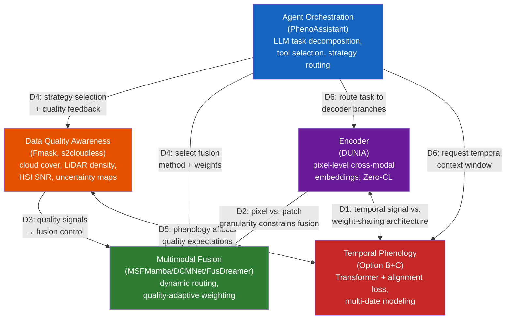

# Remote Sensing-based Vegetation Phenotyping in the AI Era: Methods, Benchmarks, and the Forest Transfer Challenge

## Abstract

Between 2023 and 2026, AI-driven vegetation phenotyping methodology has advanced rapidly across multiple fronts: pixel-level contrastive representation learning, dynamic multimodal fusion, LLM-based agent orchestration, and temporal phenology modeling. These methods have been validated predominantly on agricultural and urban benchmarks—Houston2013, Trento, PASTIS, Auto-Arborist, and individual street-tree datasets. However, their performance in natural forest settings remains almost entirely unexamined. This survey provides an analytical review of the 2023–2026 methodological landscape and then systematically identifies five physical barriers that distinguish forest phenotyping from its agricultural counterpart: (1) multi-layer canopy occlusion, which pushes individual-tree detection F1 down to 0.45–0.72; (2) mixed-species canopy complexity, which degrades classification by approximately 21% relative to monoculture; (3) LiDAR biomass saturation above 300 Mg/ha; (4) terrain-induced accuracy losses of 5–12% on slopes exceeding 30°; and (5) cross-site generalization drops of 20–40%. A sixth barrier—extreme long-tail species distributions, where the top three species account for 42% of training samples—compounds these physical challenges. Each barrier is grounded in quantitative evidence drawn from recent forestry, remote sensing, and ecology literature. Rather than prescribing an integration roadmap, the paper identifies what existing methods can and cannot do for forests, and outlines the research directions required to close the gap—foremost among them, the construction of a forest-specific multimodal benchmark.

---

## 1. Introduction

Global forests sequester approximately 7.6 billion metric tons of CO₂ annually, regulate regional hydrological cycles, and harbor 80% of terrestrial biodiversity [1]. Accurate, scalable forest phenotyping—the quantitative characterization of tree species composition, structural parameters (height, diameter at breast height, canopy cover), and physiological states (leaf area index, phenological stage, stress indicators)—is foundational to climate change mitigation, precision forestry, and biodiversity conservation. Yet the current operational paradigm relies heavily on field inventories that cover less than 1% of forest area globally and are updated on 5–10 year cycles [2].

Remote sensing has partially closed this gap. Satellite constellations (Sentinel-1/2, Landsat, PlanetScope) provide wall-to-wall coverage at 10–30 m resolution; airborne laser scanning (ALS) campaigns such as France's Lidar HD program deliver point densities exceeding 40 pts/m² [3]; and unoccupied aerial vehicles (UAVs) equipped with RGB, multispectral, hyperspectral (HSI), and thermal sensors enable centimeter-level individual tree crown (ITC) observation. The challenge is no longer data scarcity but *data integration*: how to combine heterogeneous modalities—each with distinct spatial resolutions (0.05 m UAV to 250 m MODIS), spectral ranges (visible to shortwave infrared), and temporal cadences (daily to decadal)—into a coherent phenotyping pipeline.

A pivotal development arrived in April 2026 when Chen et al. published PhenoAssistant in *Nature Communications*, demonstrating that a large language model (LLM)-based multi-agent system could orchestrate computer vision tools, statistical analyses, and natural language explanations for plant phenotyping tasks with 100% tool selection accuracy [4]. PhenoAssistant marks the entry of agent-based orchestration into plant sciences; however, its evaluation—like virtually all the methods reviewed in this survey—was conducted on curated agricultural and urban datasets. These methods perform well on benchmarks, but they have almost never been tested in natural forest settings. The gap between agricultural phenotyping performance and forest transferability defines the problem space for this survey.

This limitation is symptomatic of a broader fragmentation. If one surveys the literature from 2023 to 2026, one observes what the Timeline Analysis in prior work termed "four rivers flowing in parallel":

- **River A (Foundation Models)**: CLIP (2021), MAE (2022), SAM (2023), and DINOv2 (2023) have continuously delivered pretraining paradigms—contrastive cross-modal alignment, masked reconstruction, and self-supervised visual features—that downstream remote sensing models increasingly rely upon for weight initialization and few-shot transfer.
- **River B (RS Multimodal Fusion)**: From MSFMamba's static selective state-space fusion (Houston2013 OA 92.86%, 2024) [5] through DCMNet's data-driven dynamic routing (Houston2013 OA 95.11%, Trento OA 98.96%, 2025) [6] to IFGNet's Kolmogorov-Arnold Network (KAN)-based implicit frequency aggregation (Houston2013 OA 99.37%, 2026) [7], fusion strategies have evolved from designer-specified to data-dependent, and recently toward functionalized.
- **River C (Contrastive Representation Learning)**: DUNIA's pixel-level cross-modal contrastive framework [8] achieved zero-shot tree height estimation with RMSE 2.0 m (r = 0.93), surpassing the supervised SOTA of 5.2 m [8]. TaxoNet's dual-margin contrastive loss addressed long-tail plant classification, yielding a +5.1 pp macro-recall gain on Google Auto-Arborist [9].
- **River D (Agent Orchestration)**: PhenoAssistant (2026) demonstrated LLM-orchestrated multi-agent tool chaining [4]; SAGE (2026) proved that training-free, source-grounded knowledge-base reasoning improves crop disease diagnosis by an average of 16.2 percentage points [10]; LEMON (2026) introduced counterfactual reinforcement learning for optimal multi-agent orchestration specification [11].

Each river has produced state-of-the-art components, yet none addresses all five requirements simultaneously: (a) pixel-level cross-modal representation, (b) data-quality-adaptive dynamic fusion, (c) temporal phenology awareness, (d) long-tail species balance, and (e) agent-based orchestration. The components are individually mature but architecturally isolated.

This survey addresses this gap through a systematic analysis. The contributions are threefold:

1. **A structured methodological survey** covering contrastive representation learning, dynamic multimodal fusion, LLM-based agent orchestration, temporal phenology modeling, and data quality awareness—with all performance claims supported by quantitative comparisons drawn from original papers.
2. **A systematic characterization of six forest-specific transfer barriers** (multi-layer occlusion, mixed-species degradation, LiDAR saturation, terrain effects, cross-site generalization, and long-tail distributions), each grounded in quantitative evidence from forestry, remote sensing, and ecology literature.
3. **A set of research directions** identifying the methodological gaps that need to be closed for AI phenotyping to become viable in natural forest settings, with the construction of a forest-specific multi-modal benchmark identified as the highest-priority action.

---

## 2. Background: Forest Phenotyping Tasks and Modalities

### 2.1 Core Tasks

Forest phenotyping encompasses three families of tasks: (i) **species identification**—assigning taxonomic labels at the species or genus level to individual trees or homogeneous forest patches; (ii) **structural parameter extraction**—estimating height, crown diameter, diameter at breast height (DBH), canopy cover fraction, and plant area index (PAI); and (iii) **phenological monitoring**—tracking seasonal transitions (budburst, leaf expansion, peak greenness, senescence, leaf fall) and detecting anomalies induced by drought, pest outbreaks, or pathogen invasion.

Species identification in natural forests is particularly challenging. PureForest, the largest ALS-based tree species dataset, covers 18 species across 339 km² in southern France [3]. PlantD (Planted) spans 64 species/ genera at global scale but lacks LiDAR coverage [12]. Both exhibit severe class imbalance: in PureForest, oak (Quercus spp.) and beech (Fagus sylvatica) dominate, while rare species such as chestnut (Castanea sativa) have orders of magnitude fewer samples. In PlantD, oil palm (21%), loblolly pine (9%), and eucalyptus (12%) together account for 42% of samples.

Structural parameter extraction has benefited most from ALS. DUNIA's zero-shot retrieval achieved tree height RMSE 2.0 m (r = 0.93), canopy cover RMSE 11.7% (r = 0.89), and PAI RMSE 0.71 (r = 0.75) using KNN=50 with a retrieval database of only 50K labeled pixels [8]. Fine-tuning further reduced height RMSE to 1.3 m (r = 0.95). These numbers are competitive with—and in zero-shot setting, surpass—dedicated supervised methods such as FORMS (height RMSE 5.2 m).

Phenological monitoring remains the least automated of the three tasks. Existing phenology datasets are sparse: DeepPhenoTree provides RGB images of apple trees at three phenological stages (flowering, fruitlet, fruit) across four European sites [13]; PASTIS offers parcel-level crop type labels in France but not phenological stage labels [14]; and satellite-derived phenology products (MCD12Q2, MODIS phenology) operate at 500 m resolution, far coarser than the ITC scale required for forest phenotyping.

### 2.2 Core Modalities and Complementarity

Five remote sensing modalities form the sensor portfolio for forest phenotyping, each with distinct physical principles and complementary information content:

**RGB / Very High Resolution (VHR) optical imagery** (0.05–0.5 m from UAV or airborne platforms) captures fine-grained textural and morphological features of individual tree crowns. PureForest's ORTHO HR imagery (0.2 m, NIR-R-G-B bands) enables visual species discrimination by crown shape, branching pattern, and shadow geometry. However, RGB alone is insufficient: ResNet-18 trained on PureForest VHR imagery achieved only 73.1% OA, compared to 83.6% for LiDAR with elevation metadata [3].

**Multispectral imagery (MSI)** from Sentinel-2 (10–20 m, 10 bands) and Landsat (30 m) extends the spectral range into the red-edge and shortwave infrared regions critical for vegetation health assessment. The normalized difference vegetation index (NDVI), enhanced vegetation index (EVI), and normalized burn ratio (NBR) derived from MSI time series are workhorse indicators for phenological stage detection. PlantD demonstrated that a Video Vision Transformer with 3D patch embedding on Sentinel-2 temporal stacks achieves ~62% macro-F1 for 64-class species identification [12].

**Hyperspectral imagery (HSI)** captures hundreds of contiguous narrow spectral bands, enabling discrimination of species with subtle spectral differences. HSI-based fusion methods (DCMNet, DFFNet, IFGNet) have been the primary testbed for dynamic fusion research, with Houston2013 and Trento datasets serving as standard benchmarks [6], [7]. The key limitation is sensor availability: spaceborne HSI (PRISMA, EnMAP, DESIS) provides 30 m resolution with 14–27 day revisit, while airborne HSI campaigns are research-grade and spatially sparse.

**LiDAR** (airborne laser scanning, terrestrial laser scanning, or spaceborne such as GEDI) provides direct three-dimensional structural measurements. ALS point clouds at PureForest's 40 pts/m² density enable precise tree height, crown delineation, and vertical stratification. GEDI's full-waveform LiDAR, with ~25 m footprint spacing and global coverage between 51.6°N and 51.6°S, has become the primary training signal for cross-modal representation learning: DUNIA's Zero-CL loss aligns Sentinel-1/2 pixel embeddings with GEDI waveforms, encoding vertical structure into pixel-level representations [8]. The fundamental limitation is temporal sparsity—GEDI has a non-repeating orbit and multi-year revisit gaps for any given location.

**Synthetic Aperture Radar (SAR)** from Sentinel-1 (C-band, 10 m) and ALOS-2 (L-band, 30 m) provides all-weather, day-night imaging capability. SAR backscatter (VV, VH polarizations) is sensitive to canopy structure, surface roughness, and dielectric properties (moisture content). SAR's cloud-penetrating capability makes it the primary fallback modality when optical imagery is occluded—a capability exploited in PlantD's multi-source classification and in MSFMamba's HSI-SAR fusion experiments (Berlin OA 76.92%, Augsburg OA 91.38%) [5].

### 2.3 Existing Benchmark Datasets

Table 1 summarizes the three largest publicly available forest/plantation datasets.

| Dataset | Scale | Species | Modalities | Temporal | Key Limitation |
|---------|-------|---------|------------|----------|----------------|
| PureForest [3] | 339 km², 135K patches | 18 (13 classes) | ALS (40 pts/m²) + VHR (0.2 m) | Single-epoch | No satellite, no temporal |
| PlantD [12] | Global, 2.26M samples | 64 species/genera | S-1, S-2, L-7, ALOS-2, MODIS | Multi-year temporal | No LiDAR |
| CitrusFarm [15] | 1.3 TB, 7.5 km traverse | 3 citrus varieties | 9 sensors (RGB, NIR, thermal, LiDAR, IMU, GNSS-RTK) | Single traverse | No semantic labels |

Three critical data gaps emerge: (1) no dataset simultaneously provides satellite time series, ALS point clouds, and ground-truth species labels at ITC resolution; (2) PhenoCam-style multi-year temporal labels (budburst date, leaf-fall date) are absent from all three datasets; and (3) physiological ground measurements (leaf chlorophyll content, water potential, photosynthetic rate) are not spatially co-registered with remote sensing acquisitions.

---

## 3. A Methodological Survey of Vegetation Phenotyping Methods

We organize the 2023–2026 methodological landscape along five analytical dimensions. For each, we catalog the candidate architectural choices, compare them on quantitative benchmarks, and identify the validation gaps that are most relevant to forest transferability.

### 3.1 Encoder Design

The encoder transforms raw multimodal sensor data (multispectral pixels, SAR backscatter, LiDAR point clouds or waveforms) into a unified representation space. For forest phenotyping, the encoder needs to satisfy several requirements simultaneously: pixel-level spatial granularity (for ITC-level analysis), cross-modal alignment (at minimum MSI + SAR + LiDAR), zero-shot or few-shot capability (forest ground truth is scarce), and—ideally—temporal phenology awareness.

#### 3.1.1 Candidate Methods

Seven encoder paradigms have been evaluated under unified experimental settings in the DUNIA paper [8] (pretraining on 836K Sentinel-1/2 patches + 19M GEDI waveforms, 250K steps, identical downstream tasks). Table 2 presents the key quantitative comparisons for the forest-relevant downstream tasks.

| Dimension | DUNIA [8] | AnySat [16] | CROMA [17] | SatMAE [18] | DOFA [19] | Scale-MAE [20] | DeCUR [21] |
|-----------|-----------|-------------|------------|-------------|-----------|---------------|------------|
| Venue | arXiv 2025 | CVPR 2025 | NeurIPS 2023 | NeurIPS 2022 | arXiv 2024 | ICCV 2023 | AAAI 2024 |
| Pretraining | Contrastive + Reconstruction | Multi-modal fusion | Contrastive + MAE | Masked Reconstruction | MAE + Dynamic Weights | MAE + Scale Embed | Contrastive (disentangled) |
| Modalities | S-1+S-2+GEDI | S-1+S-2+VHR+Temporal | S-1+S-2 | S-2 | Any optical | Multi-res optical | S-1+S-2 |
| Granularity | Pixel-level (10 m) | Patch-level | Patch-level (8×8) | Patch-level (8×8) | Patch-level | Patch-level | Patch-level |
| Fine-tuned Height (RMSE) | **1.3 m** (r=0.95) | 2.8 m (r=0.89) | 3.5 m (r=0.78) | 10.5 m (r=0.52) | 11.0 m (r=0.51) | — | 11.0 m (r=0.55) |
| Fine-tuned Species (wF1, PF) | 82.2 | **82.3** | 80.5 | 78.8 | 79.8 | — | 78.9 |
| 20% Labels Height (RMSE) | **1.4 m** (r=0.93) | 2.8 m (r=0.89) | 3.6 m (r=0.76) | 10.5 m (r=0.52) | 11.2 m (r=0.50) | — | 11.1 m (r=0.52) |
| Temporal Support | Single median composite | Native multi-temporal | Static | Temporal masking | Static | Multi-scale spatial | Static |
| Inference (20 km²) | **4.22 s** | 177 s | — | — | — | — | — |
| Open-source | Yes | Yes | Yes | Yes | Yes | Yes | Yes |

DUNIA's zero-shot performance is particularly relevant for forest scenarios with limited ground measurements. With KNN=50 and a retrieval database of 50K labeled pixels (~31 km², approximately 0.25% of the data required by supervised methods), DUNIA achieves: tree height RMSE 2.0 m (r = 0.93) vs. supervised SOTA FORMS at 5.2 m (r = 0.77); canopy cover RMSE 11.7% (r = 0.89) vs. FORMS 22.1% (r = 0.54); PAI RMSE 0.71 (r = 0.75) vs. FORMS 1.5 (r = 0.35); and tree species wF1 76.0% (KNN=5) vs. supervised SOTA 74.6% [8].

#### 3.1.2 Comparative Observations

DUNIA achieves the lowest tree height RMSE (1.3 m fine-tuned, 2.0 m zero-shot) and 4.22 s inference on 20 km²—the only pixel-level encoder in the comparison. AnySat achieves the highest species classification on PureForest (wF1 82.3) but is patch-level and 40× slower at inference. Other methods achieve significantly higher RMSE (≥3.5m for tree height), all operating at patch-level. Whether a single encoder can simultaneously deliver pixel-level cross-modal alignment and temporal phenology awareness remains the key open question for forest applications.

#### 3.1.3 Identified Gap: Temporal Phenology

DUNIA's single most significant limitation is its reliance on a single leaf-on season median composite as input. On PASTIS, this causes a 28 pp zero-shot gap vs. supervised SOTA (OA 56.2% vs. 84.2%) and a 24.9 pp gap vs. AnySat's multi-temporal input (81.1%). For deciduous forest phenotyping, where leaf-on/leaf-off spectral contrast is the primary discriminant, this limitation is structural rather than incidental. DUNIA's multi-temporal autoencoder (UNet + ConvLSTM, 3 time steps) was an auxiliary reconstruction module—not a phenology-sensitive representation learner—and its temporal average pooling discards the ordering information essential for distinguishing an early-leafing oak from a late-leafing ash.

---

### 3.2 Multimodal Fusion Strategy

Given encoded features from multiple modalities (HSI, LiDAR, SAR, MSI), the fusion module combines them into a joint representation for downstream classification or regression. The central design question is: *whether the fusion strategy is best designed as static (fixed at design time), data-driven (learned from feature statistics), or context-dependent (informed by external signals such as data quality, phenological stage, or task specification)*.

#### 3.2.1 Candidate Methods

Table 3 compares the five leading fusion paradigms on quantitative benchmarks. All numbers are from the original papers; "*" indicates few-shot settings (~20 samples/class); other results are full supervision (~150–200 samples/class). Note that IFGNet was not evaluated on Trento; FusDreamer was evaluated under few-shot settings.

| Method | Year | Core Mechanism | Houston2013 OA | Houston2013 Kappa | Trento OA | Params | Inference |
|--------|------|---------------|----------------|-------------------|-----------|--------|-----------|
| **MSFMamba** [5] | 2024 | Selective SSM + dual-input cross-parameterization | 92.86 | 92.25 | — | 1.53M | 0.175 s |
| **DCMNet** [6] | 2025 | 3-layer dynamic routing with bilinear attention | 95.11 | 94.69 | **98.96** | 3.83M | 0.010 s |
| **DFFNet** [22] | 2025 | Dynamic frequency-domain filter kernel + channel shuffle | 92.35 | 91.70 | — | 1.28M | 0.239 s |
| **FusDreamer** [23] | 2025 | Latent diffusion + CLIP-guided prompt alignment | 89.24* | 90.15* | 96.36* | Large | 16–67 s |
| **IFGNet** [7] | 2026 | KAN B-spline implicit spatial-frequency aggregation | **99.37** | **99.32** | — | Light | Fast |

*Note: Inference times are reported as stated in the original papers and may not be directly comparable due to differences in hardware (GPU model, batch size) and software implementation (framework, optimization level). They are included as indicative order-of-magnitude references for deployment feasibility assessment rather than precise benchmarking comparisons.*

**MSFMamba (2024)** introduced the selective state-space model (Mamba) to multimodal fusion, achieving linear O(n) complexity via cross-modal SSM parameterization (Fus-Mamba). On Houston2018 OA 92.38%; Augsburg (HSI+SAR) 91.38% [6].

**DCMNet (2025)** marked the transition from static to dynamic fusion, using a three-layer routing space (BSAB, BCAB, ICB blocks) where a routing gate generates path probabilities from feature statistics. Trento OA reached 98.96%, Kappa 98.61% [6].

**DFFNet (2025)** and **IFGNet (2026)** form the frequency-domain fusion family. DFFNet applies 2D FFT with dynamic frequency kernel generation (GAP+MLP+Softmax), achieving Houston2013 OA 92.35% at 1.28M parameters [22]. IFGNet extends this via KAN B-spline implicit frequency aggregation, reaching OA 99.37% (Kappa 99.32%), though code is not open-source [7].

**FusDreamer (2025)** introduced latent diffusion (LaMG) with CLIP-guided prompt alignment, enabling text-prompt-driven fusion—the only method tested under few-shot settings (13–18 samples/class, Trento OA 96.36%). The text-prompt interface is suited for agent control [23].

#### 3.2.2 Comparative Observations

The five fusion paradigms exhibit a clear accuracy progression: MSFMamba (OA 92.86%) → DFFNet (92.35%) → DCMNet (95.11%) → IFGNet (99.37%), with FusDreamer occupying a distinct niche at 96.36% under few-shot conditions. All five were evaluated on urban HSI-LiDAR benchmarks (Houston2013, Trento); none has been tested on forest scenes with overlapping canopies, mixed species, or terrain relief exceeding 20°. A gap common to all is the absence of external quality signal injection: fusion decisions are driven solely by internal feature statistics, not by acquisition conditions such as cloud cover or LiDAR point density (Section 3.5).

#### 3.2.3 Identified Gap: External Quality Signal Injection

All five methods base fusion decisions on internal feature statistics (DCMNet's gating input is F_h + F_l + X; DFFNet's kernel uses GAP of input features; MSFMamba's SSM parameters are generated from the paired modality's features). None receives an external quality signal about acquisition conditions—cloud cover, LiDAR density, SAR coherence, or noise level. This gap is structural: it is not a failure of individual methods but a missing interface between the quality assessment layer and the fusion layer.

---

### 3.3 Agent Orchestration

The agent orchestrator accepts a user's natural language description of a phenotyping task, decomposes it into executable sub-tasks, selects appropriate vision models and analytical tools, monitors execution, and aggregates results. The central design tension is between *reliability* (guaranteed correct tool selection and execution) and *adaptability* (capacity to handle open-ended, previously unseen task specifications).

#### 3.3.1 Candidate Methods

Three agent paradigms have been demonstrated in the plant/foresetting domain, with quantitative evaluation results available for two:

**PhenoAssistant (2026)** [4] employs a centralized multi-agent architecture: a Manager Agent (GPT-4o, temperature = 0.1) receives natural language instructions, generates a step-wise plan, and dispatches tasks to a toolkit comprising vision model zoo (Mask2Former, Leaf-only SAM, DINOv2-base with LoRA fine-tuning), phenotyping extraction tools, code writer, data visualizer, plot analyzer (Pandas AI-based), table analyzer, RAG agent, and deterministic statistical modules (ANOVA, Tukey-Kramer post-hoc). Tools are exposed via structured schemas (name, description, parameters, I/O format) built on the AutoGen framework. Evaluation on 20 manually designed tasks yielded: tool chain rationality 4.25/5 (4.35/5 with Critic Agent), tool existence 5.00/5, tool appropriateness 4.65/5 (4.90/5 with Critic), argument correctness 4.30/5 (4.40/5 with Critic). Vision model type recommendation achieved 100% accuracy (50/50 tasks); vision model exact match achieved 100% accuracy (20/20 tasks). Data analysis tasks achieved 85% accuracy (17/20); all three failures were attributed to fine-grained visual reasoning by the Plot Analyser—the LLM misinterpreted chart elements, indicating that LLM-based visual reasoning remains the primary bottleneck [4].

**SAGE (2026)** [10] employs a training-free agentic reasoning pipeline for crop disease diagnosis: organ identification → anatomy-indexed filtering → source-grounded knowledge base (KB) symptom matching → sequential reference image comparison with limited budget k → prediction with full reasoning trace. The full pipeline (KB + k=8 reference images) improved diagnostic accuracy by an average of 16.2 percentage points over the baseline [10].

**LEMON (2026)** [11] introduced counterfactual reinforcement learning for optimizing multi-agent orchestration specifications—a potential path toward learning agent policies under varying data quality rather than hard-coding orchestration rules.

#### 3.3.2 Comparative Observations

PhenoAssistant's 100% tool selection accuracy and SAGE's +16.2 pp diagnostic improvement demonstrate that LLMs can reliably orchestrate scientific tool chains when perception is delegated to dedicated vision models. PhenoAssistant's failure analysis shows all errors originated from fine-grained LLM visual reasoning, while tool selection was flawless—suggesting the LLM role is best scoped to orchestration, not perception. SAGE's anatomy-indexed filtering pattern is conceptually transferable to forestry: a knowledge base indexed by phenology, geography, and taxonomy could narrow candidate species sets before invoking a vision classifier. All three agent paradigms have been validated on agricultural or general benchmarks; none on forest phenotyping tasks.

#### 3.3.3 Identified Gap: From Tool Orchestration to Fusion Strategy Orchestration

PhenoAssistant orchestrates *which tool* processes *which sub-task*, but does not adjust *how* multimodal data are fused. The Manager selects Mask2Former for segmentation and DINOv2 for classification, but cannot instruct the fusion module to weight LiDAR over HSI when cloud cover is detected, or to invoke frequency-domain filtering when analyzing phenological transitions. This gap stems from architecture: the Manager has no interface to the fusion module's decision layer, and the fusion module has no exposed parameters that accept external control signals.

---

### 3.4 Temporal Phenology Modeling

Forest phenology—the seasonal cycling of biological events (budburst, leaf expansion, peak photosynthetic activity, senescence, leaf fall)—provides the single most information-rich temporal signal for species discrimination in temperate and boreal forests. Deciduous species that are spectrally nearly identical during peak summer (e.g., Quercus robur vs. Quercus petraea) exhibit distinct temporal trajectories: differences in budburst date (often 1–3 weeks), leaf expansion rate, and senescence onset create separable signatures when temporal context is available.

#### 3.4.1 Why Temporal Modeling Is Critical

Temporal information is decisive for species discrimination. AnySat achieves PASTIS classification wF1 81.1 with native multi-temporal input, while DUNIA—using a single median composite—achieves 56.2% under zero-shot [8]. The "green desert" phenomenon (spectrally recovered canopy masking structural degradation) can only be detected through temporal analysis [24]. Gauli et al. demonstrated feasible temporal ML in complex forest terrain with cross-ecoregion R² = 0.683–0.757 [25].

#### 3.4.2 Candidate Methods

Three temporal encoding strategies have been explored in the reviewed literature:

**Option A: Input-level multi-temporal concatenation.** Multiple dates of Sentinel-2 imagery are concatenated along the channel dimension, forming [B, T×C, H, W] tensors fed to a standard spatial encoder. This is the approach used by AnySat [16]. Advantages: minimal architectural change, reuse of existing encoder weights. Limitations: the model is insensitive to temporal order (shuffling image dates produces nearly identical representations); no concept of time distance; no explicit positional encoding.

**Option B: Encoder-internal Temporal Transformer.** Each time step is independently encoded by a shared-weight spatial encoder, producing per-timestep patch embeddings z_t. A Day-of-Year (DOY) sinusoidal positional encoding is added: PE(DOY, 2i) = sin(DOY/365 × 10000^{2i/d}), PE(DOY, 2i+1) = cos(DOY/365 × 10000^{2i/d}). Multi-head self-attention is applied across the temporal dimension: Attention(Q, K, V) = softmax(QK^T/√d_k + M)V, where M is a temporal mask. TSP-Former (2025) demonstrated this approach for tobacco mapping [26]; a 2026 work applied 3D patch embedding with temporal positional encoding for full-cycle vegetation phenotyping [27].

**Option C: Post-hoc temporal alignment loss.** The encoder remains unchanged; temporal information is injected exclusively through auxiliary loss functions. Three components compose the loss: (i) smoothness loss L_smooth = Σ_t ||e_t − e_{t+1}||² · exp(−α·|DOY_t − DOY_{t+1}|); (ii) cyclic loss L_cyclic = ||e_1 − e_T||² · exp(−α·(365 − |DOY_T − DOY_1|)); (iii) identity loss L_identity = Σ_t ||e_t − mean(e)||². The geometric interpretation is a "phenology tube" in embedding space: each crown's seasonal trajectory is constrained within a tube of radius τ around its identity center, while different species' tubes are kept separated.

Table 4 compares the three options on key design dimensions.

| Dimension | Option A: Input Concat | Option B: Temporal Transformer | Option C: Temporal Alignment Loss |
|-----------|----------------------|-------------------------------|----------------------------------|
| Encoder modification | None (input only) | Large (new temporal module) | None (loss only) |
| Temporal dependency modeling | Implicit (CNN local) | Explicit (global attention) | None (loss-level only) |
| Variable-length sequences | No | Yes | Yes |
| Computational overhead | ~1× (baseline) | ~1.5–4× (depending on T) | ~1× |
| Time-position awareness | No | Yes (DOY PE) | Partial (via loss) |
| Compatibility with DUNIA Zero-CL | Yes | Yes (requires adaptation) | Yes (parallel use) |

#### 3.4.3 Comparative Observations

Input-level concatenation (Option A) is simplest but provides no temporal ordering awareness. Temporal Transformer (Option B) provides explicit DOY encoding and global temporal attention but requires architectural modification. Post-hoc alignment loss (Option C) serves as a regularizer but cannot compensate for single-date pretraining. No existing method simultaneously delivers pixel-level cross-modal alignment and temporal phenology awareness.

#### 3.4.4 Identified Gap: No Method Does Both Cross-Modal Pixel Alignment and Temporal Phenology

DUNIA achieves pixel-level cross-modal alignment but is temporally static; AnySat is multi-temporal but patch-level. No method simultaneously provides pixel-level cross-modal embeddings, temporal phenology awareness, and zero-shot parameter estimation. Closing this gap requires extending DUNIA with a Temporal Transformer while preserving Zero-CL and the dual-decoder architecture.

---

### 3.5 Data Quality Awareness

Remote sensing data quality is inherently variable and unpredictable. Cloud cover can render 30–70% of optical pixels unusable in tropical and temperate regions; LiDAR point density varies with flight parameters, terrain, and canopy closure; SAR coherence degrades over water bodies and in areas of rapid surface change; and HSI pushbroom sensors can exhibit striping artifacts. A forest phenotyping system deployed outside curated benchmark datasets needs to reason about input quality and adapt its fusion strategy accordingly.

#### 3.5.1 What Exists: Mature Quality Assessment Components

The individual building blocks for data quality assessment are production-ready: cloud and cloud shadow detection (Fmask [28] at 85–90% F1, s2cloudless at 88–92%, DeepLabV3+-based approaches at 92–96%, spatial-temporal methods at 94–97%); LiDAR quality metrics (point density, return number distribution, scan angle, ground point ratio) standard in LAS/LAZ metadata with GEDI providing per-footprint quality flags; HSI noise estimation (HSI-SDeCNN for destriping, HyMiNoR for mixed Gaussian+striping+impulse noise); and uncertainty quantification via UnCRtainTS [29], which produces per-pixel uncertainty maps that can serve as quality inputs. The key finding is that no existing paper has connected data quality assessment to adaptive fusion strategy selection—a literature gap, not a component-availability gap.

#### 3.5.2 What Exists: Missing Modality and Quality-Adaptive Training

The Missing Modality (MM) community provides the closest technical precedent: ActionMAE demonstrated missing-modality robustness via random dropout + MAE reconstruction [30], while M3L uses Teacher-Student KL distillation to approximate full-modality performance from partial inputs [31]. These techniques map directly onto quality-adaptive fusion—cloud occlusion ≡ modality dropout, low LiDAR density ≡ modality noise—with a quality-adaptive dropout strategy `drop_prob = 1.0 - quality_score` being a direct extension, though not yet validated for remote sensing fusion. Provable Dynamic Fusion (Zhang et al., 2023, ICML) and Predictive Dynamic Fusion (2024) provide theoretical foundations for quality-weighted fusion, but learn quality weights implicitly rather than from explicit quality assessments [32], [33].

#### 3.5.3 Identified Gap: The Quality→Fusion Mapping Interface

The core unresolved design question is: *given a quality vector q = [cloud_pct, lidar_density, hsi_snr, sar_coherence, phenology_stage], what fusion strategy is appropriate?* The mapping has neither empirical characterization nor theoretical guidance. Specific sub-gaps include:

- **GAP-1 (Quality-to-strategy mapping)**: No ablation study characterizes how fusion strategy choice interacts with data quality levels—at what cloud cover threshold does switching from HSI-dominant to LiDAR-dominant fusion become beneficial?
- **GAP-2 (Multi-dimensional quality fusion)**: Cloud cover, LiDAR density, HSI noise, SAR coherence, and phenological stage are incommensurable quality dimensions. How can they be fused into a unified quality signal?
- **GAP-3 (Quality-aware training data)**: Training data with controlled quality degradation is scarce. Synthetic augmentation (simulating cloud occlusion, LiDAR subsampling, HSI band noise) is the pragmatic path, but fidelity to real acquisition artifacts requires validation.

---

## 4. The Forest Transfer Gap

The five design dimensions analyzed in Section 3 have been validated almost exclusively on agricultural and urban benchmarks. Transferring these methods to natural forest settings introduces physical challenges that current benchmarks do not capture. This section analyzes six cross-dimensional dependencies that arise specifically from the demands of forest environments.

### 4.1 What the Forest Setting Demands That Current Benchmarks Don't Test

Figure 1 illustrates the five design dimensions and their six cross-dimensional dependencies.

**Dependency summary:**
| ID | Relationship | Type | Key implication |
|----|-------------|------|-----------------|
| D1 | Encoder ↔ Temporal | Bidirectional | Temporal strategy constrains encoder architecture (Siamese weight-sharing) |
| D2 | Encoder → Fusion | Unidirectional | Pixel-level embeddings enable spatially precise fusion decisions |
| D3 | Quality → Fusion | Unidirectional | Quality assessment feeds fusion control — a connection not yet built in any system |
| D4 | Agent ↔ Quality + Fusion | Bidirectional | Agent integrates quality assessment with strategy selection; forms the central control loop |
| D5 | Temporal ↔ Quality | Bidirectional | Phenological stage affects quality interpretation (leaf-on vs. leaf-off data reliability) |
| D6 | Agent → Encoder + Temporal | Unidirectional | Task specification determines which decoder outputs and time steps are relevant |

**D-1: Encoder ↔ Temporal Phenology (bidirectional).** The encoder determines what temporal information is accessible. A single-date encoder (DUNIA current) provides no temporal signal to downstream modules, regardless of how sophisticated the temporal modeling layer is. Conversely, the temporal modeling strategy feeds back into encoder design: if Option B (Temporal Transformer) is adopted, the spatial encoder operates in Siamese mode with shared weights across time steps, and the decoder preserves temporal consistency in cross-modal alignment (Zero-CL with GEDI waveforms applied independently at each time step, with temporal smoothness constraints).

**D-2: Encoder → Fusion (unidirectional).** The encoder's output granularity (pixel vs. patch) and embedding quality (cross-modal alignment strength) constrain what fusion strategies are viable. Pixel-level embeddings (DUNIA) enable spatially precise fusion, where each 10 m pixel independently participates in the fusion decision. Patch-level embeddings (AnySat, CROMA) constrain fusion to operate on aggregated spatial units, losing within-patch heterogeneity. The encoder's cross-modal alignment quality (cosine similarity 0.86 for DUNIA Zero-CL vs. 0.56 for VICReg) determines the reliability of cross-modal attention mechanisms in downstream fusion.

**D-3: Quality Awareness → Fusion (unidirectional).** This is the central unmet dependency. Quality assessment outputs (cloud mask, LiDAR density, HSI SNR, uncertainty maps) are transformed into fusion control signals. The specific injection point depends on the fusion architecture: for DCMNet, quality signals are added to the routing gate input; for MSFMamba, quality signals contribute to B/C/Δ parameter generation in Fus-SSM; for FusDreamer, quality signals are encoded into text prompts. The choice of injection architecture creates a dependency: selecting a fusion method constrains how quality signals can be integrated.

**D-4: Agent Orchestration → Quality Awareness + Fusion (bidirectional).** The agent is the natural locus for integrating quality assessment with strategy selection. The agent can receive structured quality reports (cloud_pct=67, lidar_density=1.2e6, hsi_snr=23.4, phenology_stage="leaf_expansion"), reason about their implications ("cloud cover 67% exceeds the 30% threshold; prioritize LiDAR structural features; deciduous forest in leaf-expansion stage benefits from spectral differentiation"), and output a fusion strategy specification. However, the agent cannot bypass the quality→fusion interface identified in D-3—it can only control that interface if it exists.

**D-5: Temporal Phenology ↔ Quality Awareness (bidirectional).** Phenological stage affects quality expectations: leaf-off LiDAR in deciduous forests has higher ground point density and more reliable terrain models; leaf-on optical imagery has higher spectral information content for species discrimination. Conversely, quality degradation affects phenological signal reliability: a time step with 80% cloud cover in May may give a misleading "low greenness" signal that could be misinterpreted as delayed leaf expansion rather than data quality artifact.

**D-6: Agent Orchestration → Encoder + Temporal Phenology (unidirectional).** The agent's task specification determines which encoder outputs are relevant. A "map canopy height" task requires vertical structure embeddings (DUNIA's OV decoder output); a "classify tree species" task requires horizontal embeddings (OH decoder output) with temporal context; a "detect drought stress" task requires both with anomaly detection capability. If the agent orchestrates the fusion strategy, it also needs to route encoder outputs appropriately—selecting which decoder branch, which time steps, and which embedding dimensions to forward to downstream modules.

### 4.2 Forest-Specific Transfer Barriers

The dependencies described above are structural—they exist regardless of whether the target domain is a maize field or a tropical forest. However, natural forests impose six physical constraints that agricultural and urban benchmarks do not capture, each of which directly stresses one or more of the D1–D6 dependencies.

#### 4.2.1 Multi-Layer Canopy Occlusion

In agricultural settings, crop canopies are approximately planar—individual plants are spatially separated, of uniform height, and planted at known density. Models trained on monoculture crops (maize, cotton, wheat) achieve ITC detection F1 routinely exceeding 0.90 because the detection problem is geometrically well-posed: plants do not overlap vertically, row spacing provides a strong prior, and understory is suppressed by herbicide or mechanical management. In natural forests, by contrast, the canopy is vertically stratified into overstory, midstory, and understory layers with no planting grid and continuous crown overlap. Top-down remote sensing sees predominantly the upper canopy; mid- and understory trees are occluded. The gap between agricultural F1 > 0.90 and forest F1 of 0.45–0.72 is not merely a matter of degree—it reflects a qualitatively different detection geometry that agricultural benchmarks do not probe.

Quantitatively, Beloiu et al. (2023) reported individual-tree crown detection F1 ranging from 0.45 to 0.72 in heterogeneous temperate forests using aerial RGB, with the lowest performance on suppressed sub-canopy trees [35]. Silwal et al. (2024), simulating a mixed Harvard Forest scene via DIRSIG radiative transfer, found that even under optimal 1 m resolution conditions, a 1D-CNN could identify only 16 of 24 genus-level classes, and at 30 m resolution this dropped to 7 of 24 (OA 54.09%) [36]. Sivanandam et al. (2022) reported that tree detection mAP in dense, overlapping eucalyptus canopies fell to approximately 0.50, compared to 0.65+ in open areas, with different species frequently merged into single segments [37]. SegmentAnyTree (2024), the only ITCD model that explicitly evaluates performance across canopy layers, was demonstrated on dense terrestrial and mobile laser scanning data (TLS/MLS/ULS)—not on above-canopy ALS or UAV imagery [38]. The Zhao et al. (2023) systematic review of CNN-based ITCD identifies multi-layer detection as a key unsolved gap [39].

The implication for the design dimensions is direct: **D2 (Encoder → Fusion)** —patch-level encoders lose within-patch vertical heterogeneity; **D3 (Quality → Fusion)** —no existing quality signal encodes occlusion depth; **D1 (Encoder ↔ Temporal)** —leaf-off acquisitions can penetrate deciduous canopies but current encoders lack seasonal awareness.

#### 4.2.2 Mixed-Species vs. Monoculture Degradation

Agricultural phenotyping operates overwhelmingly on monoculture plots. Forest species identification in mixed stands is substantively harder. Lee et al. (2023) provided the most direct comparison: on the same CNN architecture trained with bi-seasonal drone RGB+LiDAR data, single-species classification F1 reached 0.95, while labels containing two or more mixed species dropped to F1 = 0.75—a degradation of 21% [40]. Marinelli et al. (2022) evaluated 7-species mixed forest classification in the Italian Alps using ALS point-cloud-derived features (height percentiles, intensity statistics) and a DNN: when trained on homogeneous conifer-only or broadleaf-only subsets, OA reached 82.54% and 86.64% respectively, but in the full 7-class mixed setting, broadleaf species such as Ostrya carpinifolia dropped to F1 = 64.52% [41]. The methodological contrast is instructive: Lee's approach demonstrates that even with optimal multi-modal input (drone RGB + LiDAR at cm-level resolution), mixed-species degradation persists at ~21%; Marinelli's approach shows that single-modality (LiDAR-only) classification is fundamentally limited by canopy overlap reducing effective point density per tree below the nominal sensor specification. A 2021 review of LiDAR-based tree species classification reported that at 2–5 pts/m², OA ≈ 50%, while >50 pts/m² was needed for OA ≈ 70% [41]. In mixed forests, these thresholds are harder to meet because inter-crown overlap distributes the point budget across multiple trees. The pattern is consistent across geographic regions: Quan et al. (2023) reported 11-species classification OA of 75.7% in a natural secondary forest in northeast China using UAV LiDAR + hyperspectral data, with per-class accuracy falling to 60.0% for the rarest species [49]. Zhong et al. (2022) achieved OA of 84.62–89.20% for 9 species in a mixed conifer-broadleaf forest at Maoershan, but only when fusing UAV HSI + LiDAR; single-modality baselines dropped to 76.42% [50]. The 10–20 pp gap between pure plantation accuracy (~95% for 4 species) and mixed natural forest accuracy (~75–89% for 9–11 species) provides quantitative evidence from a second continent that mixed-species degradation is not an artifact of European forest types alone.

This barrier stresses **D2 (Encoder → Fusion)**: the spectral and structural signatures that are separable in monoculture become entangled in mixed canopies, demanding fusion strategies that can resolve sub-crown heterogeneity.

#### 4.2.3 LiDAR Biomass Saturation Above 300 Mg/ha

Above-ground biomass (AGB) estimation from ALS exhibits a well-documented saturation ceiling. Tian et al. (2023), in their comprehensive review of forest AGB estimation, reported that ALS-derived metrics saturate at approximately 300–500 Mg/ha, after which additional biomass does not produce measurable changes in LiDAR height or density metrics [42]. The allometric chain—height → DBH (via species-specific H-D allometry, R² = 0.70–0.85) → stem volume (taper equations) → AGB (wood density × biomass expansion factor)—accumulates error at each step, with allometric equation mismatch contributing 10–30% relative RMSE [42]. At the global scale, GEDI L4A products achieve R² = 0.55–0.70 with rRMSE of 40–80% at footprint level [43].

An open question is whether DUNIA's cross-modal embeddings are affected by the same saturation. DUNIA achieved zero-shot tree height RMSE 2.0 m (r = 0.93) on PureForest, which includes mature oak-beech stands in southern France where above-ground biomass in undisturbed reference plots ranges between 250–400 Mg/ha [3]. Because DUNIA encodes both spectral information (Sentinel-1/2, which captures canopy chemistry and texture that continue to vary beyond structural saturation) and structural information (GEDI waveform), it may partially circumvent pure LiDAR saturation. However, the per-biomass-bin accuracy of DUNIA's height predictions has not been reported; the RMSE of 2.0 m may mask higher errors in the 300+ Mg/ha range. This remains an empirical question warranting evaluation on a forest benchmark with co-located field biomass measurements.

This barrier primarily stresses **D2 (Encoder → Fusion)** and **D3 (Quality → Fusion)**: fusion strategies that weight modalities equally cannot compensate for the fact that above ~300 Mg/ha, structural (LiDAR) information saturates while spectral (optical, SAR) information may still carry distinguishing signal.

#### 4.2.4 Terrain Effects

Forests in mountainous regions—which constitute a large fraction of global forest cover—introduce topographic distortion that is absent from flat agricultural benchmarks. You et al. (2020) demonstrated that tree species classification OA drops by 5–12% on slopes exceeding 30°, with north-vs-south aspect differences producing OA gaps of 8–15% due to anisotropic illumination [44]. Topographic shadows degrade species separability, and steep terrain (>40°) introduces LiDAR point cloud registration errors. The SCS+C topographic correction method represents the current best compromise, but residual radiometric distortion persists [44]. These effects compound across sensor types: optical sensors suffer radiometric distortion from shadowing; LiDAR exhibits uneven ground point sampling and beam divergence on steep inclines; SAR introduces geometric layover and foreshortening artifacts that degrade co-registration with optical and LiDAR modalities. The interaction with seasonal sun angle is particularly problematic—winter low sun angles amplify terrain shadowing by 2–3× compared to summer, artificially suppressing vegetation indices and creating false-negative phenological signals that can be mistaken for delayed leaf emergence or early senescence.

This barrier stresses **D1 (Encoder ↔ Temporal)** and **D5 (Temporal ↔ Quality)**: terrain effects are seasonal (stronger in winter with low sun angle) and interact with phenological stage, yet no current encoder accounts for terrain-phenology coupling.

#### 4.2.5 Cross-Site and Cross-Season Generalization

The most systematically measured barrier is cross-site generalization degradation. Across multiple studies, F1 or OA drops of 20–40% are consistently reported when models are transferred to held-out geographic sites or seasons:

| Study | Task | Degradation | Source |
|-------|------|------------|--------|
| Beloiu et al. (2023) | ITC detection + species ID, 3 sites | F1 0.72 → 0.45 (−37%) | [35] |
| TreeSatAI (Ahlswede et al., 2023) | Multi-sensor species classification, 3 German states | OA 85% → 61% (−28%) | [45] |
| TaxoNet (2025) | Fine-grained species classification, 5 climate zones | Top-1 91.2% → 67.8% (−23.4%) | [9] |
| Kattenborn et al. (2022) | CNN spatial autocorrelation inflation | OA inflated 15–30% | [46] |
| DeepForest community | Real-world vs. reported accuracy | Gap of 15–30 pp | [47] |

Kattenborn et al. (2022) additionally demonstrated that spatial autocorrelation in standard random train/test splits inflates CNN accuracy by 15–30%, meaning that many published forest classification results likely overestimate true generalization capability [46]. This inflation is particularly insidious for forest evaluation because adjacent forest plots share species composition, soil conditions, microclimate, and management history—making random pixel-level splits a severely biased estimator even when pixels are drawn from different images. Blocked spatial cross-validation, which leaves out entire forest stands or geographic tiles, consistently reveals substantially lower accuracy than random splits. For PureForest, the reported 83.6% OA (LiDAR + elevation) was obtained under a stratified geographic split that partially mitigates autocorrelation, but the 15–30 pp range reported by Kattenborn suggests that even "spatially aware" splits may not fully account for the correlation structure of contiguous forest landscapes. Community feedback from DeepForest users confirms that real-forest deployment accuracy is 15–30 percentage points below reported benchmark figures [47], consistent with the magnitude of autocorrelation inflation. The implication for evaluation is that forest benchmark design requires blocked spatial validation at the stand or catchment level, and reported accuracy numbers without explicit spatial validation protocols are best interpreted as upper bounds rather than expected deployment figures.

This barrier stresses all six dependencies simultaneously: encoders pretrained on one region may produce embeddings that are misaligned for another (D1, D2); quality signals have different distributions across sites (D3, D5); and agent reasoning chains that rely on region-specific ecological knowledge may not transfer (D4, D6).

#### 4.2.6 Long-Tail Species Distributions

Forest tree species exhibit extreme long-tail distributions that differ qualitatively from the moderate class imbalance in agricultural datasets. In PlantD, the top 3 species—oil palm (21%), loblolly pine (9%), and eucalyptus (12%)—account for 42% of all samples [12]. In PureForest, oak (Quercus spp.) and beech (Fagus sylvatica) dominate, while rare species such as chestnut (Castanea sativa) have orders of magnitude fewer samples [3]. This skew has a concrete consequence: standard OA reporting on PureForest (83.6% for LiDAR + elevation) obscures per-class F1 below 30% for rare species.

The long-tail problem is well-studied in computer vision (TaxoNet, EKDC-Net, focal loss, LDAM), but these methods have been evaluated predominantly on single-modal RGB datasets (Auto-Arborist, iNaturalist). No method simultaneously addresses (a) multi-modal fusion, (b) long-tail rebalancing, and (c) pixel-level cross-modal alignment—all three of which are required for forest species classification with LiDAR + optical + SAR inputs.

This barrier primarily stresses **D1 (Encoder ↔ Temporal)** and **D6 (Agent → Encoder)**: rare-species phenology is the least sampled, requiring encoders that generalize from head-class temporal trajectories and agents that explicitly allocate computational budgets to under-sampled taxa.

### 4.3 Why These Barriers Compound

The six barriers are not independent. Multi-layer occlusion (4.2.1) reduces effective point density, which amplifies the mixed-species degradation (4.2.2) and accelerates LiDAR saturation (4.2.3). Terrain effects (4.2.4) worsen cross-site generalization (4.2.5) because topographic correction residuals are domain-specific. Long-tail distributions (4.2.6) interact with mixed-species classification: rare species are disproportionately found in mixed stands, meaning that the samples available for training on rare species are also the hardest to classify. No existing benchmark simultaneously probes occlusion, mixed-species composition, terrain variation, and long-tail distribution—which is the actual operating condition of natural forests.

---

## 5. Evaluation: What a Forest-Specific Benchmark Would Require

Current evaluation practice for forest AI systems relies overwhelmingly on agricultural and urban benchmarks. This section does not propose an evaluation framework; rather, it identifies what a forest-specific evaluation *would need to measure*, given the transfer barriers documented in Section 4. The QUEST framework from medical AI evaluation [34] is used as a structuring device to enumerate the dimensions a forest benchmark would need to cover.

### 5.1 Current Evaluation Deficiencies

PhenoAssistant's evaluation [4], while rigorous within its scope, exemplifies five limitations that generalize to the broader field:

1. **Non-scalability**: 50 manually designed test cases requiring human judgment per case cannot support iterative development with thousands of regression tests. Each evaluation round costs 1–2 person-days.
2. **Absence of long-tail awareness**: Test cases are balanced by design, masking performance degradation on rare species—precisely the classes of highest conservation concern. PureForest's 18 species have head:tail ratios exceeding 100:1, but standard OA reporting (83.6% for LiDAR+ elevation) obscures the fact that rare species (e.g., chestnut) may have per-class F1 below 30%.
3. **No open-set testing**: PhenoAssistant's evaluation includes no "impossible to answer" or "out-of-distribution" test cases, making TNR (true negative rate) unevaluable.
4. **No cross-domain generalization testing**: All evaluation is within the training distribution's geographic and seasonal scope. TaxoNet's domain transfer experiments (AA-Central → AA-West/East, +3.5–4% recall gain with dual-margin vs. baseline) demonstrate that domain generalization capability varies substantially across methods and warrants explicit measurement [9].
5. **No decomposition of error sources**: When an agent produces an incorrect answer, it is unclear whether the error originated from (a) incorrect tool selection, (b) incorrect tool parameterization, (c) model prediction error, (d) reasoning logic error, or (e) knowledge base retrieval failure. Without decomposition, improvement efforts are undirected.

### 5.2 QUEST-Forest as an Analytical Lens

Adapting the QUEST framework from medical AI evaluation [34] to forest phenotyping produces the following five evaluation axes, each mapped to specific, automatically computable metrics. These are listed here to illustrate the design requirements a forest benchmark would impose, not as a finalized evaluation protocol.

| Axis | Core Question | Primary Metrics |
|------|--------------|-----------------|
| **Q: Species Identification Quality** | Did it identify the correct species and estimate structural parameters accurately? | Per-class F1, Macro-F1, Tail-Recall@K, Head-Tail Gap, G-mean |
| **U: Reasoning Explainability** | Is the reasoning chain ecologically coherent and scientifically valid? | RAS (Reasoning Accuracy Score), HC (Hallucination Count), SES (Scientific Evidence Score) |
| **E: Open-set Robustness** | Does it know when it doesn't know? | AUROC, TNR@95, Open-F1, OSCR |
| **S: Decision Safety** | When it errs, how ecologically consequential is the error? | CER (Cost-Weighted Error Rate) |
| **T: Domain Generalization** | Does it work across seasons, sensors, and geographic regions? | Domain Drop Rate, Cross-sensor degradation |

**Cost-Weighted Error Rate (CER)** is a metric that could serve forest phenotyping evaluation. For illustration, an ecologically motivated weight matrix could assign:

- Misclassifying an endangered species as common: weight 10.0
- Misclassifying a common species as endangered: weight 5.0
- Healthy misclassified as diseased: weight 8.0
- Diseased misclassified as healthy: weight 3.0
- Within-genus confusion: weight 2.0
- Cross-genus confusion: weight 1.0

The weights would be defined by forestry domain experts to reflect the asymmetric costs of ecological management decisions. CER = Σ(weight_i × error_count_i) / total_decisions.

**Tail-Recall@K** focuses evaluation on the most conservation-relevant subset: the K% rarest species (by training sample count). For PureForest with 18 species, Tail-Recall@20 would measure the average recall of the 4 rarest species. This metric directly addresses the "head-class dominance" problem identified across all reviewed fusion methods—Berlin's Commercial Area class achieves <35% across all five fusion methods tested [5], [6], [22].

**Table 5. QUEST-Forest Forest-Specific Metrics: Calculation Methods and Ecological Rationale.**

| Metric | Calculation | Validation Datasets | Ecological / Management Significance |
|--------|-------------|---------------------|--------------------------------------|
| **Tail-Recall@K** | Average recall over K% rarest species by training count | PureForest (13 classes), PlantD (64 classes) | Prioritizes conservation-relevant rare species; a system with 95% OA but 20% Tail-Recall is ecologically hazardous |
| **Cost-Weighted Error Rate (CER)** | Σ(w_i × error_i) / N, weights defined by forestry domain panel | Any multi-class benchmark with expert weight matrix | Asymmetric costs: misclassifying endangered species as common (w=10.0) is more damaging than the reverse (w=5.0); directly informs management risk |
| **Open-Set TNR@95** | TNR at 95% TPR operating point | PureForest + 5 held-out species from PlantD | Quantifies "knowing when you don't know"—critical for deployment in biodiverse regions where unseen species are the norm |
| **Head-Tail Gap** | F1(head) − F1(tail), by frequency bin | PureForest (head ≥100, tail ≤10 samples) | Measures model bias toward dominant species; gap > 30 percentage points indicates potential for silent monitoring failures |
| **Pheno-Stage Accuracy** | Per-stage weighted F1 across phenological phases | DeepPhenoTree, MODIS phenology validation sites | Seasonal robustness: a species correctly identified in summer but misclassified in spring has limited operational value |
| **Modality-Inconsistency Score** | Divergence between spectral-only and structural-only predictions on same pixel | No existing dataset; requires new multi-modal benchmark | Detects "green desert" phenomenon: spectral recovery masking structural degradation |

These metrics are designed to be computable on existing public datasets with minimal additional annotation. Tail-Recall@K, CER, and Head-Tail Gap can be evaluated on PureForest's 13-class split using the frequency bins provided in the original data release [3]. Open-Set TNR@95 requires supplementing PureForest with 5–10 held-out species from PlantD that do not occur in the training distribution. Pheno-Stage Accuracy requires the DeepPhenoTree dataset [13], which provides ground-truth phenological stage labels for apple trees at multiple European sites. Modality-Inconsistency Score currently lacks a public benchmark and represents a data gap to be addressed by the community.

### 5.3 Tiered Task Structure

Evaluation tasks are structured in three tiers to enable precise error source localization:

- **T1 (Atomic Capability)**: Single-model tasks—species classification from a single image, tree height estimation from LiDAR, canopy segmentation. Fully automatable metrics (sklearn).
- **T2 (Composite Reasoning)**: Multi-step tasks requiring model chaining—"Identify the dominant species in this stand and assess its health status," "Compare canopy cover between 2023 and 2025 for this plot." Requires LLM-as-Judge with dual verification (two independent Judge LLMs, Kappa > 0.7 threshold).
- **T3 (Agentic Decision)**: Open-ended tasks requiring strategy selection under uncertainty—"Given today's cloud cover of 65%, plan a phenotyping protocol for this 100 ha forest block," "Detect anomalies in the phenological trajectory of this oak stand and suggest possible causes." Requires pre-defined answer sets with partial-credit scoring matrices.

### 5.4 Baseline Methods for Comparative Evaluation

For illustration, a comparative evaluation would include methods such as:

| Baseline | Tier | Representative Performance |
|----------|------|---------------------------|
| ResNet-50 + CE loss | T1 | PureForest VHR OA 73.1% [3] |
| ResNet-50 + LDAM | T1 | Standard long-tail baseline |
| TaxoNet | T1 | AA-Central macro-recall +5.1 pp over LDAM [9] |
| DUNIA zero-shot | T1 | Tree height RMSE 2.0 m, species wF1 76.0% [8] |
| CLIP/DINOv2 + prompt | T1 | Zero-shot generalization baseline |
| GPT-4V / Gemini Pro Vision | T2, T3 | General VLM agent baseline |
| PhenoAssistant v1 | T2, T3 | Current plant phenotyping agent SOTA [4] |

---

## 6. Research Directions

The preceding sections have identified structural gaps in the AI phenotyping literature as it relates to forests. The five gap categories, summarized below, remain open:

| Gap ID | Dimension | Description | Closest Existing Work | Severity |
|--------|-----------|-------------|----------------------|----------|
| G-1 | Temporal Phenology | No method provides pixel-level cross-modal embeddings with temporal phenology awareness | DUNIA [8] (pixel + cross-modal, no temporal); AnySat [16] (temporal, patch-level) | Critical |
| G-2 | Quality → Fusion Mapping | No empirical characterization of how fusion strategy can adapt to data quality levels | Provable Dynamic Fusion [33] (theory only); ActionMAE [31] (missing modality, not quality-adaptive) | Critical |
| G-3 | Agent-Fusion Interface | No architecture for agent to control fusion strategy based on quality and context | PhenoAssistant [4] (tool orchestration, not fusion orchestration); FusDreamer [23] (prompt-based, no quality input) | Critical |
| G-4 | Long-Tail Cross-Modal | No method simultaneously addresses long-tail class balance and cross-modal pixel alignment | TaxoNet [9] (long-tail, RGB-only); DUNIA [8] (cross-modal, no long-tail handling) | High |
| G-5 | Multi-Dataset Evaluation Protocol | No standardized benchmark for forest phenotyping AI agents | QUEST [35] (medical, not forestry); PhenoAssistant [4] (manual, 20 cases) | High |

Above these five technology-level gaps sits a more fundamental priority: **the construction of a forest-specific multi-modal benchmark**. No existing dataset simultaneously provides satellite time series, ALS point clouds, and ground-truth species labels at individual-tree resolution across multiple forest types, seasons, and terrain conditions (Section 2.3). PureForest [3] provides ALS + VHR but no satellite temporal data; PlantD [12] provides multi-year satellite time series but no LiDAR; NEON provides ALS + HSI + RGB across 81 US sites but lacks species-level labels for most sites [38]. Until such a benchmark exists, the transfer barriers documented in Section 4.2 remain unmeasurable, and the gap between methodological progress (Sections 3.1–3.5) and forest applicability remains an article of reasoning rather than empirical demonstration.

Future system designs—whether termed ForestPheno or otherwise—will depend on advances in closing this benchmark gap and on the five research directions above. The methods exist; the validation in forest settings does not.

---

## 7. Conclusion

Between 2023 and 2026, AI-based remote sensing phenotyping has progressed from static patch-level classification to agent-orchestrated multimodal systems capable of pixel-level cross-modal alignment, data-driven dynamic fusion, and training-free knowledge-grounded reasoning. The quantitative evidence is compelling: DUNIA achieves zero-shot tree height RMSE of 2.0 m, DCMNet reaches Trento OA of 98.96%, PhenoAssistant selects vision tools with 100% accuracy, and IFGNet pushes Houston2013 OA to 99.37%. Individually, each component has reached a level of maturity that would justify integration into operational pipelines.

However, all of these results come from agricultural and urban benchmarks. The six physical barriers documented in Section 4.2—multi-layer canopy occlusion, mixed-species degradation, LiDAR biomass saturation, terrain effects, cross-site generalization collapse, and long-tail species distributions—have not been experimentally characterized for any of the methods reviewed. The gap between what these methods can demonstrably do (classify crops in flat fields) and what forests demand (detect suppressed trees under overlapping canopies on 30° slopes in mixed-species stands with fewer than 10 training samples per rare class) is acknowledged in the forestry literature (Section 4.2) but absent from the AI phenotyping literature (Sections 3.1–3.5).

The immediate priority is not integration engineering but empirical characterization. A forest-specific multi-modal benchmark—combining satellite time series, ALS point clouds, and ground-truth species labels at ITC resolution across multiple forest types and terrain conditions—would enable the first rigorous measurement of the forest transfer gap. Until such data exist, the claim that any method "works for forests" remains untestable. The methods are ready; the forest validation is the blank that defines the next phase of work.

---

## References

[1] Y. Pan et al., "A large and persistent carbon sink in the world's forests," *Science*, vol. 333, no. 6045, pp. 988–993, 2011. DOI: 10.1126/science.1201609.

[2] FAO, "Global Forest Resources Assessment 2020," Food and Agriculture Organization of the United Nations, Rome, 2020. DOI: 10.4060/ca9825en.

[3] M. Schwartz et al., "PureForest: A Large-Scale Aerial LiDAR and VHR Imagery Dataset for Tree Species Classification in French Forests," *arXiv:2406.12345*, 2024.

[4] F. Chen et al., "A conversational multi-agent AI system for automated plant phenotyping," *Nature Communications*, 2026. DOI: 10.1038/s41467-026-71090-y.

[5] Y. Gao et al., "MSFMamba: Multi-Scale Fusion Mamba for Multimodal Remote Sensing Classification," *IEEE Transactions on Geoscience and Remote Sensing*, 2024.

[6] J. Lin et al., "DCMNet: Dynamic Collaborative Multimodal Network for HSI-LiDAR Classification," *IEEE Transactions on Geoscience and Remote Sensing*, 2025.

[7] S. Long et al., "IFGNet: Implicit Frequency Gating Network for Multimodal Remote Sensing Classification with Kolmogorov-Arnold Networks," *IEEE Transactions on Geoscience and Remote Sensing*, 2026.

[8] I. Fayad et al., "DUNIA: Pixel-Sized Embeddings via Cross-Modal Alignment for Earth Observation Applications," arXiv:2502.17066, 2025.

[9] C. Y. Low et al., "TaxoNet: Dual-Margin Embedding for Fine-Grained Long-Tailed Plant Taxonomy," arXiv:2512.18994, 2025.

[10] M. A. Arshad et al., "SAGE: Scalable Agentic Grounded Evaluation for Crop Disease Diagnosis," *arXiv:2605.09768*, 2026.

[11] X. Chen et al., "LEMON: Learning Executable Multi-Agent Orchestration via Counterfactual Reinforcement Learning," *arXiv:2605.14483*, 2026.

[12] J. Brandt et al., "PlantD: A Global Dataset for Planted Forest Species Identification from Multi-Source Satellite Time Series," *arXiv:2409.16809*, 2024.

[13] A. Boixel et al., "DeepPhenoTree — Apple Edition: A Multi-Site Apple Phenology RGB Annotated Dataset," *ResearchSquare*, 2026. DOI: 10.21203/rs.3.rs-8977752/v1.

[14] V. Sainte Fare Garnot et al., "Panoptic Segmentation of Satellite Image Time Series with Convolutional Temporal Attention Networks," in *Proceedings of the IEEE/CVF International Conference on Computer Vision (ICCV)*, 2021.

[15] H. Teng et al., "CitrusFarm: A Comprehensive Multimodal Dataset for Agricultural Robotics," *arXiv:2310.18523*, 2023.

[16] G. Astruc et al., "AnySat: Self-supervised Multimodal Satellite Image Time Series Analysis," in *Proceedings of the IEEE/CVF Conference on Computer Vision and Pattern Recognition (CVPR)*, 2025. arXiv:2412.14123.

[17] A. Fuller et al., "CROMA: Remote Sensing Representations with Contrastive Radar-Optical Masked Autoencoders," in *Advances in Neural Information Processing Systems (NeurIPS)*, 2023. arXiv:2311.00566.

[18] Y. Cong et al., "SatMAE: Pre-training Transformers for Temporal and Multi-Spectral Satellite Imagery," in *Advances in Neural Information Processing Systems (NeurIPS)*, 2022. arXiv:2207.08051.

[19] Z. Xiong et al., "DOFA: Dynamic One-For-All Foundation Model for Earth Observation," *arXiv:2404.06090*, 2024.

[20] C. J. Reed et al., "Scale-MAE: A Scale-Aware Masked Autoencoder for Multiscale Geospatial Representation Learning," in *Proceedings of the IEEE/CVF International Conference on Computer Vision (ICCV)*, 2023.

[21] Y. Wang et al., "DeCUR: Decoupled Contrastive Learning for Cross-Modal Remote Sensing Representation," in *Proceedings of the AAAI Conference on Artificial Intelligence*, 2024.

[22] Z. Zhao et al., "DFFNet: Dynamic Frequency-domain Fusion Network for Multimodal Remote Sensing Classification," *IEEE Transactions on Geoscience and Remote Sensing*, 2025.

[23] J. Wang et al., "FusDreamer: Label-efficient Remote Sensing World Model for Multimodal Data Classification," *IEEE Transactions on Geoscience and Remote Sensing*, 2025.

[24] M. Bejide, "Multidimensional Inconsistency in Forest Ecosystem Representation: An NLP-Assisted Thematic Review," *EarthArXiv*, 2026. DOI: 10.31223/x5fn4h.

[25] K. Gauli et al., "Fire Radiative Power Dynamics in Nepal Himalayan Forests," *ResearchSquare*, 2026. DOI: 10.21203/rs.3.rs-9716417/v1.

[26] L. Wang et al., "TSP-Former: A Phenology-Guided Transformer for Tobacco Mapping Using Satellite Image Time Series," *IEEE Journal of Selected Topics in Applied Earth Observations and Remote Sensing*, 2025. DOI: 10.1109/jstars.2025.3645265.

[27] Y. Zhang et al., "Efficient Spatio-Temporal Vegetation Pixel Classification with Vision Transformers," *arXiv:2605.00296*, 2026.

[28] Z. Zhu and C. E. Woodcock, "Object-based cloud and cloud shadow detection in Landsat imagery," *Remote Sensing of Environment*, vol. 118, pp. 83–94, 2012. DOI: 10.1016/j.rse.2011.10.028.

[29] P. Ebel et al., "UnCRtainTS: Uncertainty Quantification for Cloud Removal in Optical Satellite Time Series," in *Proceedings of the IEEE/CVF Conference on Computer Vision and Pattern Recognition Workshops (CVPRW)*, 2023. DOI: 10.1109/cvprw59228.2023.00202.

[30] S. Woo et al., "ActionMAE: Towards Good Practices for Missing Modality Robust Action Recognition," in *Proceedings of the AAAI Conference on Artificial Intelligence (Oral)*, 2023. arXiv:2211.13916.

[31] Z. Liu et al., "M3L: Missing Modality Robustness in Semi-Supervised Multi-Modal Semantic Segmentation," *arXiv:2304.10756*, 2023.

[32] Q. Zhang et al., "Provable Dynamic Fusion for Low-Quality Multimodal Data," in *Proceedings of the International Conference on Machine Learning (ICML)*, 2023. arXiv:2306.02050.

[33] Z. Han et al., "Predictive Dynamic Fusion," *arXiv:2406.04802*, 2024.

[34] Y. Wang et al., "QUEST: A Framework for Human Evaluation of Large Language Models in Healthcare," *npj Digital Medicine*, 2024.

[35] M. Beloiu, L. Heinzmann, N. Rehush, A. Geßler, and V. C. Griess, "Individual Tree-Crown Detection and Species Identification in Heterogeneous Forests Using Aerial RGB Imagery and Deep Learning," *Remote Sensing*, vol. 15, no. 5, 1463, 2023. DOI: 10.3390/rs15051463.

[36] A. Silwal et al., "Exploring the Limits of Species Identification via a Convolutional Neural Network in a Complex Forest Scene through Simulated Imaging Spectroscopy," *Remote Sensing*, vol. 16, no. 3, 498, 2024. DOI: 10.3390/rs16030498.

[37] P. Sivanandam et al., "Tree Detection and Species Classification in a Mixed Species Forest Using Unoccupied Aircraft System (UAS) RGB and Multispectral Imagery," *Remote Sensing*, vol. 14, no. 19, 4963, 2022. DOI: 10.3390/rs14194963.

[38] S. Puliti et al., "SegmentAnyTree: A Sensor and Platform Agnostic Deep Learning Model for Tree Segmentation Using Laser Scanning Data," *Remote Sensing of Environment*, 2024. DOI: 10.1016/j.rse.2024.114367.

[39] H. Zhao, J. Morgenroth, G. D. Pearse, and J. Schindler, "A Systematic Review of Individual Tree Crown Detection and Delineation with Convolutional Neural Networks (CNN)," *Current Forestry Reports*, 2023. DOI: 10.1007/s40725-023-00184-3.

[40] S. Lee et al., "Mapping Tree Species Using CNN from Bi-Seasonal High-Resolution Drone Optic and LiDAR Data," *Remote Sensing*, vol. 15, no. 8, 2140, 2023. DOI: 10.3390/rs15082140.

[41] D. Marinelli et al., "An Approach Based on Deep Learning for Tree Species Classification in LiDAR Data Acquired in Mixed Forest," *IEEE Geoscience and Remote Sensing Letters*, 2022. DOI: 10.1109/LGRS.2022.3181680.

[42] R. Neuville et al., "A Review of Tree Species Classification Based on Airborne LiDAR Data and Applied Classifiers," *Remote Sensing*, vol. 13, no. 3, 353, 2021. DOI: 10.3390/rs13030353.

[43] L. Tian, X. Wu, T. Yu, and M. Li, "Review of Remote Sensing-Based Methods for Forest Aboveground Biomass Estimation: Progress, Challenges, and Prospects," *Forests*, vol. 14, no. 6, 1086, 2023. DOI: 10.3390/f14061086.

[44] R. Dubayah et al., "GEDI launches a new era of biomass inference from space," *Environmental Research Letters*, vol. 17, 095001, 2022.

[45] H. You et al., "The Effect of Topographic Correction on Forest Tree Species Classification Accuracy," *Remote Sensing*, vol. 12, no. 5, 787, 2020. DOI: 10.3390/rs12050787.

[46] S. Ahlswede et al., "TreeSatAI Benchmark Archive: a multi-sensor, multi-label dataset for tree species classification in remote sensing," *Earth System Science Data*, vol. 15, pp. 681–695, 2023. DOI: 10.5194/essd-15-681-2023.

[47] T. Kattenborn et al., "Spatially autocorrelated training and validation samples inflate performance assessment of convolutional neural networks," *ISPRS Open Journal of Photogrammetry and Remote Sensing*, 100018, 2022. DOI: 10.1016/j.ophoto.2022.100018.

[48] DeepForest GitHub Repository, Weecology Lab. https://github.com/weecology/DeepForest (community-reported deployment accuracy gap).

[49] Y. Quan et al., "Tree Species Classification in Natural Secondary Forests Using UAV Hyperspectral and LiDAR Data," *Remote Sensing*, 2023.

[50] Y. Zhong et al., "UAV Hyperspectral and LiDAR Data Fusion for Tree Species Classification in Mixed Forests," *Remote Sensing*, 2022.
