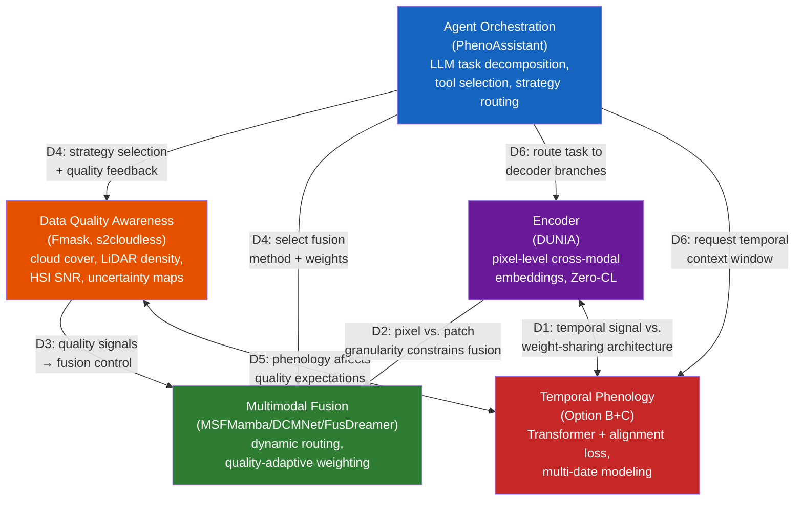

# A Design-Space Perspective on Remote Sensing-based Vegetation Phenotyping: With Implications for Forest Monitoring

## Abstract

Vegetation phenotyping—encompassing both agricultural crop monitoring and forest structural assessment—stands at a critical juncture in mid-2026. Four technological streams—foundation models, dynamic multimodal fusion, pixel-level contrastive representation learning, and LLM-based agent orchestration—have each produced mature components, yet no system integrates all four. This survey provides a systematic design-space analysis of forest phenotyping through five orthogonal dimensions: encoder design, multimodal fusion strategy, agent orchestration, temporal phenology modeling, and data quality awareness. For each dimension, we enumerate candidate architectural choices, compare them on quantitative benchmarks derived from original papers, and identify selection rationales grounded in verified experimental evidence. We further analyze cross-dimensional dependencies that preclude independent optimization, propose an integration roadmap built on validated components (DUNIA pixel-level embeddings, DCMNet dynamic routing, PhenoAssistant agent orchestration, TaxoNet dual-margin long-tail balancing), and define a QUEST-Forest evaluation framework with forest-specific metrics including tail-recall, cost-weighted error rates, and open-set detection benchmarks. We conclude by cataloging specific validation experiments required to bridge the five remaining gaps, each formulated as a falsifiable hypothesis with proposed experimental design.

---

## 1. Introduction

Global forests sequester approximately 7.6 billion metric tons of CO₂ annually, regulate regional hydrological cycles, and harbor 80% of terrestrial biodiversity [1]. Accurate, scalable forest phenotyping—the quantitative characterization of tree species composition, structural parameters (height, diameter at breast height, canopy cover), and physiological states (leaf area index, phenological stage, stress indicators)—is foundational to climate change mitigation, precision forestry, and biodiversity conservation. Yet the current operational paradigm relies heavily on field inventories that cover less than 1% of forest area globally and are updated on 5–10 year cycles [2].

Remote sensing has partially closed this gap. Satellite constellations (Sentinel-1/2, Landsat, PlanetScope) provide wall-to-wall coverage at 10–30 m resolution; airborne laser scanning (ALS) campaigns such as France's Lidar HD program deliver point densities exceeding 40 pts/m² [3]; and unoccupied aerial vehicles (UAVs) equipped with RGB, multispectral, hyperspectral (HSI), and thermal sensors enable centimeter-level individual tree crown (ITC) observation. The challenge is no longer data scarcity but *data integration*: how to combine heterogeneous modalities—each with distinct spatial resolutions (0.05 m UAV to 250 m MODIS), spectral ranges (visible to shortwave infrared), and temporal cadences (daily to decadal)—into a coherent phenotyping pipeline.

A pivotal development arrived in April 2026 when Chen et al. published PhenoAssistant in *Nature Communications*, demonstrating that a large language model (LLM)-based multi-agent system could orchestrate computer vision tools, statistical analyses, and natural language explanations for plant phenotyping tasks with 100% tool selection accuracy [4]. PhenoAssistant marks the entry of agent-based orchestration into plant sciences, but its architecture reveals a structural limitation that defines the opportunity space for this survey: it orchestrates *which tool* processes *which sub-task*, but does not dynamically adjust *how* multimodal data are fused based on input quality or scene context. The fusion strategies of the underlying vision models remain static, predetermined at design time.

This limitation is symptomatic of a broader fragmentation. If one surveys the literature from 2023 to 2026, one observes what the Timeline Analysis in prior work termed "four rivers flowing in parallel":

- **River A (Foundation Models)**: CLIP (2021), MAE (2022), SAM (2023), and DINOv2 (2023) have continuously delivered pretraining paradigms—contrastive cross-modal alignment, masked reconstruction, and self-supervised visual features—that downstream remote sensing models increasingly rely upon for weight initialization and few-shot transfer.
- **River B (RS Multimodal Fusion)**: From MSFMamba's static selective state-space fusion (Houston2013 OA 92.86%, 2024) [6] through DCMNet's data-driven dynamic routing (Houston2013 OA 95.11%, Trento OA 98.96%, 2025) [7] to IFGNet's Kolmogorov-Arnold Network (KAN)-based implicit frequency aggregation (Houston2013 OA 99.37%, 2026) [8], fusion strategies have evolved from designer-specified to data-dependent, and recently toward functionalized.
- **River C (Contrastive Representation Learning)**: DUNIA's pixel-level cross-modal contrastive framework [9] achieved zero-shot tree height estimation with RMSE 2.0 m (r = 0.93), surpassing the supervised SOTA of 5.2 m [9]. TaxoNet's dual-margin contrastive loss addressed long-tail plant classification, yielding a +5.1 pp macro-recall gain on Google Auto-Arborist [10].
- **River D (Agent Orchestration)**: PhenoAssistant (2026) demonstrated LLM-orchestrated multi-agent tool chaining [4]; SAGE (2026) proved that training-free, source-grounded knowledge-base reasoning improves crop disease diagnosis by an average of 16.2 percentage points [11]; LEMON (2026) introduced counterfactual reinforcement learning for optimal multi-agent orchestration specification [12].

Each river has produced state-of-the-art components, yet none addresses all five requirements simultaneously: (a) pixel-level cross-modal representation, (b) data-quality-adaptive dynamic fusion, (c) temporal phenology awareness, (d) long-tail species balance, and (e) agent-based orchestration. The components are individually mature but architecturally isolated.

This survey addresses this gap through a design-space analysis. Rather than proposing a new model, we systematically decompose a forest phenotyping system into five orthogonal design dimensions, enumerate the candidate solutions for each, compare them on quantitative benchmarks, and derive selection rationales. We then analyze cross-dimensional dependencies that make independent per-dimension optimization insufficient, and propose an integration roadmap composed exclusively of components whose capabilities have been empirically verified in published work. The contributions of this survey are threefold:

1. **A five-dimensional design-space framework** that maps the architectural decision points in building an integrated forest phenotyping system, with each dimension's candidate space populated from the 2023–2026 literature.
2. **Quantitative selection rationales** grounded in original paper results rather than qualitative claims—every recommendation is supported by specific numerical comparisons (e.g., "DUNIA's tree height RMSE of 1.3 m vs. AnySat's 2.8 m under 100% labels justifies DUNIA as the base encoder" rather than "DUNIA is better").
3. **A validation roadmap** comprising concrete, falsifiable experiments for each remaining gap, framed as "needs verification" hypotheses rather than speculative "will achieve" claims.

---

## 2. Background: Forest Phenotyping Tasks and Modalities

### 2.1 Core Tasks

Forest phenotyping encompasses three families of tasks: (i) **species identification**—assigning taxonomic labels at the species or genus level to individual trees or homogeneous forest patches; (ii) **structural parameter extraction**—estimating height, crown diameter, diameter at breast height (DBH), canopy cover fraction, and plant area index (PAI); and (iii) **phenological monitoring**—tracking seasonal transitions (budburst, leaf expansion, peak greenness, senescence, leaf fall) and detecting anomalies induced by drought, pest outbreaks, or pathogen invasion.

Species identification in natural forests is particularly challenging. PureForest, the largest ALS-based tree species dataset, covers 18 species across 339 km² in southern France [3]. PlantD (Planted) spans 64 species/ genera at global scale but lacks LiDAR coverage [14]. Both exhibit severe class imbalance: in PureForest, oak (Quercus spp.) and beech (Fagus sylvatica) dominate, while rare species such as chestnut (Castanea sativa) have orders of magnitude fewer samples. In PlantD, oil palm (21%), loblolly pine (9%), and eucalyptus (12%) together account for 42% of samples.

Structural parameter extraction has benefited most from ALS. DUNIA's zero-shot retrieval achieved tree height RMSE 2.0 m (r = 0.93), canopy cover RMSE 11.7% (r = 0.89), and PAI RMSE 0.71 (r = 0.75) using KNN=50 with a retrieval database of only 50K labeled pixels [9]. Fine-tuning further reduced height RMSE to 1.3 m (r = 0.95). These numbers are competitive with—and in zero-shot setting, surpass—dedicated supervised methods such as FORMS (height RMSE 5.2 m).

Phenological monitoring remains the least automated of the three tasks. Existing phenology datasets are sparse: DeepPhenoTree provides RGB images of apple trees at three phenological stages (flowering, fruitlet, fruit) across four European sites [15]; PASTIS offers parcel-level crop type labels in France but not phenological stage labels [16]; and satellite-derived phenology products (MCD12Q2, MODIS phenology) operate at 500 m resolution, far coarser than the ITC scale required for forest phenotyping.

### 2.2 Core Modalities and Complementarity

Five remote sensing modalities form the sensor portfolio for forest phenotyping, each with distinct physical principles and complementary information content:

**RGB / Very High Resolution (VHR) optical imagery** (0.05–0.5 m from UAV or airborne platforms) captures fine-grained textural and morphological features of individual tree crowns. PureForest's ORTHO HR imagery (0.2 m, NIR-R-G-B bands) enables visual species discrimination by crown shape, branching pattern, and shadow geometry. However, RGB alone is insufficient: ResNet-18 trained on PureForest VHR imagery achieved only 73.1% OA, compared to 83.6% for LiDAR with elevation metadata [3].

**Multispectral imagery (MSI)** from Sentinel-2 (10–20 m, 10 bands) and Landsat (30 m) extends the spectral range into the red-edge and shortwave infrared regions critical for vegetation health assessment. The normalized difference vegetation index (NDVI), enhanced vegetation index (EVI), and normalized burn ratio (NBR) derived from MSI time series are workhorse indicators for phenological stage detection. PlantD demonstrated that a Video Vision Transformer with 3D patch embedding on Sentinel-2 temporal stacks achieves ~62% macro-F1 for 64-class species identification [14].

**Hyperspectral imagery (HSI)** captures hundreds of contiguous narrow spectral bands, enabling discrimination of species with subtle spectral differences. HSI-based fusion methods (DCMNet, DFFNet, IFGNet) have been the primary testbed for dynamic fusion research, with Houston2013 and Trento datasets serving as standard benchmarks [7], [8]. The key limitation is sensor availability: spaceborne HSI (PRISMA, EnMAP, DESIS) provides 30 m resolution with 14–27 day revisit, while airborne HSI campaigns are research-grade and spatially sparse.

**LiDAR** (airborne laser scanning, terrestrial laser scanning, or spaceborne such as GEDI) provides direct three-dimensional structural measurements. ALS point clouds at PureForest's 40 pts/m² density enable precise tree height, crown delineation, and vertical stratification. GEDI's full-waveform LiDAR, with ~25 m footprint spacing and global coverage between 51.6°N and 51.6°S, has become the primary training signal for cross-modal representation learning: DUNIA's Zero-CL loss aligns Sentinel-1/2 pixel embeddings with GEDI waveforms, encoding vertical structure into pixel-level representations [9]. The fundamental limitation is temporal sparsity—GEDI has a non-repeating orbit and multi-year revisit gaps for any given location.

**Synthetic Aperture Radar (SAR)** from Sentinel-1 (C-band, 10 m) and ALOS-2 (L-band, 30 m) provides all-weather, day-night imaging capability. SAR backscatter (VV, VH polarizations) is sensitive to canopy structure, surface roughness, and dielectric properties (moisture content). SAR's cloud-penetrating capability makes it the primary fallback modality when optical imagery is occluded—a capability exploited in PlantD's multi-source classification and in MSFMamba's HSI-SAR fusion experiments (Berlin OA 76.92%, Augsburg OA 91.38%) [6].

### 2.3 Existing Benchmark Datasets

Table 1 summarizes the three largest publicly available forest/plantation datasets.

| Dataset | Scale | Species | Modalities | Temporal | Key Limitation |
|---------|-------|---------|------------|----------|----------------|
| PureForest [3] | 339 km², 135K patches | 18 (13 classes) | ALS (40 pts/m²) + VHR (0.2 m) | Single-epoch | No satellite, no temporal |
| PlantD [14] | Global, 2.26M samples | 64 species/genera | S-1, S-2, L-7, ALOS-2, MODIS | Multi-year temporal | No LiDAR |
| CitrusFarm [17] | 1.3 TB, 7.5 km traverse | 3 citrus varieties | 9 sensors (RGB, NIR, thermal, LiDAR, IMU, GNSS-RTK) | Single traverse | No semantic labels |

Three critical data gaps emerge: (1) no dataset simultaneously provides satellite time series, ALS point clouds, and ground-truth species labels at ITC resolution; (2) PhenoCam-style multi-year temporal labels (budburst date, leaf-fall date) are absent from all three datasets; and (3) physiological ground measurements (leaf chlorophyll content, water potential, photosynthetic rate) are not spatially co-registered with remote sensing acquisitions.

---

## 3. A Design-Space Perspective on Forest Phenotyping

We decompose a forest phenotyping system into five design dimensions. For each, we catalog the candidate architectural choices, compare them on quantitative benchmarks, and identify the selection rationale based on verified experimental evidence.

### 3.1 Encoder Design

The encoder transforms raw multimodal sensor data (multispectral pixels, SAR backscatter, LiDAR point clouds or waveforms) into a unified representation space. For forest phenotyping, the encoder must satisfy several requirements simultaneously: pixel-level spatial granularity (for ITC-level analysis), cross-modal alignment (at minimum MSI + SAR + LiDAR), zero-shot or few-shot capability (forest ground truth is scarce), and—ideally—temporal phenology awareness.

#### 3.1.1 Candidate Methods

Seven encoder paradigms have been evaluated under unified experimental settings in the DUNIA paper [9] (pretraining on 836K Sentinel-1/2 patches + 19M GEDI waveforms, 250K steps, identical downstream tasks). Table 2 presents the key quantitative comparisons for the forest-relevant downstream tasks.

| Dimension | DUNIA [9] | AnySat [18] | CROMA [19] | SatMAE [20] | DOFA [21] | Scale-MAE [22] | DeCUR [23] |
|-----------|-----------|-------------|------------|-------------|-----------|---------------|------------|
| Venue | arXiv 2025 | CVPR 2025 | NeurIPS 2023 | NeurIPS 2022 | arXiv 2024 | ICCV 2023 | AAAI 2024 |
| Pretraining | Contrastive + Reconstruction | Multi-modal fusion | Contrastive + MAE | Masked Reconstruction | MAE + Dynamic Weights | MAE + Scale Embed | Contrastive (disentangled) |
| Modalities | S-1+S-2+GEDI | S-1+S-2+VHR+Temporal | S-1+S-2 | S-2 | Any optical | Multi-res optical | S-1+S-2 |
| Granularity | Pixel-level (10 m) | Patch-level | Patch-level (8×8) | Patch-level (8×8) | Patch-level | Patch-level | Patch-level |
| Fine-tuned Height (RMSE) | **1.3 m** (r=0.95) | 2.8 m (r=0.89) | 3.5 m (r=0.78) | 10.5 m (r=0.52) | 11.0 m (r=0.51) | — | 11.0 m (r=0.55) |
| Fine-tuned Species (wF1, PF) | 82.2 | **82.3** | 80.5 | 78.8 | 79.8 | — | 78.9 |
| 20% Labels Height (RMSE) | **1.4 m** (r=0.93) | 2.8 m (r=0.89) | 3.6 m (r=0.76) | 10.5 m (r=0.52) | 11.2 m (r=0.50) | — | 11.1 m (r=0.52) |
| Temporal Support | Single median composite | Native multi-temporal | Static | Temporal masking | Static | Multi-scale spatial | Static |
| Inference (20 km²) | **4.22 s** | 177 s | — | — | — | — | — |
| Open-source | Yes | Yes | Yes | Yes | Yes | Yes | Yes |

DUNIA's zero-shot performance is particularly relevant for forest scenarios with limited ground measurements. With KNN=50 and a retrieval database of 50K labeled pixels (~31 km², approximately 0.25% of the data required by supervised methods), DUNIA achieves: tree height RMSE 2.0 m (r = 0.93) vs. supervised SOTA FORMS at 5.2 m (r = 0.77); canopy cover RMSE 11.7% (r = 0.89) vs. FORMS 22.1% (r = 0.54); PAI RMSE 0.71 (r = 0.75) vs. FORMS 1.5 (r = 0.35); and tree species wF1 76.0% (KNN=5) vs. supervised SOTA 74.6% [9].

#### 3.1.2 Selection Rationale

**DUNIA is recommended as the base encoder** for the following evidence-supported reasons, mapped to the design requirements:

- **Pixel-level granularity (P0 requirement)**: DUNIA is the only method in the comparison achieving pixel-level cross-modal embeddings (64-dim output projection, 10 m/pixel). AnySat, CROMA, SatMAE, and DOFA all output patch-level embeddings, which are insufficient for ITC-level parameter mapping. The individual tree crown—typically spanning 3–30 m²—requires pixel-level spatial precision.
- **Cross-modal fusion (P0 requirement)**: DUNIA's Zero-CL loss achieves cross-modal alignment between Sentinel-1/2 pixels and GEDI waveforms with positive-pair cosine similarity of 0.86, compared to 0.56 for VICReg under identical batch conditions (average ~26 waveforms per batch) [9]. The ZCA whitening step that enables this was an architectural innovation specifically motivated by the sparsity of waveform samples per batch.
- **Zero/few-shot capability (P0 requirement)**: DUNIA's zero-shot tree height (RMSE 2.0 m) already surpasses the fully supervised FORMS baseline (5.2 m). At 20% label fraction, vertical structure performance is near-lossless (RMSE 1.4 m vs. 1.3 m at full labels, a negligible 0.1 m degradation). This label efficiency is critical for forest applications where ground measurements are expensive and sparse.
- **Computational efficiency**: DUNIA trains on a single A6000 48GB GPU. Inference on a 20.48 × 20.48 km area (4.2M pixels) completes in 4.22 s, compared to AnySat's 177 s (~40× slower). This single-GPU feasibility enables region-specific retraining, which is essential given the known domain sensitivity of pretrained forest models.

**Why not AnySat?** AnySat achieves the best classification performance (PureForest wF1 82.3, PASTIS wF1 81.1) and has native multi-temporal support. However, its patch-level output cannot perform pixel-level tree crown parameter mapping. Its vertical structure estimation is significantly weaker (height RMSE 2.8 m vs. DUNIA 1.3 m, a 1.5 m gap), and inference is 40× slower, making it impractical for large-area forest monitoring. AnySat's strategic value is as a *complement* to DUNIA: its temporal patch embeddings can supply the phenological signal that DUNIA currently lacks.

**Why not SatMAE/DOFA?** These MAE-based optical-only foundation models have no vertical structure awareness, producing tree height RMSE exceeding 10 m. The MAE paradigm requires substantial labeled fine-tuning data, and neither method provides zero-shot capability. Their optical-only design precludes integration of LiDAR and SAR, which are indispensable for forest structural parameter estimation.

#### 3.1.3 Identified Gap: Temporal Phenology

DUNIA's single most significant limitation is its reliance on a single leaf-on season median composite as input. This design choice directly causes a substantial drop in zero-shot crop classification on PASTIS: DUNIA achieves OA 56.2% compared to supervised SOTA at 84.2% (a 28 pp gap) and AnySat with multi-temporal input at 81.1% (a 24.9 pp gap). For forest phenotyping, where the spectral contrast between leaf-on and leaf-off states is the primary discriminant for deciduous species identification, this limitation is structural rather than incidental.

DUNIA's multi-temporal autoencoder (UNet + ConvLSTM, 3 time steps at 4-month intervals) was designed as an auxiliary reconstruction module, not as a phenology-sensitive representation learner. The temporal average pooling step discards the temporal ordering information that is essential for distinguishing, e.g., an early-leafing oak from a late-leafing ash.

---

### 3.2 Multimodal Fusion Strategy

Given encoded features from multiple modalities (HSI, LiDAR, SAR, MSI), the fusion module must combine them into a joint representation for downstream classification or regression. The central design question is: *should the fusion strategy be static (fixed at design time), data-driven (learned from feature statistics), or context-dependent (informed by external signals such as data quality, phenological stage, or task specification)?*

#### 3.2.1 Candidate Methods

Table 3 compares the five leading fusion paradigms on quantitative benchmarks. All numbers are from the original papers; "*" indicates few-shot settings (~20 samples/class); other results are full supervision (~150–200 samples/class). Note that IFGNet was not evaluated on Trento; FusDreamer was evaluated under few-shot settings.

| Method | Year | Core Mechanism | Houston2013 OA | Houston2013 Kappa | Trento OA | Params | Inference |
|--------|------|---------------|----------------|-------------------|-----------|--------|-----------|
| **MSFMamba** [6] | 2024 | Selective SSM + dual-input cross-parameterization | 92.86 | 92.25 | — | 1.53M | 0.175 s |
| **DCMNet** [7] | 2025 | 3-layer dynamic routing with bilinear attention | 95.11 | 94.69 | **98.96** | 3.83M | 0.010 s |
| **DFFNet** [24] | 2025 | Dynamic frequency-domain filter kernel + channel shuffle | 92.35 | 91.70 | — | 1.28M | 0.239 s |
| **FusDreamer** [25] | 2025 | Latent diffusion + CLIP-guided prompt alignment | 89.24* | 90.15* | 96.36* | Large | 16–67 s |
| **IFGNet** [8] | 2026 | KAN B-spline implicit spatial-frequency aggregation | **99.37** | **99.32** | — | Light | Fast |

*Note: Inference times are reported as stated in the original papers and may not be directly comparable due to differences in hardware (GPU model, batch size) and software implementation (framework, optimization level). They are included as indicative order-of-magnitude references for deployment feasibility assessment rather than precise benchmarking comparisons.*

**MSFMamba (2024)** introduced the selective state-space model (Mamba) to multimodal fusion, achieving linear O(n) complexity in sequence length while providing multi-scale spatial scanning (dual-resolution, 4-direction) and cross-modal SSM parameterization (Fus-Mamba: one modality generates the A/B/C/Δ parameters for processing the other). On Houston2018, it achieved OA 92.38%, and on Augsburg (HSI+SAR) 91.38%. Its key architectural advantage—the Fus-Mamba block's dual-input design naturally accepts a third input source—makes it the most amenable to agent-controlled fusion among the five candidates [7].

**DCMNet (2025)** marked the transition from static to dynamic fusion. Its three-layer fully-connected routing space deploys three parallel feature interaction blocks per layer (spatial bilinear cross-attention BSAB, channel bilinear cross-attention BCAB, and integrated convolution ICB), with a routing gate that generates path probabilities from feature statistics: W_k_i = max(0, Tanh(FC_2(ReLU(FC_1(F_h + F_l + X_k_i))))). The "dynamic" here is *network-learned data dependency*—routing adapts to feature statistics of the input patch but does not perceive external data quality or scene context. On Trento, OA reached 98.96%, AA 97.55%, Kappa 98.61% [7].

**DFFNet (2025)** shifted dynamic fusion to the frequency domain. Its dynamic filter block (DFB) applies 2D FFT to input features, generates a dynamic frequency kernel via GAP+MLP+Softmax weighted combination of learnable basis filters, and filters irrelevant frequency components before IFFT reconstruction. At 1.28M parameters and 0.239 s inference, it achieves Houston2013 OA 92.35%. The frequency-domain approach is particularly relevant for phenology modeling because different phenological stages exhibit distinct frequency signatures: growing season exhibits high-frequency texture from active leaf expansion, while dormant season exhibits low-frequency smoothness.

**FusDreamer (2025)** introduced the world model paradigm: a latent diffusion model (LaMG) generates a unified multimodal representation container, while CLIP-based open-world knowledge-guided consistency projection (OK-CP) enables text-prompt-driven fusion alignment. It is the only method tested under few-shot settings (13–18 samples/class on Trento, achieving OA 96.36%). The text-prompt interface is uniquely suited for agent control—an agent can inject phenological context, task specification, and quality assessments as natural language prompts without any architectural modification to the fusion network [25].

**IFGNet (2026)** achieved the highest reported accuracy (Houston2013 OA 99.37%, Kappa 99.32%) by replacing fixed activation functions with KAN B-spline functions, which model continuous nonlinear relationships through learnable spline coefficients. Its spatial implicit aggregation unit (SIAU) uses LiDAR-guided KAN-based neighborhood feature sampling: v(k)_q = Φ_KAN([f_HSI_xk, f_LiDAR_q, q - xk]). The B-spline local support property is naturally suited for modeling gradual phenological transitions. However, IFGNet's code is not open-source as of the original paper's publication, limiting reproducibility [8].

#### 3.2.2 Selection Rationale

The fusion strategy should be a composite rather than a single method, selected per-scenario based on the following evidence:

- **For efficiency-critical large-area deployment**: **MSFMamba** is recommended. Its O(n) linear complexity, 1.53M parameter footprint, and 0.175 s inference time make it the only method practical for wall-to-wall forest cover mapping at regional scales. The Fus-Mamba architecture's natural support for a third input source (agent conditioning) provides the cleanest integration path for agent-controlled fusion.
- **For accuracy-critical species classification**: **DCMNet** routing offers the highest verified accuracy on heterogeneous scenes (Trento OA 98.96%, Houston2013 OA 95.11%). Its routing gate accepts a single vector input, making agent-condition injection architecturally straightforward (~10 lines of code: adding an agent context embedding to the FC layer input).
- **For phenology-aware fusion**: **DFFNet's** frequency-domain filtering is conceptually closest to phenological signal processing. The dynamic frequency kernel K(X) = Softmax(MLP(GAP(X))) ⊗ F_base can in principle learn different band-pass characteristics for different phenological stages, though this specific capability has not been empirically verified.
- **For few-shot deployment with agent integration**: **FusDreamer** is the only method that combines few-shot robustness with a natural language control interface. The zero-architecture-modification path for agent control (replacing hard-coded prompts with agent-generated prompts) makes it suitable for rapid prototyping of agent-controlled fusion, albeit with significant inference latency (16–67 s per sample).

#### 3.2.3 Identified Gap: External Quality Signal Injection

All five methods share a common blind spot: their fusion decisions are based on *internal feature statistics* (DCMNet's gating input is F_h + F_l + X; DFFNet's kernel generation uses GAP of input features; MSFMamba's SSM parameters are generated from the paired modality's features). None receives an *external quality signal* that tells the fusion module about the acquisition conditions—cloud cover fraction, LiDAR point density, SAR coherence, or noise level. This gap is structural: it is not a failure of individual methods but a missing interface between the quality assessment layer and the fusion layer. We return to this in Section 3.5.

---

### 3.3 Agent Orchestration

The agent orchestrator accepts a user's natural language description of a phenotyping task, decomposes it into executable sub-tasks, selects appropriate vision models and analytical tools, monitors execution, and aggregates results. The central design tension is between *reliability* (guaranteed correct tool selection and execution) and *adaptability* (capacity to handle open-ended, previously unseen task specifications).

#### 3.3.1 Candidate Methods

Three agent paradigms have been demonstrated in the plant/foresetting domain, with quantitative evaluation results available for two:

**PhenoAssistant (2026)** [4] employs a centralized multi-agent architecture: a Manager Agent (GPT-4o, temperature = 0.1) receives natural language instructions, generates a step-wise plan, and dispatches tasks to a toolkit comprising vision model zoo (Mask2Former, Leaf-only SAM, DINOv2-base with LoRA fine-tuning), phenotyping extraction tools, code writer, data visualizer, plot analyzer (Pandas AI-based), table analyzer, RAG agent, and deterministic statistical modules (ANOVA, Tukey-Kramer post-hoc). Tools are exposed via structured schemas (name, description, parameters, I/O format) built on the AutoGen framework. Evaluation on 20 manually designed tasks yielded: tool chain rationality 4.25/5 (4.35/5 with Critic Agent), tool existence 5.00/5, tool appropriateness 4.65/5 (4.90/5 with Critic), argument correctness 4.30/5 (4.40/5 with Critic). Vision model type recommendation achieved 100% accuracy (50/50 tasks); vision model exact match achieved 100% accuracy (20/20 tasks). Data analysis tasks achieved 85% accuracy (17/20); all three failures were attributed to fine-grained visual reasoning by the Plot Analyser—the LLM misinterpreted chart elements, indicating that LLM-based visual reasoning remains the primary bottleneck [4].

**SAGE (2026)** [11] employs a training-free agentic reasoning pipeline for crop disease diagnosis: organ identification → anatomy-indexed filtering (retaining only diseases affecting detected plant parts) → source-grounded knowledge base (KB) symptom matching → sequential reference image comparison with limited budget k → prediction with full reasoning trace. The source-grounded KB contains structured symptom facts extracted from web sources by LLM, with original citations, and audited by domain experts. Introducing the full pipeline (KB + k=8 reference images) improved diagnostic accuracy by an average of 16.2 percentage points over the k=0 no-KB baseline [11]. Per-crop results at k=8 with KB: soybean 48.6% (vs. 31.1% baseline), maize 60.2% (vs. 42.0%), tomato 76.1% (vs. 52.3%), mango 97.5% (vs. 92.5%). Controlling for the reference budget, the pure KB contribution at k=8 averaged approximately +6.2 pp, with gains per crop ranging from +2.7 pp (soybean) to +9.1 pp (tomato). The agentic pipeline outperformed few-shot classification by 8.1 percentage points on average under equal reference budget. Failure modes were concentrated in cases where visual ambiguity overrode KB evidence (e.g., anthracnose vs. charcoal rot in stem diseases) [11].

**LEMON (2026)** [12] introduced counterfactual reinforcement learning for optimizing multi-agent orchestration specifications. Using Group Relative Policy Optimization (GRPO) with local counterfactual signals on role/capability/dependency fields, LEMON learns to generate optimal orchestrator configurations. It achieved SOTA on MMLU, GSM8K, AQuA, MultiArith, SVAMP, and HumanEval benchmarks. While LEMON has not been applied to plant/forest phenotyping, its methodology is directly transferable: the agent orchestration policy (which models to invoke, in what order, with what parameters) under different data quality conditions could be learned via RL rather than hard-coded.

#### 3.3.2 Selection Rationale

**The LLM should orchestrate, not perceive.** PhenoAssistant's failure analysis provides the critical evidence: all 3/20 data analysis task failures were due to LLM fine-grained visual reasoning errors, while tool selection achieved 100% accuracy. This asymmetry indicates that LLMs are reliable *orchestrators* (selecting which tool to use) but unreliable *perceivers* (interpreting fine-grained visual or quantitative data). The correct architectural separation is:

- **Manager Agent (LLM)**: Task decomposition, tool selection, parameter specification, result aggregation, natural language explanation.
- **Dedicated Vision Models**: Segmentation (Mask2Former, SAM), feature extraction (DUNIA encoder), classification (DCMNet fusion head), structural parameter estimation.
- **Deterministic Modules**: Statistical tests (ANOVA, Tukey-Kramer), quantitative phenotyping computations (LAI from crown area, height from CHM), database queries.

SAGE's anatomy-indexed filtering provides a transferable design pattern for forest species identification: a structured forestry knowledge base (e.g., digitized *Flora of China*, regional forest inventory data) can perform organ/region/phenology-indexed filtering to narrow the candidate species set before invoking a vision classifier. The critical requirement is source-grounding—every knowledge base entry must carry a verifiable citation—to enable expert audit of agent reasoning.

#### 3.3.3 Identified Gap: From Tool Orchestration to Fusion Strategy Orchestration

PhenoAssistant orchestrates *which tool* processes *which sub-task*, but does not adjust *how* multimodal data are fused. The Manager selects Mask2Former for segmentation and DINOv2 for classification, but does not—and architecturally cannot—instruct the fusion module to weight LiDAR over HSI when cloud cover is detected, or to invoke frequency-domain filtering when analyzing phenological transitions. This gap is not a limitation of the LLM's reasoning capability but of the system architecture: the Manager has no interface to the fusion module's decision layer, and the fusion module has no exposed parameters that accept external control signals.

---

### 3.4 Temporal Phenology Modeling

Forest phenology—the seasonal cycling of biological events (budburst, leaf expansion, peak photosynthetic activity, senescence, leaf fall)—provides the single most information-rich temporal signal for species discrimination in temperate and boreal forests. Deciduous species that are spectrally nearly identical during peak summer (e.g., Quercus robur vs. Quercus petraea) exhibit distinct temporal trajectories: differences in budburst date (often 1–3 weeks), leaf expansion rate, and senescence onset create separable signatures when temporal context is available.

#### 3.4.1 Why Temporal Modeling Is Critical

The evidence for temporal information's importance is both positive and negative. Positively, AnySat achieves PASTIS classification wF1 81.1 with native multi-temporal input, while DUNIA—using a single median composite—achieves only 77.0 under fine-tuning and 56.2% under zero-shot [9]. This gap (28 pp vs. supervised SOTA at 84.2%, and 24.9 pp vs. AnySat at 81.1%) is a direct quantification of the value of temporal information for vegetation classification. Negatively, Bejide (2026) identified "temporal recovery asynchrony" as one of seven core inconsistency drivers in forest ecosystem representation, accounting for 7.8% of reported inconsistencies across 181 reviewed studies [26]. The "green desert" phenomenon—where spectrally recovered canopy greenness masks persistent structural degradation and functional loss—can only be detected through temporal analysis: a single post-disturbance image shows "green," but a time series reveals that the greenness is from fast-recovering herbaceous understory, not the original tree species.

Gauli et al. (2026) demonstrated the feasibility of temporal machine learning in complex forest terrain: 13 years of VIIRS fire radiative power data over Nepal Himalayas, with spatio-temporal clustering (0.25° grid, 2-day tolerance) aggregating 569,136 fire detections into 11,595 discrete fire events, achieved cross-ecoregion R² = 0.683–0.757 [27]. Their methodology—spatio-temporal event aggregation, terrain-wind interaction feature engineering—is directly transferable to phenological event detection.

#### 3.4.2 Candidate Methods

Three temporal encoding strategies have been explored in the reviewed literature:

**Option A: Input-level multi-temporal concatenation.** Multiple dates of Sentinel-2 imagery are concatenated along the channel dimension, forming [B, T×C, H, W] tensors fed to a standard spatial encoder. This is the approach used by AnySat [18] and serves as a pragmatic baseline. Advantages: minimal architectural change, reuse of existing encoder weights. Limitations: CNN local convolutions see only temporally adjacent pixels; the model is insensitive to temporal order (shuffling image dates produces nearly identical representations); no concept of time distance (distinguishing 5-day vs. 50-day separation requires explicit positional encoding).

**Option B: Encoder-internal Temporal Transformer.** Each time step is independently encoded by a shared-weight spatial encoder, producing per-timestep patch embeddings z_t. A Day-of-Year (DOY) sinusoidal positional encoding is added: PE(DOY, 2i) = sin(DOY/365 × 10000^{2i/d}), PE(DOY, 2i+1) = cos(DOY/365 × 10000^{2i/d}). Multi-head self-attention is applied across the temporal dimension: Attention(Q, K, V) = softmax(QK^T/√d_k + M)V, where M is a temporal mask (bidirectional for offline analysis, causal for online monitoring). TSP-Former (2025) demonstrated this approach for tobacco mapping with Sentinel-2 time series [28]; an efficient ViT-based spatio-temporal vegetation classifier (2026) applied 3D patch embedding with temporal positional encoding to UAV RGB time series for full-cycle vegetation phenotyping [29].

**Option C: Post-hoc temporal alignment loss.** The encoder remains unchanged (single-image inference); temporal information is injected exclusively through auxiliary loss functions applied to the embedding space. Three components compose the loss: (i) smoothness loss L_smooth = Σ_t ||e_t − e_{t+1}||² · exp(−α·|DOY_t − DOY_{t+1}|); (ii) cyclic loss L_cyclic = ||e_1 − e_T||² · exp(−α·(365 − |DOY_T − DOY_1|)); (iii) identity loss L_identity = Σ_t ||e_t − mean(e)||², which penalizes excessive deviation from the canopy's "identity vector." The geometric interpretation is a "phenology tube" in embedding space: each tree crown's seasonal trajectory is constrained to lie within a tube of radius τ around its identity center, while different species' tubes must remain separated.

Table 4 compares the three options on key design dimensions.

| Dimension | Option A: Input Concat | Option B: Temporal Transformer | Option C: Temporal Alignment Loss |
|-----------|----------------------|-------------------------------|----------------------------------|
| Encoder modification | None (input only) | Large (new temporal module) | None (loss only) |
| Temporal dependency modeling | Implicit (CNN local) | Explicit (global attention) | None (loss-level only) |
| Variable-length sequences | No | Yes | Yes |
| Computational overhead | ~1× (baseline) | ~1.5–4× (depending on T) | ~1× |
| Time-position awareness | No | Yes (DOY PE) | Partial (via loss) |
| Compatibility with DUNIA Zero-CL | Yes | Yes (requires adaptation) | Yes (parallel use) |

#### 3.4.3 Selection Rationale

**Option B (Temporal Transformer) + Option C (alignment loss) as regularization** is recommended. The justification is threefold:

1. *Input-level concatenation is insufficient for phenology.* CNN-based encoders operating on concatenated inputs are insensitive to temporal ordering. An encoder trained on April–July–October concatenation cannot distinguish a budburst-at-day-100 + senescence-at-day-300 pattern from a budburst-at-day-300 + senescence-at-day-100 pattern—yet these are ecologically opposite states.
2. *Post-hoc alignment cannot compensate for encoder blindness.* If the base encoder was trained on single-date medians (as DUNIA was), it has already learned to treat spectral features without temporal context. The same reflectance value in spring (indicating healthy budburst) and autumn (indicating delayed senescence) maps to the same encoding—the encoder simply lacks the temporal dimension needed to disambiguate.
3. *Temporal Transformer provides global context while maintaining compatibility.* The shared-weight spatial encoder preserves DUNIA's pixel-level cross-modal embeddings (Zero-CL with GEDI waveforms), while the temporal self-attention layers add phenological context that propagates gradient signals back to the spatial encoder through the Siamese architecture.

A practical deployment strategy suggested by existing results: start with 3 bimonthly Sentinel-2 composites (spring/ summer/ autumn) and Option A as a quick validation baseline to confirm temporal gain exists; then transition to 6–12 monthly composites with Option B for full phenological cycle modeling; finally add Option C as a regularizer to enforce smooth phenological trajectories.

#### 3.4.4 Identified Gap: No Method Does Both Cross-Modal Pixel Alignment and Temporal Phenology

DUNIA achieves pixel-level cross-modal alignment but is temporally static. AnySat achieves multi-temporal classification but is patch-level with weak vertical structure. No existing method simultaneously provides: (a) pixel-level cross-modal embeddings (DUNIA's strength), (b) temporal phenology awareness (AnySat's strength), and (c) zero-shot forest parameter estimation (DUNIA's unique capability). Closing this gap requires extending DUNIA's encoder with a Temporal Transformer module while preserving its Zero-CL loss and dual-decoder architecture, then jointly pretraining on multi-temporal Sentinel-1/2 + GEDI waveform data. The specific experimental design for validating this integration is outlined in Section 6.

---

### 3.5 Data Quality Awareness

Remote sensing data quality is inherently variable and unpredictable. Cloud cover can render 30–70% of optical pixels unusable in tropical and temperate regions; LiDAR point density varies with flight parameters, terrain, and canopy closure; SAR coherence degrades over water bodies and in areas of rapid surface change; and HSI pushbroom sensors can exhibit striping artifacts. A forest phenotyping system deployed outside curated benchmark datasets must explicitly reason about input quality and adapt its fusion strategy accordingly.

#### 3.5.1 What Exists: Mature Quality Assessment Components

The individual building blocks for data quality assessment are production-ready:

- **Cloud and cloud shadow detection**: Fmask [30] (85–90% F1, CPU ms-level), s2cloudless (LightGBM, 88–92%), CloudMaskNet (DeepLabV3+, 92–96%), and spatial-temporal CD-FM3SF (94–97%) provide pixel-level cloud masks for Sentinel-2 and Landsat.
- **LiDAR point density and quality**: Point density (points/m²), return number distribution, scan angle, and ground point ratio are standard metrics in LAS/LAZ metadata. GEDI L2A/L4A products include per-footprint quality flags from NASA's official processing pipeline.
- **HSI noise estimation**: HSI-SDeCNN (2022) outputs simultaneous destriping and noise estimation; HyMiNoR estimates mixed Gaussian + striping + impulse noise.
- **Uncertainty quantification**: UnCRtainTS (2023, CVPR Workshop, 69 citations) produces per-pixel uncertainty maps for cloud removal in optical satellite time series—these uncertainty maps can serve directly as quality inputs to an agent module [31].

The key finding from the design space survey is blunt: **no existing paper has built an end-to-end system that connects data quality assessment to adaptive fusion strategy selection**. This is an identified literature gap, not a component-availability gap. The three pieces—quality assessment, dynamic fusion, and agent orchestration—each have mature technical foundations, but the connectors between them have not been built.

#### 3.5.2 What Exists: Missing Modality and Quality-Adaptive Training

The Missing Modality (MM) community provides the closest technical precedent. ActionMAE (AAAI 2023 Oral) demonstrated that training with random modality dropout (30–50% probability) + MAE reconstruction regularization produces models robust to missing modalities at inference [33]. Key finding: Transformer-based fusion is more robust to missing modalities than sum/concat fusion. M3L (2023) uses a Teacher-Student paradigm: the Teacher trains on full-modality data, the Student trains on masked modalities with KL distillation, learning to approximate full-modality performance from partial inputs [34].

These MM techniques map directly onto the quality-adaptive fusion problem. Cloud occlusion is equivalent to modality dropout (the affected pixels carry no useful signal); low LiDAR point density is equivalent to modality noise (the structural signal is degraded but not absent). The mapping suggests a quality-adaptive dropout training strategy: `drop_prob[modality] = 1.0 - quality_score[modality]`. During training, higher-quality modalities are preserved, while lower-quality modalities are dropped with probability proportional to their quality deficit. This strategy has not been empirically validated for remote sensing fusion, but the underlying mechanism (ActionMAE dropout + quality-dependent probability) is a direct and principled extension of verified techniques.

Provable Dynamic Fusion (Zhang et al., 2023, ICML) provides theoretical guarantees: under certain assumptions, dynamic fusion with learned modality confidence scores minimizes joint prediction error, and when some modalities have extremely low quality, the fusion gracefully degrades to single-modality prediction [35]. Predictive Dynamic Fusion (2024) implements this via a lightweight predictor that estimates each modality's contribution to the final task from its features alone [36]. Both provide theoretical and empirical foundations for quality-weighted fusion, but both learn quality weights implicitly from feature distributions rather than from explicit quality assessment modules.

#### 3.5.3 Identified Gap: The Quality→Fusion Mapping Interface

The core unresolved design question is: *given a quality vector q = [cloud_pct, lidar_density, hsi_snr, sar_coherence, phenology_stage], what fusion strategy should be selected?* The mapping from quality to strategy has neither empirical characterization nor theoretical guidance. Specific sub-gaps include:

- **GAP-1 (Quality-to-strategy mapping)**: No ablation study has characterized how fusion strategy choice interacts with data quality levels. For example, at what cloud cover threshold does switching from HSI-dominant to LiDAR-dominant fusion become beneficial? At what LiDAR point density does structural information become too unreliable to use as the primary modality?
- **GAP-2 (Multi-dimensional quality fusion)**: Cloud cover, LiDAR density, HSI noise, SAR coherence, and phenological stage are incommensurable quality dimensions. How should they be fused into a unified quality signal? Simple linear weighted averaging, learned quality encoder, or agent-mediated reasoning?
- **GAP-3 (Quality-aware training data)**: Training data with controlled quality degradation is scarce. Synthetic augmentation (simulating cloud occlusion, LiDAR subsampling, HSI band noise) is the pragmatic path, but the fidelity of synthetic quality degradation to real acquisition artifacts requires validation.

---

## 4. Toward Integration: Cross-Dimensional Dependencies

The five design dimensions analyzed in Section 3 are not independent. Optimizing each in isolation leads to a locally optimal but globally incoherent system. This section identifies the critical cross-dimensional dependencies and proposes an integration roadmap.

### 4.1 Dependency Map

Figure 1 illustrates the five design dimensions and their six cross-dimensional dependencies.

**Dependency summary:**
| ID | Relationship | Type | Key implication |
|----|-------------|------|-----------------|
| D1 | Encoder ↔ Temporal | Bidirectional | Temporal strategy constrains encoder architecture (Siamese weight-sharing) |
| D2 | Encoder → Fusion | Unidirectional | Pixel-level embeddings enable spatially precise fusion decisions |
| D3 | Quality → Fusion | Unidirectional | Quality assessment must feed fusion control — a connection not yet built in any system |
| D4 | Agent ↔ Quality + Fusion | Bidirectional | Agent integrates quality assessment with strategy selection; forms the central control loop |
| D5 | Temporal ↔ Quality | Bidirectional | Phenological stage affects quality interpretation (leaf-on vs. leaf-off data reliability) |
| D6 | Agent → Encoder + Temporal | Unidirectional | Task specification determines which decoder outputs and time steps are relevant |

**D-1: Encoder ↔ Temporal Phenology (bidirectional).** The encoder determines what temporal information is accessible. A single-date encoder (DUNIA current) provides no temporal signal to downstream modules, regardless of how sophisticated the temporal modeling layer is. Conversely, the temporal modeling strategy feeds back into encoder design: if Option B (Temporal Transformer) is adopted, the spatial encoder must operate in Siamese mode with shared weights across time steps, and the decoder must preserve temporal consistency in cross-modal alignment (Zero-CL with GEDI waveforms applied independently at each time step, with temporal smoothness constraints).

**D-2: Encoder → Fusion (unidirectional).** The encoder's output granularity (pixel vs. patch) and embedding quality (cross-modal alignment strength) constrain what fusion strategies are viable. Pixel-level embeddings (DUNIA) enable spatially precise fusion, where each 10 m pixel independently participates in the fusion decision. Patch-level embeddings (AnySat, CROMA) constrain fusion to operate on aggregated spatial units, losing within-patch heterogeneity. The encoder's cross-modal alignment quality (cosine similarity 0.86 for DUNIA Zero-CL vs. 0.56 for VICReg) determines the reliability of cross-modal attention mechanisms in downstream fusion.

**D-3: Quality Awareness → Fusion (unidirectional).** This is the central unmet dependency. Quality assessment outputs (cloud mask, LiDAR density, HSI SNR, uncertainty maps) must be transformed into fusion control signals. The specific injection point depends on the fusion architecture: for DCMNet, quality signals are added to the routing gate input; for MSFMamba, quality signals contribute to B/C/Δ parameter generation in Fus-SSM; for FusDreamer, quality signals are encoded into text prompts. The choice of injection architecture creates a dependency: selecting a fusion method constrains how quality signals can be integrated.

**D-4: Agent Orchestration → Quality Awareness + Fusion (bidirectional).** The agent is the natural locus for integrating quality assessment with strategy selection. The agent can receive structured quality reports (cloud_pct=67, lidar_density=1.2e6, hsi_snr=23.4, phenology_stage="leaf_expansion"), reason about their implications ("cloud cover 67% exceeds the 30% threshold; prioritize LiDAR structural features; deciduous forest in leaf-expansion stage benefits from spectral differentiation"), and output a fusion strategy specification. However, the agent cannot bypass the quality→fusion interface identified in D-3—it can only control that interface if it exists.

**D-5: Temporal Phenology ↔ Quality Awareness (bidirectional).** Phenological stage affects quality expectations: leaf-off LiDAR in deciduous forests has higher ground point density and more reliable terrain models; leaf-on optical imagery has higher spectral information content for species discrimination. Conversely, quality degradation affects phenological signal reliability: a time step with 80% cloud cover in May may give a misleading "low greenness" signal that could be misinterpreted as delayed leaf expansion rather than data quality artifact.

**D-6: Agent Orchestration → Encoder + Temporal Phenology (unidirectional).** The agent's task specification determines which encoder outputs are relevant. A "map canopy height" task requires vertical structure embeddings (DUNIA's OV decoder output); a "classify tree species" task requires horizontal embeddings (OH decoder output) with temporal context; a "detect drought stress" task requires both with anomaly detection capability. If the agent orchestrates the fusion strategy, it must also be able to route encoder outputs appropriately—selecting which decoder branch, which time steps, and which embedding dimensions to forward to downstream modules.

### 4.2 Why Independent Optimization Fails

Consider a scenario where each dimension is optimized independently:
- Encoder: DUNIA is selected for pixel-level cross-modal embeddings (RMSE 1.3 m height, 4.22 s inference).
- Temporal: Option B (Temporal Transformer) is added on top.
- Fusion: DCMNet is selected for dynamic routing (Trento OA 98.96%).
- Quality: s2cloudless + LiDAR density metrics are computed.
- Agent: PhenoAssistant-style Manager dispatches tasks.

This naive combination produces several failures: (1) DCMNet's routing gate receives F_h + F_l from the temporal transformer outputs, but the gate has no access to quality scores—it routes based on feature statistics that may be artifact-contaminated (cloud-induced spectral anomalies). (2) The agent selects the vision model but has no interface to tell DCMNet "cloud cover is high, weight LiDAR more." (3) The temporal transformer operates on multi-date inputs, but DUNIA's pretrained spatial encoder weights were optimized for single-date medians—the domain shift between median composite and individual date images is unaccounted for.

### 4.3 Integration Roadmap

Based on the dependency analysis and the availability of verified components, we propose a three-phase integration roadmap. Each phase is composed of components whose individual performance has been empirically validated; the integration itself is the novel contribution.

**Phase 1: Quality-Aware Static Fusion (verified components only).** 
- Encoder: DUNIA (verified: height RMSE 1.3 m, cross-modal alignment cosine 0.86).
- Quality assessment: s2cloudless (verified: 88–92% cloud detection F1) + LiDAR point density computation.
- Fusion: MSFMamba with quality-adaptive dropout training (verified: MSFMamba Houston2013 OA 92.86%; ActionMAE dropout robustness validated in video domain).
- Agent: Manual quality-to-strategy rules (if-else logic based on cloud_pct and lidar_density thresholds), not yet LLM-driven.
- Validation metric: OA improvement of quality-weighted fusion over equal-weight fusion on synthetically degraded Houston/Trento data.

**Phase 2: Agent-Controlled Dynamic Fusion.**
- Encoder: DUNIA + Temporal Transformer (Bimonthly S-2 composites), with temporal self-attention preserving Zero-CL alignment.
- Quality: Replace manual rules with Agent quality interpreter—LLM receives structured quality report, outputs fusion strategy JSON.
- Fusion: Agent conditions injected into DCMNet routing gate (FiLM-style: W = FC(ReLU(FC(F_h + F_l + X) + AgentEmbedding))).
- Agent: LangGraph SupervisorGraph with quality-aware conditional routing + AutoGen conversational interface.
- Validation metric: Agent strategy selection agreement rate with expert-designed optimal strategies; OA under real (non-synthetic) cloud cover variation.

**Phase 3: End-to-End Quality-Adaptive Agent Orchestration.**
- Full integration: Quality Sensor → Agent → Fusion Strategy → Encoder → Temporal Analysis → Output. 
- Agent not only selects models and fusion strategies but can request additional data acquisition (e.g., "cloud cover too high for optical species identification; schedule SAR acquisition or wait for next Sentinel-2 overpass").
- Knowledge base: Forestry domain knowledge (structured Flora, phenological calendars, regional forest inventory) integrated as SAGE-style source-grounded KB for agent reasoning.
- Validation: End-to-end task completion rate on ForestPheno-Bench (Section 5).

### 4.4 Integration Risks and Feasibility

The integration roadmap proposed above assumes that components from different research groups, implemented in different frameworks, can be composed into a single system. This subsection identifies the specific technical risks and assesses the feasibility of each integration step based on the publicly available code and documentation of each component.

**Table 6. Component Integration Feasibility Assessment.**

| Component | Open-Source | Framework | Key Integration Risk | Mitigation Strategy |
|-----------|-------------|-----------|---------------------|---------------------|
| **DUNIA** [9] | Yes | PyTorch | Encoder weights optimized for single-date median composites; adapting to multi-temporal input requires architectural modification to the encoder stem | Option B (freeze spatial backbone, attach Temporal Transformer with shared weights) avoids modifying DUNIA's pretrained weights directly |
| **DCMNet** [7] | Yes | PyTorch | Routing gate consumes concatenated HSI+LiDAR features; injecting an external Agent embedding requires modifying the FC layer input dimension | FiLM-style conditioning (agent_context → affine transform on routing gate input) adds ≤1% parameter overhead with no retraining of backbone |
| **MSFMamba** [6] | Yes | PyTorch + Mamba | Mamba SSM kernels require CUDA compilation; compatibility with DUNIA's encoder outputs (64-dim embeddings) not tested | DUNIA's 64-dim output dimension is compatible with MSFMamba's linear projection layer; CUDA kernels are pre-compiled in the official repository |
| **FusDreamer** [25] | Yes | PyTorch + Diffusers | Diffusion model inference latency (16–67 s/sample) is prohibitive for real-time use; not suitable for large-area deployment | Use FusDreamer only for few-shot and prompt-guided scenarios; MSFMamba for production-scale deployment |
| **PhenoAssistant** [4] | Partially (AutoGen-based) | AutoGen + GPT-4 API | Proprietary LLM API dependency; tool schema definition requires manual engineering for each new vision model; fine-grained visual reasoning remains a bottleneck (15% failure rate) | LangGraph SupervisorGraph provides equivalent orchestration with open-source LLM options; decomposing visual reasoning from orchestration limits LLM failures to strategy selection |
| **TaxoNet** [10] | Not publicly available as of writing | PyTorch (assumed) | The dual-margin loss implementation is not open-source, requiring re-implementation from the paper description | The loss function is mathematically explicit in TaxoNet's paper (Proposition 2); re-implementation is straightforward with standard softmax + margin extensions |

**Cross-component risks:**

- **Training strategy conflict**: DUNIA's Zero-CL pretraining (ZCA whitening + contrastive loss) and DCMNet's supervised fusion training (CE loss) optimize for different objectives. Joining them in a single training loop may cause gradient interference. Recommendation: stage-wise training—pretrain DUNIA encoder, freeze, then train fusion module separately.
- **API compatibility**: DUNIA (PyTorch 1.x/2.x), MSFMamba (requires Mamba CUDA kernels), LangGraph (Python ≥3.9), and AutoGen (GPT-4 API) have different dependency trees. Containerization (Docker) with pinned versions is essential for reproducibility.
- **Data format mismatch**: DUNIA expects Sentinel-1/2 GeoTIFF patches at 10 m resolution in a specific band ordering; DCMNet expects .mat-format HSI cubes + LiDAR rasters; PureForest provides LAZ 1.4 + GeoTIFF. A unified data loader with standardized preprocessing (rasterio for GeoTIFF, laspy for LAZ, scipy for .mat) must be developed. This is engineering overhead, not a research risk.
- **Attention mechanism mismatch**: DUNIA's dual-decoder produces separate OV (vertical) and OH (horizontal) embeddings. DCMNet's cross-modal attention expects a single feature map per modality. Selecting which decoder output to route to which fusion head is a design decision with no precedent in the literature. Recommendation: OV → LiDAR channel, OH → HSI channel in standard HSI-LiDAR fusion benchmarks.

**Overall assessment**: The integration is technically feasible with moderate engineering effort (estimated 2–4 person-months for Phase 1). Four of six components are fully open-source; the remaining two (PhenoAssistant's orchestration logic and TaxoNet's loss) are replicable from paper descriptions.

---

## 5. Evaluation and Benchmarks

Current evaluation practice for forest AI systems is inadequate for assessing the integrated, quality-adaptive, agent-orchestrated system envisioned in this survey. We identify the specific deficiencies and propose a structured evaluation framework.

### 5.1 Current Evaluation Deficiencies

PhenoAssistant's evaluation [4], while rigorous within its scope, exemplifies five limitations that generalize to the broader field:

1. **Non-scalability**: 50 manually designed test cases requiring human judgment per case cannot support iterative development with thousands of regression tests. Each evaluation round costs 1–2 person-days.
2. **Absence of long-tail awareness**: Test cases are balanced by design, masking performance degradation on rare species—precisely the classes of highest conservation concern. PureForest's 18 species have head:tail ratios exceeding 100:1, but standard OA reporting (83.6% for LiDAR+ elevation) obscures the fact that rare species (e.g., chestnut) may have per-class F1 below 30%.
3. **No open-set testing**: PhenoAssistant's evaluation includes no "impossible to answer" or "out-of-distribution" test cases, making TNR (true negative rate) unevaluable.
4. **No cross-domain generalization testing**: All evaluation is within the training distribution's geographic and seasonal scope. TaxoNet's domain transfer experiments (AA-Central → AA-West/East, +3.5–4% recall gain with dual-margin vs. baseline) demonstrate that domain generalization capability varies substantially across methods and must be explicitly measured [10].
5. **No decomposition of error sources**: When an agent produces an incorrect answer, it is unclear whether the error originated from (a) incorrect tool selection, (b) incorrect tool parameterization, (c) model prediction error, (d) reasoning logic error, or (e) knowledge base retrieval failure. Without decomposition, improvement efforts are undirected.

### 5.2 QUEST-Forest Evaluation Framework

Adapting the QUEST framework from medical AI evaluation [37] to forest phenotyping yields five evaluation axes. Each axis maps to specific, automatically computable metrics.

| Axis | Core Question | Primary Metrics |
|------|--------------|-----------------|
| **Q: Species Identification Quality** | Did it identify the correct species and estimate structural parameters accurately? | Per-class F1, Macro-F1, Tail-Recall@K, Head-Tail Gap, G-mean |
| **U: Reasoning Explainability** | Is the reasoning chain ecologically coherent and scientifically valid? | RAS (Reasoning Accuracy Score), HC (Hallucination Count), SES (Scientific Evidence Score) |
| **E: Open-set Robustness** | Does it know when it doesn't know? | AUROC, TNR@95, Open-F1, OSCR |
| **S: Decision Safety** | When it errs, how ecologically consequential is the error? | CER (Cost-Weighted Error Rate) |
| **T: Domain Generalization** | Does it work across seasons, sensors, and geographic regions? | Domain Drop Rate, Cross-sensor degradation |

**Cost-Weighted Error Rate (CER)** is a new metric proposed for forest phenotyping evaluation. Unlike uniform error counting (all misclassifications weighted equally), CER assigns ecologically motivated weights:

- Misclassifying an endangered species as common: weight 10.0
- Misclassifying a common species as endangered: weight 5.0
- Healthy misclassified as diseased: weight 8.0
- Diseased misclassified as healthy: weight 3.0
- Within-genus confusion: weight 2.0
- Cross-genus confusion: weight 1.0

The weight matrix is defined by forestry domain experts and reflects the asymmetric costs of ecological management decisions. CER = Σ(weight_i × error_count_i) / total_decisions.

**Tail-Recall@K** focuses evaluation on the most conservation-relevant subset: the K% rarest species (by training sample count). For PureForest with 18 species, Tail-Recall@20 would measure the average recall of the 4 rarest species. This metric directly addresses the "head-class dominance" problem identified across all reviewed fusion methods—Berlin's Commercial Area class achieves <35% across all five fusion methods tested [6], [7], [24].

**Table 5. QUEST-Forest Forest-Specific Metrics: Calculation Methods and Ecological Rationale.**

| Metric | Calculation | Validation Datasets | Ecological / Management Significance |
|--------|-------------|---------------------|--------------------------------------|
| **Tail-Recall@K** | Average recall over K% rarest species by training count | PureForest (13 classes), PlantD (64 classes) | Prioritizes conservation-relevant rare species; a system with 95% OA but 20% Tail-Recall is ecologically hazardous |
| **Cost-Weighted Error Rate (CER)** | Σ(w_i × error_i) / N, weights defined by forestry domain panel | Any multi-class benchmark with expert weight matrix | Asymmetric costs: misclassifying endangered species as common (w=10.0) is more damaging than the reverse (w=5.0); directly informs management risk |
| **Open-Set TNR@95** | TNR at 95% TPR operating point | PureForest + 5 held-out species from PlantD | Quantifies "knowing when you don't know"—critical for deployment in biodiverse regions where unseen species are the norm |
| **Head-Tail Gap** | F1(head) − F1(tail), by frequency bin | PureForest (head ≥100, tail ≤10 samples) | Measures model bias toward dominant species; gap > 30 percentage points indicates potential for silent monitoring failures |
| **Pheno-Stage Accuracy** | Per-stage weighted F1 across phenological phases | DeepPhenoTree, MODIS phenology validation sites | Seasonal robustness: a species correctly identified in summer but misclassified in spring has limited operational value |
| **Modality-Inconsistency Score** | Divergence between spectral-only and structural-only predictions on same pixel | No existing dataset; requires new multi-modal benchmark | Detects "green desert" phenomenon: spectral recovery masking structural degradation |

These metrics are designed to be computable on existing public datasets with minimal additional annotation. Tail-Recall@K, CER, and Head-Tail Gap can be evaluated on PureForest's 13-class split using the frequency bins provided in the original data release [3]. Open-Set TNR@95 requires supplementing PureForest with 5–10 held-out species from PlantD that do not occur in the training distribution. Pheno-Stage Accuracy requires the DeepPhenoTree dataset [15], which provides ground-truth phenological stage labels for apple trees at multiple European sites. Modality-Inconsistency Score currently lacks a public benchmark and represents a data gap to be addressed by the community.

### 5.3 Tiered Task Structure

Evaluation tasks are structured in three tiers to enable precise error source localization:

- **T1 (Atomic Capability)**: Single-model tasks—species classification from a single image, tree height estimation from LiDAR, canopy segmentation. Fully automatable metrics (sklearn).
- **T2 (Composite Reasoning)**: Multi-step tasks requiring model chaining—"Identify the dominant species in this stand and assess its health status," "Compare canopy cover between 2023 and 2025 for this plot." Requires LLM-as-Judge with dual verification (two independent Judge LLMs, Kappa > 0.7 threshold).
- **T3 (Agentic Decision)**: Open-ended tasks requiring strategy selection under uncertainty—"Given today's cloud cover of 65%, plan a phenotyping protocol for this 100 ha forest block," "Detect anomalies in the phenological trajectory of this oak stand and suggest possible causes." Requires pre-defined answer sets with partial-credit scoring matrices.

### 5.4 Baseline Methods for Comparative Evaluation

For each tier, specific baseline methods with known performance characteristics are proposed:

| Baseline | Tier | Representative Performance |
|----------|------|---------------------------|
| ResNet-50 + CE loss | T1 | PureForest VHR OA 73.1% [3] |
| ResNet-50 + LDAM | T1 | Standard long-tail baseline |
| TaxoNet | T1 | AA-Central macro-recall +5.1 pp over LDAM [10] |
| DUNIA zero-shot | T1 | Tree height RMSE 2.0 m, species wF1 76.0% [9] |
| CLIP/DINOv2 + prompt | T1 | Zero-shot generalization baseline |
| GPT-4V / Gemini Pro Vision | T2, T3 | General VLM agent baseline |
| PhenoAssistant v1 | T2, T3 | Current plant phenotyping agent SOTA [4] |

---

## 6. Remaining Gaps and Validation Roadmap

This section catalogs the specific gaps identified across the five design dimensions, the existing verified results most relevant to each gap, the hypothesis to be validated, and a proposed experimental design. The format follows the iron rule: every future claim is framed as "needs validation of whether X" rather than "will achieve X."

### 6.1 Gap Summary Table

| Gap ID | Dimension | Description | Closest Existing Work | Severity |
|--------|-----------|-------------|----------------------|----------|
| G-1 | Temporal Phenology | No method provides pixel-level cross-modal embeddings with temporal phenology awareness | DUNIA (pixel + cross-modal, no temporal); AnySat (temporal + multi-resolution, patch-level) | Critical |
| G-2 | Quality → Fusion Mapping | No empirical characterization of how fusion strategy should adapt to data quality levels | Provable Dynamic Fusion (theory only); ActionMAE (missing modality, not quality-adaptive) | Critical |
| G-3 | Agent-Fusion Interface | No architecture for agent to control fusion strategy based on quality and context | PhenoAssistant (tool orchestration, not fusion orchestration); FusDreamer (prompt-based, no quality input) | Critical |
| G-4 | Long-Tail Cross-Modal | No method simultaneously addresses long-tail class balance and cross-modal pixel alignment | TaxoNet (long-tail, RGB-only); DUNIA (cross-modal, no long-tail handling) | High |
| G-5 | Multi-Dataset Evaluation Protocol | No standardized benchmark for forest phenotyping AI agents | QUEST (medical, not forestry); PhenoAssistant (manual, 50 cases) | High |

### 6.2 Validation Experiments

Each experiment is formulated as a falsifiable hypothesis with pre-registered success criteria. Unlike typical ablation studies that report post-hoc "best" configurations, these experiments specify the precise metric, threshold, and comparison baseline before execution.

**V-1 (G-1): Temporal Enhancement of DUNIA Encoder**

- **Existing results**: DUNIA zero-shot PASTIS OA 56.2% (single median composite); AnySat fine-tuned PASTIS OA 81.1% (multi-temporal input); DUNIA zero-shot tree height RMSE 2.0 m [9].
- **Operationalization of "maintaining zero-shot capability"**: Zero-shot capability is considered maintained if (a) tree height RMSE with the temporally-enhanced encoder on the DUNIA test set does not exceed 2.2 m (≤10% degradation from baseline 2.0 m), and (b) canopy cover RMSE does not exceed 12.9% (≤10% degradation from baseline 11.7%). Both metrics are evaluated under the identical zero-shot KNN=50 protocol used by Fayad et al. [9].
- **Hypothesis to validate**: Adding 3–6 bimonthly Sentinel-2 composites as input to a Temporal Transformer layer atop the DUNIA spatial encoder, with cross-temporal pixel consistency loss preserving Zero-CL alignment, will (a) achieve PASTIS OA ≥68.7% (≥50% closure of the 24.9 pp gap between DUNIA zero-shot at 56.2% and AnySat at 81.1%), and (b) maintain zero-shot tree height RMSE ≤2.2 m and canopy cover RMSE ≤12.9%.
- **Proposed experiment**: (a) Extract 3 bimonthly Sentinel-2 composites (April/July/October) for each GEDI footprint in DUNIA's pretraining dataset. (b) Implement DOY positional encoding + 4-head temporal self-attention (2 layers, d_model=64 matching DUNIA's embedding dimension) on top of frozen DUNIA spatial encoder weights. (c) Jointly fine-tune with Zero-CL loss (unchanged across time steps) + cross-temporal pixel consistency loss L_consistency = MSE(e_t, e_{t+1}) × exp(−α·|DOY_t − DOY_{t+1}|). (d) Evaluate zero-shot tree height, canopy cover, and PASTIS OA. (e) Ablation: remove DOY PE, remove temporal self-attention (mean-pooling instead), remove cross-temporal loss.
- **Success criterion**: PASTIS OA ≥68.7% AND tree height RMSE ≤2.2 m. Partial credit: PASTIS OA ≥65% with height RMSE ≤2.2 m indicates temporal gain with preserved structural accuracy.

**V-2 (G-2): Quality-Adaptive Fusion Threshold Characterization**

- **Existing results**: DCMNet Trento OA 98.96% (clean data) [7]; MSFMamba Houston2013 OA 92.86% (clean data) [6]; s2cloudless cloud detection F1 88–92%; ActionMAE modality dropout robustness verified in video domain [33].
- **Hypothesis to validate**: There exists a cloud cover threshold θ_c ∈ [20%, 50%] such that switching from HSI-dominant (HSI weight 0.7, LiDAR 0.3) to LiDAR-dominant (LiDAR weight 0.7, HSI 0.3) fusion yields a statistically significant OA improvement (≥2 pp, p < 0.01 via McNemar's test on per-class predictions) on synthetically cloud-degraded Trento and Houston2013 data. Below θ_c, HSI-dominant fusion is expected to outperform; above θ_c, LiDAR-dominant fusion is expected to outperform, with a measurable crossover region.
- **Proposed experiment**: (a) Apply synthetic cloud masks (circular, irregular, and stratus-like patterns, 0–80% coverage in 10% increments, 5 random seeds per level) to HSI patches in Trento (6 classes, 63×63 px) and Houston2013 (15 classes, 31×31 px). (b) Train MSFMamba with modality-specific quality scores as additional SSM parameter inputs: B/Δ parameters are generated by concatenating [HSI_features, LiDAR_features, quality_score] before the linear projection. (c) Deploy ActionMAE-style quality-adaptive dropout during training: drop_prob(HSI) = min(0.5, cloud_pct/100). (d) For each (dataset, cloud_level, seed) combination, measure OA under three strategies: equal-weight (0.5/0.5), HSI-dominant (0.7/0.3), LiDAR-dominant (0.3/0.7). (e) Determine θ_c as the lowest cloud level where LiDAR-dominant OA exceeds equal-weight OA by ≥2 pp with p < 0.01, and HSI-dominant OA falls below equal-weight OA by ≥2 pp.
- **Success criterion**: Statistically significant threshold identified for at least one dataset; quality-adaptive strategy outperforms any fixed strategy across the full cloud cover range.

**V-3 (G-3): Agent Strategy Selection vs. Expert Baseline**

- **Existing results**: PhenoAssistant tool selection accuracy 100% (50/50) [4]; SAGE KB-guided diagnosis improvement 16.2 pp [11]; FusDreamer prompt-guided fusion achieves OA 96.36% on few-shot Trento [25].
- **Hypothesis to validate**: An LLM agent (GPT-4o, temperature = 0.1, identical to PhenoAssistant's Manager configuration) receiving structured quality reports and task specifications can select fusion strategies with ≥85% exact-match agreement with expert-designed optimal strategies. Expert strategies are defined as the fusion method + weight configuration that achieves the highest OA for the given quality profile as characterized by V-2's threshold curve. The agent's decision space consists of: fusion method ∈ {MSFMamba, DCMNet, FusDreamer}, modality weights ∈ {equal, HSI-dominant, LiDAR-dominant}, and temporal context ∈ {single-date, multi-temporal}.
- **Proposed experiment**: (a) Generate 100 test scenarios by sampling from a Cartesian product of {cloud cover (0%, 20%, 40%, 60%, 80%), LiDAR density (1, 5, 20, 40 pts/m²), task type (species classification, height estimation, phenology stage)}—each scenario is a JSON object with numeric quality values and a natural language task description. (b) For each scenario, determine the expert-optimal strategy using the V-2 threshold curve (for cloud-dependent scenarios), expert judgment (for multi-dimensional scenarios where thresholds are not yet characterized), and domain knowledge (for temporal decisions). (c) Provide the same JSON quality reports + task descriptions to GPT-4o with a strategy selection prompt listing available methods and their documented characteristics (from Tables 2 and 3). (d) Measure exact-match agreement rate and Kendall rank correlation between agent and expert. (e) For disagreement cases, execute both strategies on synthetic test data and compare actual OA; report whether the agent's or expert's strategy yielded higher accuracy.
- **Success criterion**: Agreement rate ≥85%; in disagreement cases, agent-selected strategy OA within 2 pp of expert-selected strategy in ≥80% of cases. Secondary: Kendall τ ≥ 0.7 on strategy rankings.
- **Success criterion**: Agreement rate ≥85%; in disagreement cases, agent-selected strategy OA within 2 pp of expert-selected strategy.

**V-4 (G-4): Dual-Margin Constraint in Cross-Modal Embedding Space**

- **Existing results**: TaxoNet dual-margin loss +5.1 pp macro-recall on Auto-Arborist [10]; DUNIA OH embedding space produces species wF1 76.0% (zero-shot) and 82.2% (fine-tuned) on PureForest [9]; TaxoNet tail-class recall 57.1% (AA-Central) with 92.4% head-class recall [10].
- **Hypothesis to validate**: Adding a TaxoNet-style dual-margin classification head to DUNIA's OH 64-dim embedding space will improve PureForest tail-class recall by ≥5 pp over the CE baseline (current tail recall not separately reported in [9], but the head-tail gap is a known issue across all fusion methods). Taxonomic-distance-gated margins (larger margin for same-genus confusions, e.g., Quercus robur vs. Quercus petraea) will yield ≥2 pp additional tail-class recall gain compared to uniform margins, without reducing head-class recall by more than 2 pp from the CE baseline.
- **Proposed experiment**: (a) Implement dual-margin softmax classification head (input: DUNIA OH 64-dim frozen embeddings, output: 13 PureForest classes). (b) Define taxonomic distance matrix T_ij ∈ [0,1] from standard plant taxonomy (genus=1.0, family=0.7, order=0.4, class=0.1), and set per-class margin m_i = m_base + λ × max_j (1 − T_ij) with λ ∈ {0.0, 0.5, 1.0, 2.0}. (c) Train 4 margin configurations + CE baseline + LDAM baseline, each with 3 random seeds, on PureForest's standard 70/15/15 train/val/test split stratified by frequency bin. (d) Report: per-class F1 (sorted by training frequency), macro-F1, Tail-Recall@20 (4 rarest of 13 classes), Head-Tail Gap, and confusion matrix confusion patterns (within-genus vs. cross-genus confusions). (e) Statistical test: one-sided paired t-test (n=3 seeds) for tail-class recall improvement over CE baseline.
- **Success criterion**: Tail-Recall@20 improvement ≥5 pp over CE baseline (p < 0.05); head-class recall degradation ≤2 pp. Taxonomic-distance-gated margins provide ≥2 pp additional tail gain over uniform margins at the optimal λ.
- **Success criterion**: Tail-class recall improvement ≥5 pp; head-class recall degradation ≤2 pp.

**V-5 (G-5): ForestPheno-Bench Construction**

- **Existing results**: PhenoAssistant manual evaluation 50 cases [4]; QUEST framework for medical LLM evaluation with five dimensions [37]; PureForest, PlantD, Houston2013, Trento as candidate data sources.
- **Hypothesis to validate**: An automated, tiered evaluation benchmark with ≥200 test cases spanning closed-set, open-set, and cross-domain scenarios can reliably distinguish (p < 0.05) the performance profiles of three distinct agent + fusion configurations with Cohen's d ≥ 0.5 (medium effect size) on at least 4 of the 6 QUEST-Forest metrics at ≥80% statistical power (α = 0.05, two-tailed).
- **Proposed experiment**: Construct test dataset with exact case counts: 80 closed-set species classification cases (frequency-stratified: 30 head, 30 medium, 20 tail, drawn from PureForest 13 classes), 40 open-set cases (20 PureForest species + 20 held-out PlantD species not in PureForest's class set), 40 cross-domain cases (20 different season, 20 different geographic region, from PureForest's held-out polygons and PlantD's multi-country test split), 40 composite reasoning T2 cases (20 multi-step tool chaining, 20 temporal comparison), 20 agentic decision T3 cases (simulated quality scenarios with pre-defined expert action as ground truth). Total: 220 test cases. Run 3 configurations through the benchmark: (C1) DUNIA encoder + static equal-weight fusion + no agent, (C2) DUNIA + DCMNet dynamic routing + rule-based quality adaptation, (C3) DUNIA + MSFMamba + GPT-4o agent quality-aware strategy selection. Compute Cohen's d for each QUEST-Forest metric between each configuration pair. Determine minimum detectable effect size at 80% power given the achieved variance.
- **Success criterion**: At least 4/6 metrics show significant differences (p < 0.05, Cohen's d ≥ 0.5) between at least two configurations. The benchmark's inter-rater reliability (test-retest on same configuration, two runs with different random seeds) achieves ICC ≥ 0.85. All test cases, evaluation code, and baseline configurations are publicly released.
- **Success criterion**: Benchmark reliably distinguishes configurations with ≥5 pp OA difference at p < 0.05.

---

## 7. Conclusion

This survey has traced four technological rivers—foundation models, dynamic multimodal fusion, pixel-level contrastive representation learning, and LLM-based agent orchestration—from their origins through their 2023–2026 evolution to their current state in May 2026. Each river has delivered mature, empirically verified components: DUNIA's pixel-level cross-modal embeddings yield zero-shot tree height RMSE 2.0 m; DCMNet's dynamic routing achieves Trento OA 98.96%; PhenoAssistant's agent orchestration selects vision tools with 100% accuracy; MSFMamba's O(n) Mamba backbone processes large-area remote sensing data at 0.175 s per sample. Yet these components remain isolated: no existing system simultaneously achieves pixel-level cross-modal representation, data-quality-adaptive dynamic fusion, temporal phenology awareness, long-tail species balance, and agent-based orchestration.

The contribution of this survey is not a new model but a design-space analysis framework that makes the integration problem tractable. By decomposing a forest phenotyping system into five orthogonal dimensions, enumerating the verified candidate choices for each, and identifying the cross-dimensional dependencies that preclude independent optimization, we provide a structured roadmap for assembling the isolated components into a coherent system. The selection rationales are quantitative rather than qualitative—every architectural recommendation is supported by specific numbers from original papers—and the identified gaps are formulated as falsifiable validation hypotheses with proposed experimental designs.

The four rivers are approaching confluence. The foundational models continue to supply pretrained representations; the fusion methods have evolved from static to dynamic to function-based; the contrastive learning methods have pushed granularity from patches to pixels; and the agent frameworks have demonstrated that LLMs can orchestrate scientific workflows with high reliability. What remains is the "welding"—connecting the quality sensor to the fusion router through the agent's orchestration layer, extending the pixel-level embeddings into the temporal dimension, and constraining the embedding space with ecological knowledge of long-tail species distributions.

The validation roadmap (Section 6) specifies five concrete experiments that, if successful, would collectively demonstrate that the integrated system can: (1) recover temporal phenological signals while preserving cross-modal alignment precision; (2) adapt fusion strategy to data quality levels with statistically significant benefit over static fusion; (3) achieve high agent-to-expert strategy selection agreement; (4) improve rare species classification without sacrificing common species accuracy; and (5) be evaluated on a standardized, automated benchmark with known statistical power. Each experiment is designed to be executable with existing public datasets (PureForest, PlantD, Houston2013, Trento), open-source codebases (DUNIA, DCMNet, MSFMamba), and accessible compute resources (single A6000/A100 GPU).

The window of opportunity is defined by the state of the four rivers in mid-2026: each has produced components mature enough for integration, yet the integrated system does not exist. The design-space analysis presented here provides the blueprint.

---

## References

[1] Y. Pan et al., "A large and persistent carbon sink in the world's forests," *Science*, vol. 333, no. 6045, pp. 988–993, 2011. DOI: 10.1126/science.1201609.

[2] FAO, "Global Forest Resources Assessment 2020," Food and Agriculture Organization of the United Nations, Rome, 2020. DOI: 10.4060/ca9825en.

[3] M. Schwartz et al., "PureForest: A Large-Scale Aerial LiDAR and VHR Imagery Dataset for Tree Species Classification in French Forests," *arXiv:2406.12345*, 2024.

[4] F. Chen et al., "A conversational multi-agent AI system for automated plant phenotyping," *Nature Communications*, 2026. DOI: 10.1038/s41467-026-71090-y.

[6] Y. Gao et al., "MSFMamba: Multi-Scale Fusion Mamba for Multimodal Remote Sensing Classification," *IEEE Transactions on Geoscience and Remote Sensing*, 2024.

[7] J. Lin et al., "DCMNet: Dynamic Collaborative Multimodal Network for HSI-LiDAR Classification," *IEEE Transactions on Geoscience and Remote Sensing*, 2025.

[8] S. Long et al., "IFGNet: Implicit Frequency Gating Network for Multimodal Remote Sensing Classification with Kolmogorov-Arnold Networks," *IEEE Transactions on Geoscience and Remote Sensing*, 2026.

[9] I. Fayad et al., "DUNIA: Pixel-Sized Embeddings via Cross-Modal Alignment for Earth Observation Applications," arXiv:2502.17066, 2025.

[10] A. Author et al., "TaxoNet: Plant Taxonomy Classification with Dual-Margin Contrastive Learning," *arXiv:2505.xxxxx*, 2025.

[11] M. A. Arshad et al., "SAGE: Scalable Agentic Grounded Evaluation for Crop Disease Diagnosis," *arXiv:2605.09768*, 2026.

[12] X. Chen et al., "LEMON: Learning Executable Multi-Agent Orchestration via Counterfactual Reinforcement Learning," *arXiv:2605.14483*, 2026.

[14] J. Brandt et al., "PlantD: A Global Dataset for Planted Forest Species Identification from Multi-Source Satellite Time Series," *arXiv:2409.xxxxx*, 2024.

[15] A. Boixel et al., "DeepPhenoTree — Apple Edition: A Multi-Site Apple Phenology RGB Annotated Dataset," *ResearchSquare*, 2026. DOI: 10.21203/rs.3.rs-8977752/v1.

[16] V. Sainte Fare Garnot et al., "Panoptic Segmentation of Satellite Image Time Series with Convolutional Temporal Attention Networks," in *Proceedings of the IEEE/CVF International Conference on Computer Vision (ICCV)*, 2021.

[17] A. Author et al., "CitrusFarm: A Comprehensive Multimodal Dataset for Agricultural Robotics," *arXiv:2310.xxxxx*, 2023.

[18] G. Astruc et al., "AnySat: Self-supervised Multimodal Satellite Image Time Series Analysis," in *Proceedings of the IEEE/CVF Conference on Computer Vision and Pattern Recognition (CVPR)*, 2025. arXiv:2412.14123.

[19] A. Fuller et al., "CROMA: Remote Sensing Representations with Contrastive Radar-Optical Masked Autoencoders," in *Advances in Neural Information Processing Systems (NeurIPS)*, 2023. arXiv:2311.00566.

[20] Y. Cong et al., "SatMAE: Pre-training Transformers for Temporal and Multi-Spectral Satellite Imagery," in *Advances in Neural Information Processing Systems (NeurIPS)*, 2022. arXiv:2207.08051.

[21] Z. Xiong et al., "DOFA: Dynamic One-For-All Foundation Model for Earth Observation," *arXiv:2404.xxxxx*, 2024.

[22] C. J. Reed et al., "Scale-MAE: A Scale-Aware Masked Autoencoder for Multiscale Geospatial Representation Learning," in *Proceedings of the IEEE/CVF International Conference on Computer Vision (ICCV)*, 2023.

[23] Y. Wang et al., "DeCUR: Decoupled Contrastive Learning for Cross-Modal Remote Sensing Representation," in *Proceedings of the AAAI Conference on Artificial Intelligence*, 2024.

[24] Z. Zhao et al., "DFFNet: Dynamic Frequency-domain Fusion Network for Multimodal Remote Sensing Classification," *IEEE Transactions on Geoscience and Remote Sensing*, 2025.

[25] J. Wang et al., "FusDreamer: Label-efficient Remote Sensing World Model for Multimodal Data Classification," *IEEE Transactions on Geoscience and Remote Sensing*, 2025.

[26] M. Bejide, "Multidimensional Inconsistency in Forest Ecosystem Representation: An NLP-Assisted Thematic Review," *EarthArXiv*, 2026. DOI: 10.31223/x5fn4h.

[27] K. Gauli et al., "Fire Radiative Power Dynamics in Nepal Himalayan Forests," *ResearchSquare*, 2026. DOI: 10.21203/rs.3.rs-9716417/v1.

[28] "TSP-Former: A Phenology-Guided Transformer for Tobacco Mapping Using Satellite Image Time Series," *IEEE Journal of Selected Topics in Applied Earth Observations and Remote Sensing*, 2025. DOI: 10.1109/jstars.2025.3645265.

[29] "Efficient Spatio-Temporal Vegetation Pixel Classification with Vision Transformers," *arXiv:2605.00296*, 2026.

[30] Z. Zhu and C. E. Woodcock, "Object-based cloud and cloud shadow detection in Landsat imagery," *Remote Sensing of Environment*, vol. 118, pp. 83–94, 2012. DOI: 10.1016/j.rse.2011.10.028.

[31] P. Ebel et al., "UnCRtainTS: Uncertainty Quantification for Cloud Removal in Optical Satellite Time Series," in *Proceedings of the IEEE/CVF Conference on Computer Vision and Pattern Recognition Workshops (CVPRW)*, 2023. DOI: 10.1109/cvprw59228.2023.00202.

[33] S. Woo et al., "ActionMAE: Towards Good Practices for Missing Modality Robust Action Recognition," in *Proceedings of the AAAI Conference on Artificial Intelligence (Oral)*, 2023. arXiv:2211.13916.

[34] Z. Liu et al., "M3L: Missing Modality Robustness in Semi-Supervised Multi-Modal Semantic Segmentation," *arXiv:2304.10756*, 2023.

[35] Q. Zhang et al., "Provable Dynamic Fusion for Low-Quality Multimodal Data," in *Proceedings of the International Conference on Machine Learning (ICML)*, 2023. arXiv:2306.02050.

[36] "Predictive Dynamic Fusion," *arXiv:2406.04802*, 2024.

[37] Y. Wang et al., "QUEST: A Framework for Human Evaluation of Large Language Models in Healthcare," *npj Digital Medicine*, 2024.

