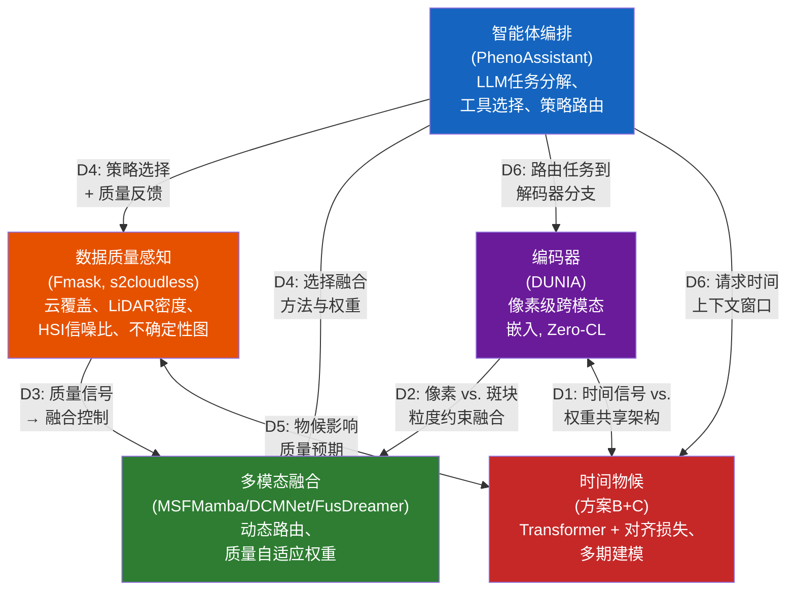

# 基于遥感的植被表型设计空间分析：对森林监测的启示

## 摘要

森林表型分析在2026年年中正处于一个关键的转折点。四股技术潮流——基础模型、动态多模态融合、像素级对比表征学习以及基于大语言模型（LLM）的智能体编排——各自产生了成熟的组件，但尚无系统将四者融为一体。本综述通过五个正交维度对森林表型分析进行系统化的设计空间分析：编码器设计、多模态融合策略、智能体编排、时间物候建模以及数据质量感知。针对每个维度，我们列举候选架构选择，基于原始论文的定量基准对其进行对比，并给出植根于已验证实验证据的选择依据。我们进一步分析了阻碍独立优化的跨维度依赖关系，提出了一条基于已验证组件的集成路线图（DUNIA像素级嵌入、DCMNet动态路由、PhenoAssistant智能体编排、TaxoNet双间隔长尾平衡），并定义了QUEST-Forest评估框架，涵盖尾部召回率（tail-recall）、代价加权错误率以及开放集检测基准等森林特有指标。最后，我们梳理了弥补五个尚存缺口所需的具体验证实验，每个实验均表述为可证伪的假设并附有实验设计方案。

---

## 1. 引言

全球森林每年固碳约76亿吨CO₂，调节区域水文循环，并承载着80%的陆地生物多样性[1]。准确且可扩展的森林表型分析——对树种组成、结构参数（树高、胸径、冠层覆盖度）及生理状态（叶面积指数、物候阶段、胁迫指标）的定量刻画——是气候变化减缓、精准林业和生物多样性保护的基础。然而，当前业务化范式主要依赖地面调查，覆盖不足全球森林面积的1%，且更新周期为5–10年[2]。

遥感在一定程度上弥补了这一缺口。卫星星座（Sentinel-1/2、Landsat、PlanetScope）以10–30 m分辨率提供全覆盖观测；机载激光扫描（ALS）活动如法国的Lidar HD项目提供超过40 pts/m²的点密度[3]；搭载RGB、多光谱、高光谱（HSI）和热红外传感器的无人机（UAV）能够实现厘米级的单木冠（ITC）观测。挑战已不再是数据稀缺，而是*数据融合*：如何将异构模态——各自具有不同的空间分辨率（0.05 m UAV至250 m MODIS）、光谱范围（可见光到短波红外）和时间频率（逐日到十年）——整合为一个连贯的表型分析流水线。

2026年4月，一项关键进展出现：Chen等人在*Nature Communications*上发表了PhenoAssistant，证明基于大语言模型的多智能体系统能够以100%的工具选择准确率，为植物表型任务编排计算机视觉工具、统计分析和自然语言解释[4]。PhenoAssistant标志着智能体编排进入植物科学领域，但其架构揭示了一个结构性局限，这也界定了本综述的机会空间：它编排的是*哪个工具*处理*哪个子任务*，但并未根据输入质量或场景上下文动态调整多模态数据的*融合方式*。底层视觉模型的融合策略保持静态，在设计阶段即已固定。

这一局限是更广泛碎片化的一个缩影。若纵观2023至2026年的文献，可观察到此前时间线分析所称的"四条并行流动的河流"：

- **河流A（基础模型）**：CLIP（2021）、MAE（2022）、SAM（2023）和DINOv2（2023）持续推出预训练范式——对比式跨模态对齐、掩码重建和自监督视觉特征——下游遥感模型越来越依赖这些范式进行权重初始化和少样本迁移。
- **河流B（遥感多模态融合）**：从MSFMamba的静态选择性状态空间融合（Houston2013 OA 92.86%，2024）[6]，到DCMNet的数据驱动动态路由（Houston2013 OA 95.11%，Trento OA 98.96%，2025）[7]，再到IFGNet的基于Kolmogorov-Arnold网络（KAN）的隐式频率聚合（Houston2013 OA 99.37%，2026）[8]，融合策略已从设计者指定演进为数据依赖，近来更趋向函数化。
- **河流C（对比表征学习）**：DUNIA的像素级跨模态对比框架[9]实现了零样本树高估计（RMSE 2.0 m，r = 0.93），超越全监督SOTA的5.2 m[9]。TaxoNet的双间隔对比损失解决了长尾植物分类问题，在Google Auto-Arborist上带来+5.1个百分点的宏观召回率提升[10]。
- **河流D（智能体编排）**：PhenoAssistant（2026）演示了LLM编排的多智能体工具链[4]；SAGE（2026）证明免训练的、来源锚定的知识库推理可使作物病害诊断平均提升16.2个百分点[11]；LEMON（2026）引入了反事实强化学习用于最优多智能体编排规范的学习[12]。

每条河流都产出了最先进的组件，但没有一个方案同时满足全部五项需求：(a) 像素级跨模态表征，(b) 数据质量自适应动态融合，(c) 时间物候感知，(d) 长尾物种平衡，以及(e) 基于智能体的编排。各组件在各自领域内已臻成熟，但在架构上相互孤立。

本综述通过设计空间分析来填补这一空白。我们不提出新模型，而是系统地将森林表型分析系统分解为五个正交设计维度，为每个维度列举候选方案，在定量基准上进行比较，并推导选择依据。随后，我们分析那些使各维度独立优化不充分且不可行的跨维度依赖关系，并提出一条全部由已发表工作中经验验证组件构成的集成路线图。本综述的贡献有三：

1. **一个五维设计空间框架**，刻画构建集成化森林表型分析系统的架构决策点，每个维度的候选空间均来自2023–2026年文献。
2. **定量的选择依据**，植根于原始论文结果而非定性断言——每项推荐均以具体的数值对比支撑（例如，"在100%标签条件下，DUNIA树高RMSE为1.3 m，而AnySat为2.8 m，故以DUNIA为基础编码器"而非"DUINA更好"）。
3. **一条验证路线图**，为每个尚存缺口设计具体的、可证伪的实验，表述为"需要验证"的假设而非推测性的"将实现"声明。

---

## 2. 背景：森林表型分析任务与模态

### 2.1 核心任务

森林表型分析包含三类任务：(i) **物种识别**——将分类学标签（种或属级）赋予单木或均质林分斑块；(ii) **结构参数提取**——估计树高、冠径、胸径（DBH）、冠层覆盖度比例和植物面积指数（PAI）；(iii) **物候监测**——跟踪季节转换（展叶、叶面积扩展、峰值绿度、衰老、落叶）并检测由干旱、病虫害或病原侵袭引发的异常。

天然林中的物种识别尤为困难。PureForest是目前最大的基于ALS的树种数据集，覆盖法国南部339 km²范围内的18个树种[3]。PlantD（人工林）在全球尺度上涵盖64个种/属，但缺乏LiDAR覆盖[14]。两者均呈现严重的类别不均衡：在PureForest中，橡树（Quercus spp.）和山毛榉（Fagus sylvatica）占主导地位，而稀有物种如欧洲栗（Castanea sativa）的样本数量少若干个数量级。在PlantD中，油棕（21%）、火炬松（9%）和桉树（12%）合计占样本的42%。

结构参数提取从ALS中获益最多。DUNIA的零样本检索使用KNN=50和仅50K标记像素的检索数据库，实现树高RMSE 2.0 m（r = 0.93）、冠层覆盖度RMSE 11.7%（r = 0.89）和PAI RMSE 0.71（r = 0.75）[9]。微调进一步将树高RMSE降至1.3 m（r = 0.95）。这些数值可媲美——且在零样本设定下超越——专用监督方法如FORMS（树高RMSE 5.2 m）。

物候监测仍是三类任务中自动化程度最低的。现有物候数据集十分稀疏：DeepPhenoTree提供四个欧洲地点苹果树在三个物候阶段（开花、幼果、果实）的RGB图像[15]；PASTIS提供法国地块级作物类型标签，但不包含物候阶段标签[16]；卫星衍生的物候产品（MCD12Q2、MODIS物候）运行在500 m分辨率上，远粗于森林表型所需的ITC尺度。

### 2.2 核心模态与互补性

五种遥感模态构成森林表型分析的传感器组合，每种具有不同的物理原理和互补的信息内容：

**RGB / 甚高分辨率（VHR）光学影像**（来自UAV或机载平台，0.05–0.5 m）获取单木冠的细粒度纹理和形态特征。PureForest的ORTHO HR影像（0.2 m，NIR-R-G-B波段）能够通过冠形、分枝模式和阴影几何进行视觉物种判别。然而，仅靠RGB是不足的：基于PureForest VHR影像训练的ResNet-18仅达到73.1%的OA，而包含高程元数据的LiDAR达到83.6%[3]。

**多光谱影像（MSI）**来自Sentinel-2（10–20 m，10个波段）和Landsat（30 m），将光谱范围扩展到对植被健康评估至关重要的红边和短波红外区域。由MSI时间序列导出的归一化植被指数（NDVI）、增强植被指数（EVI）和归一化燃烧比（NBR）是物候阶段检测的主力指标。PlantD证明，在Sentinel-2时间栈上使用3D patch embedding的Video Vision Transformer在64类物种识别中可达到约62%的宏F1分数[14]。

**高光谱影像（HSI）**获取数百个连续窄光谱波段，能够区分光谱差异微妙的物种。基于HSI的融合方法（DCMNet、DFFNet、IFGNet）一直是动态融合研究的主要试验平台，Houston2013和Trento数据集为标准基准[7], [8]。关键局限在于传感器可用性：星载HSI（PRISMA、EnMAP、DESIS）提供30 m分辨率和14–27天重访周期，而机载HSI活动是科研级别的，空间上稀疏。

**LiDAR**（机载激光扫描、地基激光扫描，或星载如GEDI）提供直接的三维结构测量。PureForest中密度为40 pts/m²的ALS点云能够实现精确的树高、冠层勾勒和垂直分层。GEDI的全波形LiDAR具有约25 m足迹间距和51.6°N至51.6°S之间的全球覆盖，已成为跨模态表征学习的主要训练信号：DUNIA的Zero-CL损失将Sentinel-1/2像素嵌入与GEDI波形对齐，将垂直结构编码到像素级表征中[9]。根本性局限在于时间稀疏性——GEDI具有非重复轨道，对任何给定位置存在多年的重访间隔。

**合成孔径雷达（SAR）**来自Sentinel-1（C波段，10 m）和ALOS-2（L波段，30 m），提供全天候、昼夜成像能力。SAR后向散射（VV、VH极化）对冠层结构、表面粗糙度和介电特性（含水量）敏感。SAR的穿云能力使其成为光学影像被遮挡时的主要后备模态——这一能力在PlantD的多源分类和MSFMamba的HSI-SAR融合实验（Berlin OA 76.92%，Augsburg OA 91.38%）中得到了利用[6]。

### 2.3 现有基准数据集

表1总结了三个最大的公开森林/人工林数据集。

| 数据集 | 规模 | 物种数 | 模态 | 时间维度 | 关键局限 |
|---------|-------|---------|------------|----------|----------------|
| PureForest [3] | 339 km², 135K斑块 | 18（13类） | ALS (40 pts/m²) + VHR (0.2 m) | 单时相 | 无卫星数据，无时间序列 |
| PlantD [14] | 全球, 2.26M样本 | 64种/属 | S-1, S-2, L-7, ALOS-2, MODIS | 多年时间序列 | 无LiDAR |
| CitrusFarm [17] | 1.3 TB, 7.5 km穿行 | 3个柑橘品种 | 9种传感器 (RGB, NIR, 热红外, LiDAR, IMU, GNSS-RTK) | 单次穿行 | 无语义标签 |

三个关键数据缺口浮现：(1) 尚无数据集同时提供卫星时间序列、ALS点云以及ITC分辨率的地面真值物种标签；(2) PhenoCam风格的多年物候时间标签（展叶日期、落叶日期）在所有三个数据集中均缺失；(3) 生理地面测量（叶片叶绿素含量、水势、光合速率）未与遥感获取在空间上共配准。

---

## 3. 面向设计空间的森林表型分析

我们将森林表型分析系统分解为五个设计维度。对每个维度，我们列举候选架构选择，在定量基准上进行比较，并给出基于已验证实验证据的选择依据。

### 3.1 编码器设计

编码器将原始多模态传感器数据（多光谱像素、SAR后向散射、LiDAR点云或波形）转换为统一的表征空间。对于森林表型分析，编码器必须同时满足多项需求：像素级空间粒度（用于ITC级分析）、跨模态对齐（至少包含MSI + SAR + LiDAR）、零样本或少样本能力（森林地面真值稀缺），以及——理想情况下——时间物候感知。

#### 3.1.1 候选方法

在DUNIA论文[9]中（在836K Sentinel-1/2斑块+19M GEDI波形上预训练、250K步、相同下游任务），七种编码器范式在统一的实验设置下被评估。表2展示了森林相关下游任务的关键定量对比。

| 维度 | DUNIA [9] | AnySat [18] | CROMA [19] | SatMAE [20] | DOFA [21] | Scale-MAE [22] | DeCUR [23] |
|-----------|-----------|-------------|------------|-------------|-----------|---------------|------------|
| 发表场所 | arXiv 2025 | CVPR 2025 | NeurIPS 2023 | NeurIPS 2022 | arXiv 2024 | ICCV 2023 | AAAI 2024 |
| 预训练方式 | 对比 + 重建 | 多模态融合 | 对比 + MAE | 掩码重建 | MAE + 动态权重 | MAE + 尺度嵌入 | 对比（解耦） |
| 模态 | S-1+S-2+GEDI | S-1+S-2+VHR+时间 | S-1+S-2 | S-2 | 任意光学 | 多分辨率光学 | S-1+S-2 |
| 粒度 | 像素级 (10 m) | 斑块级 | 斑块级 (8×8) | 斑块级 (8×8) | 斑块级 | 斑块级 | 斑块级 |
| 微调树高 (RMSE) | **1.3 m** (r=0.95) | 2.8 m (r=0.89) | 3.5 m (r=0.78) | 10.5 m (r=0.52) | 11.0 m (r=0.51) | — | 11.0 m (r=0.55) |
| 微调物种 (wF1, PF) | 82.2 | **82.3** | 80.5 | 78.8 | 79.8 | — | 78.9 |
| 20%标签树高 (RMSE) | **1.4 m** (r=0.93) | 2.8 m (r=0.89) | 3.6 m (r=0.76) | 10.5 m (r=0.52) | 11.2 m (r=0.50) | — | 11.1 m (r=0.52) |
| 时间支持 | 单中值合成 | 原生多时相 | 静态 | 时间掩码 | 静态 | 多尺度空间 | 静态 |
| 推理 (20 km²) | **4.22 s** | 177 s | — | — | — | — | — |
| 开源 | 是 | 是 | 是 | 是 | 是 | 是 | 是 |

DUNIA的零样本性能对地面测量有限的森林场景尤为相关。使用KNN=50和50K标记像素的检索数据库（约31 km²，约为监督方法所需数据的0.25%），DUNIA实现：树高RMSE 2.0 m（r = 0.93）vs. 监督SOTA FORMS 5.2 m（r = 0.77）；冠层覆盖度RMSE 11.7%（r = 0.89）vs. FORMS 22.1%（r = 0.54）；PAI RMSE 0.71（r = 0.75）vs. FORMS 1.5（r = 0.35）；以及树种wF1 76.0%（KNN=5）vs. 监督SOTA 74.6%[9]。

#### 3.1.2 选择依据

**推荐以DUNIA为基础编码器**，原因如下，均映射到设计需求并由证据支撑：

- **像素级粒度（P0需求）**：DUNIA是本次对比中唯一实现像素级跨模态嵌入的方法（64维输出投影，10 m/像素）。AnySat、CROMA、SatMAE和DOFA均输出斑块级嵌入，这对于ITC级参数映射而言粒度不足。单木冠——通常占地3–30 m²——需要像素级的空间精度。
- **跨模态融合（P0需求）**：DUNIA的Zero-CL损失实现了Sentinel-1/2像素与GEDI波形之间的跨模态对齐，正对余弦相似度为0.86，而相同批次条件下（平均每批次约26个波形）VICReg仅为0.56[9]。实现这一效果的ZCA白化步骤，是一种专门针对每批次波形样本稀疏问题的架构创新。
- **零/少样本能力（P0需求）**：DUNIA的零样本树高（RMSE 2.0 m）已超越全监督FORMS基线（5.2 m）。在20%标签比例下，垂直结构性能几乎无损（RMSE 1.4 m vs. 全标签1.3 m，仅0.1 m的微小退化）。这种标签效率对地面测量昂贵且稀疏的森林应用至关重要。
- **计算效率**：DUNIA训练在单张A6000 48GB GPU上完成。在20.48 × 20.48 km区域（4.2M像素）上的推理仅需4.22 s，而AnySat需177 s（约慢40倍）。这种单GPU可行性支持区域特定重训练，这对已知预训练森林模型存在域敏感性至关重要。

**为什么不选AnySat？** AnySat在分类性能上最佳（PureForest wF1 82.3，PASTIS wF1 81.1），并具有原生多时相支持。然而，其斑块级输出无法执行像素级树冠参数映射。其垂直结构估计显著偏弱（树高RMSE 2.8 m vs. DUNIA 1.3 m，相差1.5 m），且推理慢40倍，使其难以用于大范围森林监测。AnySat的战略价值在于作为DUNIA的*补充*：其时序斑块嵌入可提供DUNIA当前所缺乏的物候信号。

**为什么不选SatMAE/DOFA？** 这些基于MAE的纯光学基础模型不具备垂直结构感知，树高RMSE超过10 m。MAE范式需要大量标注微调数据，且两者均不提供零样本能力。其纯光学设计排除了LiDAR和SAR的集成，而这两者对森林结构参数估计是不可或缺的。

#### 3.1.3 识别到的缺口：时间物候

DUNIA最显著的局限是其依赖单期中值合成作为输入。这一设计选择直接导致在PASTIS上零样本作物分类的大幅下降：DUNIA OA仅56.2%，而监督SOTA为84.2%（相差28个百分点），具有多时相输入的AnySat为81.1%（相差24.9个百分点）。对于森林表型分析而言——有叶与无叶状态之间的光谱差异是落叶树种识别的主要判据——这一局限是结构性的而非偶然的。

DUNIA的多时相自编码器（UNet + ConvLSTM，3个时间步，间隔4个月）被设计为辅助重建模块，而非物候敏感的表示学习器。时间平均池化步骤丢弃了时间顺序信息，而这一信息对于区分例如早叶橡树和晚叶白蜡树至关重要。

---

### 3.2 多模态融合策略

给定来自多个模态（HSI、LiDAR、SAR、MSI）的编码特征，融合模块必须将它们组合为用于下游分类或回归的联合表征。核心设计问题是：*融合策略应该是静态的（在设计时固定）、数据驱动的（从特征统计中学习），还是上下文依赖的（由外部信号如数据质量、物候阶段或任务说明来驱动）？*

#### 3.2.1 候选方法

表3比较了五种主流融合范式在定量基准上的表现。所有数据均来自原始论文；"*"表示少样本设置（约20样本/类）；其余结果为全监督（约150–200样本/类）。注意，IFGNet未在Trento上评估；FusDreamer在少样本设置下评估。

| 方法 | 年份 | 核心机制 | Houston2013 OA | Houston2013 Kappa | Trento OA | 参数量 | 推理时间 |
|--------|------|---------------|----------------|-------------------|-----------|--------|-----------|
| **MSFMamba** [6] | 2024 | 选择性SSM + 双输入交叉参数化 | 92.86 | 92.25 | — | 1.53M | 0.175 s |
| **DCMNet** [7] | 2025 | 三层动态路由 + 双线性注意力 | 95.11 | 94.69 | **98.96** | 3.83M | 0.010 s |
| **DFFNet** [24] | 2025 | 动态频域滤波核 + 通道混洗 | 92.35 | 91.70 | — | 1.28M | 0.239 s |
| **FusDreamer** [25] | 2025 | 潜在扩散 + CLIP引导提示对齐 | 89.24* | 90.15* | 96.36* | 较大 | 16–67 s |
| **IFGNet** [8] | 2026 | KAN B样条隐式空间-频率聚合 | **99.37** | **99.32** | — | 轻量 | 快速 |

*注：推理时间按原始论文所述报告，可能因硬件（GPU型号、批次大小）和软件实现（框架、优化级别）差异而无法直接比较。仅作为部署可行性评估的数量级参考，而非精确基准对比。*

**MSFMamba（2024）**将选择性状态空间模型（Mamba）引入多模态融合，在序列长度上达到线性O(n)复杂度，同时提供多尺度空间扫描（双分辨率、四方向）和跨模态SSM参数化（Fus-Mamba：一个模态生成处理另一个模态的A/B/C/Δ参数）。在Houston2018上达到OA 92.38%，在Augsburg（HSI+SAR）上达到91.38%。其关键架构优势——Fus-Mamba块的双输入设计天然接受第三路输入——使其在五个候选方法中最易于实现智能体控制的融合[7]。

**DCMNet（2025）**标志着从静态融合到动态融合的转变。其三层全连接路由空间在每层部署三个并行特征交互块（空间双线性交叉注意力BSAB、通道双线性交叉注意力BCAB和集成卷积ICB），路由门从特征统计中生成路径概率：W_k_i = max(0, Tanh(FC_2(ReLU(FC_1(F_h + F_l + X_k_i)))))。此处的"动态"是*网络学习的数据依赖*——路由根据输入斑块的特征统计自适应调整，但无法感知外部数据质量或场景上下文。在Trento上，OA达到98.96%，AA 97.55%，Kappa 98.61%[7]。

**DFFNet（2025）**将动态融合转移到频域。其动态滤波块（DFB）对输入特征应用2D FFT，通过GAP+MLP+Softmax对可学习基滤波器进行加权组合生成动态频率核，并在IFFT重建前滤除无关频率分量。参数仅1.28M，推理0.239 s，Houston2013 OA达到92.35%。频域方法对物候建模尤为相关，因为不同物候阶段表现出不同的频率特征：生长期因活跃叶面积扩展呈现高频纹理，而休眠期则为低频平滑。

**FusDreamer（2025）**引入了世界模型范式：潜在扩散模型（LaMG）生成统一的多模态表征容器，而基于CLIP的开放世界知识引导一致性投影（OK-CP）实现文本提示驱动的融合对齐。它是唯一在少样本设置下测试的方法（Trento上13–18样本/类，OA达96.36%）。文本提示接口天然适合智能体控制——智能体可将物候上下文、任务规范和质量评估以自然语言提示的形式注入，无需对融合网络做任何架构修改[25]。

**IFGNet（2026）**通过用KAN B样条函数替代固定激活函数，达到了目前已报道的最高精度（Houston2013 OA 99.37%，Kappa 99.32%），KAN B样条可通过可学习样条系数建模连续非线性关系。其空间隐式聚合单元（SIAU）使用LiDAR引导的KAN邻域特征采样：v(k)_q = Φ_KAN([f_HSI_xk, f_LiDAR_q, q − xk])。B样条的局部支撑特性天然适合建模渐变的物候转换。然而，IFGNet在原始论文发表时未开源，限制了可复现性[8]。

#### 3.2.2 选择依据

融合策略应是一个组合方案而非单一方法，依据以下证据按场景选择：

- **对于效率优先的大范围部署**：推荐**MSFMamba**。其O(n)线性复杂度、1.53M参数规模和0.175 s推理速度，使其成为区域尺度全覆盖森林制图中唯一实用的方法。Fus-Mamba架构天然支持第三路输入源（智能体调节信号），为智能体控制融合提供了最简洁的集成路径。
- **对于精度优先的物种分类**：**DCMNet**路由在异构场景上实现了最高的已验证精度（Trento OA 98.96%，Houston2013 OA 95.11%）。其路由门接受单向量输入，使得智能体条件注入在架构上直接可行（约10行代码：在FC层输入中添加智能体上下文嵌入）。
- **对于物候感知融合**：**DFFNet**的频域滤波在概念上最接近物候信号处理。动态频率核K(X) = Softmax(MLP(GAP(X))) ⊗ F_base原则上可以为不同物候阶段学习不同的带通特性，但这一具体能力尚未得到经验验证。
- **对于智能体集成的少样本部署**：**FusDreamer**是唯一将少样本鲁棒性与自然语言控制接口相结合的方法。其无需修改架构即可实现智能体控制的路径（用智能体生成的提示替换硬编码提示），使其适用于智能体控制融合的快速原型开发，尽管推理延迟较大（每样本16–67 s）。

#### 3.2.3 识别到的缺口：外部质量信号注入

所有五种方法存在一个共同的盲区：其融合决策基于*内部特征统计*（DCMNet的门控输入为F_h + F_l + X；DFFNet的核生成使用输入特征的GAP；MSFMamba的SSM参数从配对模态的特征生成）。它们均未接收*外部质量信号*，来告知融合模块关于获取条件的信息——云覆盖比例、LiDAR点密度、SAR相干性或噪声水平。这一缺口是结构性的：不是个别方法的缺陷，而是质量评估层与融合层之间缺失了一个接口。我们将在第3.5节回到这一点。

---

### 3.3 智能体编排

智能体编排器接收用户对表型分析任务的自然语言描述，将其分解为可执行的子任务，选择合适的视觉模型和分析工具，监控执行过程，并聚合结果。核心设计张力在于*可靠性*（保证正确的工具选择和执行）与*适应性*（处理开放式的、未曾见过的任务说明的能力）之间。

#### 3.3.1 候选方法

三种智能体范式已在植物/森林领域展示，其中两种具有可用的定量评估结果：

**PhenoAssistant（2026）**[4]采用中心化多智能体架构：一个Manager Agent（GPT-4o，temperature = 0.1）接收自然语言指令，生成分步计划，并将任务分派到一个工具包，该工具包包含视觉模型库（Mask2Former、Leaf-only SAM、带LoRA微调的DINOv2-base）、表型提取工具、代码编写器、数据可视化器、图表分析器（基于Pandas AI）、表格分析器、RAG智能体以及确定性统计模块（ANOVA、Tukey-Kramer事后检验）。工具通过结构化模式（名称、描述、参数、输入/输出格式）暴露接口，构建于AutoGen框架之上。在20个人工设计任务上的评估结果为：工具链合理性4.25/5（带Critic Agent时为4.35/5），工具存在性5.00/5，工具适切性4.65/5（带Critic时为4.90/5），参数正确性4.30/5（带Critic时为4.40/5）。视觉模型类型推荐准确率100%（50/50任务）；视觉模型精确匹配准确率100%（20/20任务）。数据分析任务准确率85%（17/20）；全部三次失败归因于Plot Analyser的细粒度视觉推理——LLM错误解读了图表元素，表明基于LLM的视觉推理仍然是主要瓶颈[4]。

**SAGE（2026）**[11]采用免训练的智能体推理流水线用于作物病害诊断：器官识别→解剖索引过滤（仅保留影响已检测植物部位的病害）→来源锚定知识库（KB）症状匹配→带有限预算k的顺序参考图像比对→带有完整推理轨迹的预测。来源锚定的知识库包含由LLM从网络来源提取的、带有原始引用的结构化症状事实，并经领域专家审核。引入完整流水线（KB + k=8参考图像）使诊断准确率相比k=0无KB基线平均提升16.2个百分点[11]。在k=8加KB条件下各作物结果：大豆48.6%（vs. 基线31.1%），玉米60.2%（vs. 42.0%），番茄76.1%（vs. 52.3%），芒果97.5%（vs. 92.5%）。控制参考预算，k=8时KB的纯贡献约为平均+6.2 pp，各作物增益从+2.7 pp（大豆）到+9.1 pp（番茄）不等。在同等参考预算下，智能体流水线比少样本分类平均高出8.1个百分点。失败模式集中在视觉模糊性压倒KB证据的案例（例如，茎部病害中的炭疽病vs.炭腐病）[11]。

**LEMON（2026）**[12]引入反事实强化学习用于优化多智能体编排规范。利用Group Relative Policy Optimization（GRPO）在角色/能力/依赖字段上施加局部反事实信号，LEMON学习生成最优编排器配置。在MMLU、GSM8K、AQuA、MultiArith、SVAMP和HumanEval基准上达到了SOTA。虽然LEMON尚未应用于植物/森林表型分析，但其方法论可直接迁移：在不同数据质量条件下，智能体编排策略（调用哪些模型、以何种顺序、使用何种参数）可以通过RL学习而非硬编码。

#### 3.3.2 选择依据

**LLM应负责编排，而非感知。** PhenoAssistant的失败分析提供了关键证据：全部3/20的数据分析任务失败归因于LLM细粒度视觉推理错误，而工具选择达到100%准确率。这种不对称性表明，LLM是可靠的*编排器*（选择使用哪个工具），但不可靠的*感知器*（解读细粒度视觉或定量数据）。正确的架构分离应为：

- **Manager Agent（LLM）**：任务分解、工具选择、参数指定、结果聚合、自然语言解释。
- **专用视觉模型**：分割（Mask2Former、SAM）、特征提取（DUNIA编码器）、分类（DCMNet融合头）、结构参数估计。
- **确定性模块**：统计检验（ANOVA、Tukey-Kramer）、定量表型计算（从冠层面积计算LAI、从CHM计算树高）、数据库查询。

SAGE的解剖索引过滤为森林物种识别提供了一个可迁移的设计模式：结构化林业知识库（例如数字化《中国植物志》、区域森林资源清查数据）可执行器官/区域/物候索引过滤，在调用视觉分类器之前缩小候选物种集。关键要求是来源锚定——每个知识库条目必须携带可验证的引用——以便专家对智能体推理进行审核。

#### 3.3.3 识别到的缺口：从工具编排到融合策略编排

PhenoAssistant编排*哪个工具*处理*哪个子任务*，但不调整多模态数据的*融合方式*。Manager选择Mask2Former进行分割、DINOv2进行分类，但并没有——且在架构上无法——指示融合模块在检测到云覆盖时对LiDAR比HSI施加更高权重，或在分析物候转换时调用频域滤波。这一缺口不是LLM推理能力的局限，而是系统架构的问题：Manager与融合模块的决策层之间没有接口，且融合模块没有暴露可接受外部控制信号的参数。

---

### 3.4 时间物候建模

森林物候——生物事件（展叶、叶面积扩展、光合作用峰值、衰老、落叶）的季节循回——为温带和寒带森林的物种判别提供了信息量最丰富的单一时间信号。在夏季峰值期间光谱近乎相同的落叶树种（例如夏栎Quercus robur vs.无梗花栎Quercus petraea）表现出截然不同的时间轨迹：展叶日期（通常相差1–3周）、叶面积扩展速率和衰老起始的差异，在具备时间上下文时产生可分离的信号特征。

#### 3.4.1 为什么时间建模至关重要

时间信息重要性的证据兼具正向和负向。正向：AnySat凭借原生多时相输入实现PASTIS分类wF1 81.1，而DUNIA——使用单中值合成——在微调下仅达77.0，零样本下达56.2%[9]。这一差距（与监督SOTA 84.2%相差28 pp，与AnySat 81.1%相差24.9 pp）直接量化了时间信息对植被分类的价值。负向：Bejide（2026）将"时间恢复异步性"确定为森林生态系统表征中七个核心不一致驱动因素之一，占181篇综述研究中所报告不一致现象的7.8%[26]。"绿色沙漠"现象——光谱上已恢复的冠层绿度掩盖了持续的结构退化和功能丧失——只能通过时间分析来检测：单幅干扰后影像显示"绿色"，但时间序列揭示绿度来自快速恢复的草本下层，而非原始树种。

Gauli等人（2026）证明了复杂森林地形中时间机器学习的可行性：13年尼泊尔喜马拉雅山区的VIIRS火辐射功率数据，通过时空聚类（0.25°网格，2天容差）将569,136个火点聚合为11,595个离散火灾事件，实现了跨生态区R² = 0.683–0.757[27]。他们的方法论——时空事件聚合、地形-风场交互特征工程——可直接迁移到物候事件检测中。

#### 3.4.2 候选方法

综述文献中探索了三种时间编码策略：

**方案A：输入级多时相拼接。** 将多期Sentinel-2影像沿通道维度拼接，形成[B, T×C, H, W]张量送入标准空间编码器。这是AnySat[18]使用的方法，并作为一个实用的基线。优势：架构改动最小，复用现有编码器权重。局限：CNN局部卷积仅能看到时间相邻的像素；模型对时间顺序不敏感（打乱影像日期产生几乎相同的表征）；无法感知时间距离（区分5天和50天间隔需要显式位置编码）。

**方案B：编码器内部时间Transformer。** 每个时间步由一个共享权重的空间编码器独立编码，生成每个时间步的斑块嵌入z_t。添加Day-of-Year（DOY）正弦位置编码：PE(DOY, 2i) = sin(DOY/365 × 10000^{2i/d})，PE(DOY, 2i+1) = cos(DOY/365 × 10000^{2i/d})。多头自注意力跨时间维度应用：Attention(Q, K, V) = softmax(QK^T/√d_k + M)V，其中M为时间掩码（离线分析为双向，在线监测为因果掩码）。TSP-Former（2025）在使用Sentinel-2时间序列进行烟草制图时演示了该方法[28]；一种高效的基于ViT的时空植被分类器（2026）应用3D patch embedding与时间位置编码到UAV RGB时间序列用于全周期植被表型分析[29]。

**方案C：后置时间对齐损失。** 编码器保持不变（单图推理）；时间信息仅通过对嵌入空间施加的辅助损失函数注入。损失由三个部分组成：(i) 平滑性损失 L_smooth = Σ_t ||e_t − e_{t+1}||² · exp(−α·|DOY_t − DOY_{t+1}|)；(ii) 循环损失 L_cyclic = ||e_1 − e_T||² · exp(−α·(365 − |DOY_T − DOY_1|))；(iii) 身份损失 L_identity = Σ_t ||e_t − mean(e)||²，惩罚与冠层"身份向量"的过度偏离。其几何解释为嵌入空间中的"物候管"：每棵树冠的季节轨迹被约束在围绕其身份中心、半径为τ的管内，而不同物种的管必须保持分离。

表4在关键设计维度上比较三种方案。

| 维度 | 方案A：输入拼接 | 方案B：时间Transformer | 方案C：时间对齐损失 |
|-----------|----------------------|-------------------------------|----------------------------------|
| 编码器修改 | 无（仅输入） | 大（新增时间模块） | 无（仅损失函数） |
| 时间依赖建模 | 隐式（CNN局部） | 显式（全局注意力） | 无（仅损失层面） |
| 变长序列 | 否 | 是 | 是 |
| 计算开销 | ~1×（基线） | ~1.5–4×（取决于T） | ~1× |
| 时间位置感知 | 否 | 是（DOY PE） | 部分（通过损失） |
| 与DUNIA Zero-CL兼容性 | 是 | 是（需适配） | 是（可并行使用） |

#### 3.4.3 选择依据

**推荐方案B（时间Transformer）+ 方案C（对齐损失）作为正则化**。理由有三：

1. *输入级拼接不足以建模物候。* 基于CNN的编码器对拼接输入的时间顺序不敏感。一个在四月-七月-十月拼接上训练的编码器无法区分展叶在day-100 + 衰老在day-300的模式与展叶在day-300 + 衰老在day-100的模式——然而这些是生态学上完全相反的状态。
2. *后置对齐无法弥补编码器的盲区。* 如果基础编码器在单期中值上训练（如DUNIA），它已经学会在不带时间上下文的条件下处理光谱特征。春季同一反射率值（指示健康展叶）与秋季同一反射率值（指示延迟衰老）映射到相同的编码——编码器根本缺乏消除歧义所需的时间维度。
3. *时间Transformer在保持兼容性的同时提供全局上下文。* 共享权重的空间编码器保留了DUNIA的像素级跨模态嵌入（与GEDI波形的Zero-CL），而时间自注意力层添加了物候上下文，并通过孪生架构将梯度信号传回空间编码器。

现有结果所建议的实用部署策略：从3个双月Sentinel-2合成（春/夏/秋）和方案A开始，作为快速验证基线以确认存在时间增益；然后过渡到6–12个月合成与方案B进行全物候周期建模；最后添加方案C作为正则化器以强制平滑物候轨迹。

#### 3.4.4 识别到的缺口：尚无方法兼具跨模态像素对齐和时间物候

DUNIA实现了像素级跨模态对齐但时间上静态。AnySat实现了多时相分类但为斑块级且垂直结构较弱。目前尚不存在同时提供以下能力的方法：(a) 像素级跨模态嵌入（DUNIA的优势），(b) 时间物候感知（AnySat的优势），(c) 零样本森林参数估计（DUNIA的独特能力）。弥合这一缺口需要用时间Transformer模块扩展DUNIA的编码器，同时保留其Zero-CL损失和双解码器架构，然后在多时相Sentinel-1/2 + GEDI波形数据上联合预训练。验证这一集成的具体实验设计见第6节。

---

### 3.5 数据质量感知

遥感数据质量具有内在的变异性且不可预测。云覆盖可使热带和温带地区30–70%的光学像素不可用；LiDAR点密度随飞行参数、地形和冠层郁闭度而变化；SAR相干性在水体和地表快速变化区域下降；HSI推扫式传感器可能出现条纹伪影。在精心策划的基准数据集之外部署的森林表型分析系统，必须显式地推理输入质量并据此调整融合策略。

#### 3.5.1 现有基础：成熟的质量评估组件

数据质量评估的单个构建模块已达到生产就绪水平：

- **云和云影检测**：Fmask [30]（85–90% F1，CPU毫秒级）、s2cloudless（LightGBM，88–92%）、CloudMaskNet（DeepLabV3+，92–96%），以及时空CD-FM3SF（94–97%）为Sentinel-2和Landsat提供像素级云掩膜。
- **LiDAR点密度和质量**：点密度（pts/m²）、回波次数分布、扫描角和地面点比率是LAS/LAZ元数据中的标准指标。GEDI L2A/L4A产品包含来自NASA官方处理流水线的逐足迹质量标记。
- **HSI噪声估计**：HSI-SDeCNN（2022）同时输出去条带和噪声估计；HyMiNoR估计混合高斯+条带+脉冲噪声。
- **不确定性量化**：UnCRtainTS（2023，CVPR Workshop，69次引用）为光学卫星时间序列的云去除生成逐像素不确定性图——这些不确定性图可直接作为质量输入送入智能体模块[31]。

设计空间综述的核心发现直截了当：**尚无已有论文构建了将数据质量评估连接到自适应融合策略选择的端到端系统**。这是已识别的文献缺口，而非组件可得性缺口。三个部分——质量评估、动态融合和智能体编排——各自具备成熟的技术基础，但它们之间的连接器尚未被构建。

#### 3.5.2 现有基础：缺失模态与质量自适应训练

缺失模态（MM）社区提供了最接近的技术先例。ActionMAE（AAAI 2023 Oral）证明，以随机模态丢弃（30–50%概率）+ MAE重建正则化进行训练，可产生在推理时对缺失模态鲁棒的模型[33]。关键发现：基于Transformer的融合比sum/concat融合对缺失模态更鲁棒。M3L（2023）采用Teacher-Student范式：Teacher在全模态数据上训练，Student在掩码模态上训练，通过KL蒸馏学习从部分输入中逼近全模态性能[34]。

这些MM技术直接映射到质量自适应融合问题上。云遮挡等同于模态丢弃（受影响的像素不携带有用信号）；低LiDAR点密度等同于模态噪声（结构信号退化但非缺失）。这一映射提示了一种质量自适应丢弃训练策略：`drop_prob[modality] = 1.0 − quality_score[modality]`。在训练期间，高质量模态被保留，而低质量模态按与其质量缺陷成比例的概率被丢弃。这一策略尚未在遥感融合中得到经验验证，但其底层机制（ActionMAE丢弃 + 质量依赖概率）是已有验证技术的一种直接且规范的扩展。

Provable Dynamic Fusion（Zhang等人，2023，ICML）提供了理论保证：在一定假设下，以学习的模态置信度分数进行动态融合可以最小化联合预测误差，且当某些模态质量极低时，融合可优雅退化到单模态预测[35]。Predictive Dynamic Fusion（2024）通过一个轻量预测器实现此机制，该预测器从各模态的特征单独估计其对最终任务的贡献[36]。两者为质量加权融合提供了理论和经验基础，但两者均从特征分布中隐式学习质量权重，而非从显式质量评估模块中获取。

#### 3.5.3 识别到的缺口：质量→融合映射接口

核心的未解决设计问题是：*给定质量向量q = [cloud_pct, lidar_density, hsi_snr, sar_coherence, phenology_stage]，应选择何种融合策略？* 从质量到策略的映射既无经验刻画也无理论指导。具体的子缺口包括：

- **GAP-1（质量到策略映射）**：尚无消融研究刻画融合策略选择如何与数据质量水平交互。例如，在什么云覆盖阈值处，从HSI主导切换到LiDAR主导的融合是有益的？在什么LiDAR点密度处，结构信息变得过于不可靠而无法作为主要模态？
- **GAP-2（多维质量融合）**：云覆盖、LiDAR密度、HSI噪声、SAR相干性和物候阶段是不同量的、不可直接比较的质量维度。应如何将它们融合为统一的质信号？简单的线性加权平均、学习的质量编码器，还是智能体中介的推理？
- **GAP-3（质量感知训练数据）**：具有受控质量退化的训练数据十分稀缺。合成增强（模拟云遮挡、LiDAR子采样、HSI波段噪声）是务实的路径，但合成质量退化对真实获取伪影的保真度需要验证。

---

## 4. 走向集成：跨维度依赖关系

第3节分析的五个设计维度并非相互独立。孤立优化每个维度会导致局部最优但全局不一致的系统。本节识别关键的跨维度依赖关系并提出集成路线图。

### 4.1 依赖关系图

图1展示了五个设计维度及其六个跨维度依赖关系。

**依赖关系汇总：**
| ID | 关系 | 类型 | 关键含义 |
|----|------|------|---------|
| D1 | 编码器 ↔ 时间物候 | 双向 | 时间策略约束编码器架构（孪生权重共享） |
| D2 | 编码器 → 融合 | 单向 | 像素级嵌入实现空间精确的融合决策 |
| D3 | 质量感知 → 融合 | 单向 | 质量评估必须馈入融合控制——尚未在任何系统中构建 |
| D4 | 智能体 ↔ 质量感知 + 融合 | 双向 | 智能体整合质量评估与策略选择；构成中央控制环路 |
| D5 | 时间物候 ↔ 质量感知 | 双向 | 物候阶段影响质量解读（展叶期 vs. 落叶期数据可靠性） |
| D6 | 智能体 → 编码器 + 时间物候 | 单向 | 任务规格决定哪些解码器输出和时间步是相关的 |

该依赖关系图的核心洞见是，智能体编排和数据质量感知维度构成了一个*控制环路*（D4）：智能体接收质量评估，推理其影响，并选择融合策略。然而，仅当质量→融合接口（D3）存在时——正如第3.5节所识别的，该连接在任何已发表系统中尚未被构建——这一控制环路才可能运行。

**D-1：编码器 ↔ 时间物候（双向）。** 编码器决定了哪些时间信息是可获取的。单期编码器（当前DUNIA）无论时间建模块多么复杂，都无法向下游模块提供时间信号。反之，时间建模策略反馈到编码器设计中：若采用方案B（时间Transformer），空间编码器必须以跨时间步共享权重的孪生模式运行，且解码器必须在跨模态对齐中保持时间一致性（每个时间步独立施加与GEDI波形的Zero-CL，并附加时间平滑约束）。

**D-2：编码器 → 融合（单向）。** 编码器的输出粒度（像素级 vs. 斑块级）和嵌入质量（跨模态对齐强度）约束了哪些融合策略是可行的。像素级嵌入（DUNIA）实现了空间精确的融合，每个10 m像素独立参与融合决策。斑块级嵌入（AnySat、CROMA）将融合限制在聚合的空间单元上，丢失了斑块内异质性。编码器的跨模态对齐质量（DUNIA Zero-CL余弦相似度0.86 vs. VICReg 0.56）决定了在下游融合中跨模态注意力机制的可靠性。

**D-3：质量感知 → 融合（单向）。** 这是核心的未满足依赖。质量评估输出（云掩膜、LiDAR密度、HSI SNR、不确定性图）必须转化为融合控制信号。具体的注入点取决于融合架构：对于DCMNet，质量信号添加到路由门输入；对于MSFMamba，质量信号参与Fus-SSM中B/C/Δ参数的生成；对于FusDreamer，质量信号编码到文本提示中。注入架构的选择产生了一个依赖关系：选择融合方法即约束了质量信号可以如何集成。

**D-4：智能体编排 → 质量感知 + 融合（双向）。** 智能体是将质量评估与策略选择集成的天然枢纽。智能体可接收结构化的质量报告（cloud_pct=67, lidar_density=1.2e6, hsi_snr=23.4, phenology_stage="leaf_expansion"），推理其影响（"云覆盖67%超过30%阈值；优先使用LiDAR结构特征；处于展叶阶段的落叶林受益于光谱区分"），并输出融合策略规范。然而，智能体无法绕开D-3中识别的质量→融合接口——它只能在该接口存在的前提下对其进行控制。

**D-5：时间物候 ↔ 质量感知（双向）。** 物候阶段影响质量预期：无叶状态下，落叶林的LiDAR具有更高的地面点密度和更可靠的地形模型；有叶状态下，光学影像对物种判别具有更高的光谱信息含量。反之，质量退化影响物候信号的可靠性：五月一个80%云覆盖的时间步可能给出误导性的"低绿度"信号，可能被误解为延迟展叶而非数据质量伪影。

**D-6：智能体编排 → 编码器 + 时间物候（单向）。** 智能体的任务规范决定了哪些编码器输出是相关的。"制图冠层高度"任务需要垂直结构嵌入（DUNIA的OV解码器输出）；"分类树种"任务需要带时间上下文的水平嵌入（OH解码器输出）；"检测干旱胁迫"任务需要两者加上异常检测能力。若智能体编排融合策略，则它也必须能够适当地路由编码器输出——选择哪个解码器分支、哪些时间步以及哪些嵌入维度送入下游模块。

### 4.2 为什么独立优化不可行

考虑一个各维度独立优化的场景：
- 编码器：选择DUNIA以获得像素级跨模态嵌入（RMSE 1.3 m树高，4.22 s推理）。
- 时间：在之上附加方案B（时间Transformer）。
- 融合：选择DCMNet实现动态路由（Trento OA 98.96%）。
- 质量：计算s2cloudless + LiDAR密度指标。
- 智能体：PhenoAssistant风格的Manager分派任务。

这种朴素组合会产生若干失败：(1) DCMNet的路由门从时间Transformer输出中接收F_h + F_l，但路由门无法访问质量分数——它基于可能被伪影污染的特征统计进行路由（云引起的光谱异常）。(2) 智能体选择了视觉模型，但没有接口告诉DCMNet"云覆盖高，对LiDAR施加更高权重。"(3) 时间Transformer操作多期输入，但DUNIA预训练的空间编码器权重是为单期中值优化的——中值合成与单期影像之间的域偏移未被考虑。

### 4.3 集成路线图

基于依赖关系分析和已验证组件的可得性，我们提出三阶段集成路线图。每个阶段由经验验证过的组件构成；集成本身是新的贡献。

**第一阶段：质量感知静态融合（仅使用已验证组件）。**
- 编码器：DUNIA（已验证：树高RMSE 1.3 m，跨模态对齐余弦相似度0.86）。
- 质量评估：s2cloudless（已验证：88–92%云检测F1）+ LiDAR点密度计算。
- 融合：MSFMamba配合质量自适应丢弃训练（已验证：MSFMamba Houston2013 OA 92.86%；ActionMAE丢弃鲁棒性在视频领域验证）。
- 智能体：人工质量-策略规则（基于cloud_pct和lidar_density阈值的if-else逻辑），尚未LLM驱动。
- 验证指标：在合成退化Houston/Trento数据上，质量加权融合相比等权融合的OA提升。

**第二阶段：智能体控制动态融合。**
- 编码器：DUNIA + 时间Transformer（双月Sentinel-2合成），时间自注意力保持Zero-CL对齐。
- 质量：用Agent质量解释器替代人工规则——LLM接收结构化质量报告，输出融合策略JSON。
- 融合：智能体条件注入DCMNet路由门（FiLM风格：W = FC(ReLU(FC(F_h + F_l + X) + AgentEmbedding))）。
- 智能体：LangGraph SupervisorGraph配合质量感知条件路由 + AutoGen对话接口。
- 验证指标：智能体策略选择与专家设计最优策略的一致率；在真实（非合成）云覆盖变化下的OA。

**第三阶段：端到端质量自适应智能体编排。**
- 完整集成：质量传感器 → 智能体 → 融合策略 → 编码器 → 时间分析 → 输出。
- 智能体不仅选择模型和融合策略，还可以请求额外数据获取（例如"云覆盖过高无法进行光学的物种识别；安排SAR获取或等待下一次Sentinel-2过境"）。
- 知识库：将林业领域知识（结构化植物志、物候日历、区域森林资源清查）作为SAGE风格的来源锚定KB集成到智能体推理中。
- 验证：在ForestPheno-Bench上的端到端任务完成率（第5节）。

### 4.4 集成风险与可行性分析

上述集成路线图假设来自不同研究组、使用不同框架实现的组件可以组合成一个统一系统。本小节识别具体的技术风险，并基于每个组件的公开代码和文档评估每个集成步骤的可行性。

**表6. 组件集成可行性评估。**

| 组件 | 开源 | 框架 | 关键集成风险 | 缓解策略 |
|-----------|-------------|-----------|---------------------|---------------------|
| **DUNIA** [9] | 是 | PyTorch | 编码器权重为单期中值合成优化；适应多时相输入需修改编码器主干架构 | 方案B（冻结空间骨干，附加共享权重的时间Transformer）可避免直接修改DUNIA预训练权重 |
| **DCMNet** [7] | 是 | PyTorch | 路由门消费拼接的HSI+LiDAR特征；注入外部Agent嵌入需修改FC层输入维度 | FiLM风格条件化（agent_context → 对路由门输入做仿射变换）增加≤1%参数开销，无需重新训练骨干 |
| **MSFMamba** [6] | 是 | PyTorch + Mamba | Mamba SSM核需CUDA编译；与DUNIA编码器输出（64维嵌入）的兼容性未测试 | DUNIA的64维输出维度兼容MSFMamba的线性投影层；CUDA核在官方仓库中预编译 |
| **FusDreamer** [25] | 是 | PyTorch + Diffusers | 扩散模型推理延迟（16–67 s/样本）对实时应用过于昂贵；不适合大范围部署 | 仅在少样本和提示引导场景使用FusDreamer；MSFMamba用于生产级部署 |
| **PhenoAssistant** [4] | 部分（基于AutoGen） | AutoGen + GPT-4 API | 依赖闭源LLM API；工具模式定义需为每个新视觉模型手工工程化；细粒度视觉推理仍是瓶颈（15%失败率） | LangGraph SupervisorGraph提供等价编排功能且支持开源LLM选项；将视觉推理与编排解耦，将LLM失败限制在策略选择层面 |
| **TaxoNet** [10] | 撰写时未公开 | PyTorch（推测） | 双间隔损失实现未开源，需根据论文描述重新实现 | 损失函数在TaxoNet论文中有数学上明确的定义（命题2）；用标准softmax + 间隔扩展重新实现直接可行 |

**跨组件风险：**

- **训练策略冲突**：DUNIA的Zero-CL预训练（ZCA白化 + 对比损失）和DCMNet的监督融合训练（CE损失）优化不同的目标。在单一训练循环中联合可能导致梯度干扰。建议：分阶段训练——预训练DUNIA编码器，冻结，然后单独训练融合模块。
- **API兼容性**：DUNIA（PyTorch 1.x/2.x）、MSFMamba（需要Mamba CUDA核）、LangGraph（Python ≥3.9）和AutoGen（GPT-4 API）具有不同的依赖树。容器化（Docker）并固定版本对可复现性至关重要。
- **数据格式不匹配**：DUNIA期望特定波段顺序的10 m分辨率Sentinel-1/2 GeoTIFF斑块；DCMNet期望.mat格式HSI立方体 + LiDAR栅格；PureForest提供LAZ 1.4 + GeoTIFF。必须开发具有标准化预处理的统一数据加载器（rasterio用于GeoTIFF，laspy用于LAZ，scipy用于.mat）。这是工程开销，而非研究风险。
- **注意力机制不匹配**：DUNIA的双解码器产生分离的OV（垂直）和OH（水平）嵌入。DCMNet的跨模态注意力期望每个模态一个特征图。选择将哪个解码器输出路由到哪个融合头是一个在文献中尚无先例的设计决策。建议：OV → LiDAR通道，OH → HSI通道，用于标准HSI-LiDAR融合基准。

**总体评估**：集成在技术上可行，需要中等程度的工程工作（第一阶段预计2–4人月）。六个组件中的四个完全开源；其余两个（PhenoAssistant的编排逻辑和TaxoNet的损失）可根据论文描述复现。

---

## 5. 评估与基准

当前森林AI系统的评估实践，不足以评估本综述所构想的集成化、质量自适应、智能体编排系统。我们识别具体的不足并提出结构化评估框架。

### 5.1 当前评估的不足

PhenoAssistant的评估[4]虽然在其范围内是严谨的，但体现了五个可推广到更广泛领域的局限：

1. **不可扩展**：50个人工设计测试用例，每个需要人工判断，无法支撑包含数千个回归测试的迭代开发。每轮评估耗费1–2人天。
2. **缺乏长尾感知**：测试用例在设计上均衡分布，掩盖了稀有物种上的性能退化——而稀有物种恰恰是保护关注度最高的类别。PureForest的18个物种具有超过100:1的头部:尾部比例，但标准OA报告（LiDAR+高程为83.6%）掩盖了稀有物种（如欧洲栗）的每类F1可能低于30%的事实。
3. **无开放集测试**：PhenoAssistant的评估不包含"无法回答"或"分布外"测试用例，使TNR（真阴性率）无法评估。
4. **无跨域泛化测试**：所有评估在训练分布的地理和季节范围内进行。TaxoNet的域迁移实验（AA-Central → AA-West/East，双间隔相比基线+3.5–4%召回率增益）证明，域泛化能力在不同方法间差异显著，必须显式测量[10]。
5. **无错误源分解**：当智能体产生错误答案时，不清楚错误来源于(a)错误的工具选择，(b)错误的工具参数化，(c)模型预测错误，(d)推理逻辑错误，还是(e)知识库检索失败。没有分解，改进工作是无方向的。

### 5.2 QUEST-Forest评估框架

将医学AI评估中的QUEST框架[37]适配到森林表型分析，产生五个评估轴。每个轴映射到具体的、可自动计算的指标。

| 轴 | 核心问题 | 主要指标 |
|------|--------------|-----------------|
| **Q：物种识别质量** | 是否正确识别物种并准确估计结构参数？ | 每类F1、宏F1、Tail-Recall@K、Head-Tail Gap、G-mean |
| **U：推理可解释性** | 推理链是否生态学上融贯且在科学上有效？ | RAS（推理准确性评分）、HC（幻觉计数）、SES（科学证据评分） |
| **E：开放集鲁棒性** | 系统是否知道自己不知道？ | AUROC、TNR@95、Open-F1、OSCR |
| **S：决策安全性** | 当出错时，错误的生态后果有多严重？ | CER（代价加权错误率） |
| **T：域泛化** | 是否可跨季节、传感器和地理区域工作？ | 域退化率、跨传感器退化量 |

**代价加权错误率（CER）**是为森林表型评估提出的新指标。与统一错误计数（所有误分类等权重）不同，CER赋予生态学驱动的权值：

- 将濒危物种误分为常见物种：权重 10.0
- 将常见物种误分为濒危物种：权重 5.0
- 将健康误分为病害：权重 8.0
- 将病害误分为健康：权重 3.0
- 属内混淆：权重 2.0
- 跨属混淆：权重 1.0

权重矩阵由林业领域专家定义，反映生态管理决策的非对称代价。CER = Σ(weight_i × error_count_i) / total_decisions。

**Tail-Recall@K**将评估聚焦于最具保护相关性的子集：K%最稀有物种（按训练样本数）。对于包含18个物种的PureForest，Tail-Recall@20将测量4个最稀有物种的平均召回率。该指标直接针对所有综述融合方法中识别的"头部类别主导"问题——Berlin的Commercial Area类在所有五种融合方法下均低于35%[6], [7], [24]。

**表5. QUEST-Forest森林特有指标：计算方法和生态学依据。**

| 指标 | 计算方法 | 验证数据集 | 生态/管理意义 |
|--------|-------------|---------------------|--------------------------------------|
| **Tail-Recall@K** | K%最稀有物种（按训练计数）的平均召回率 | PureForest（13类）, PlantD（64类） | 优先关注保护相关的稀有物种；一个系统OA 95%但Tail-Recall仅20%，在生态上是危险的 |
| **代价加权错误率 (CER)** | Σ(w_i × error_i) / N，权重由林业领域专家组定义 | 任何具有专家权重矩阵的多类别基准 | 非对称代价：将濒危物种误分为常见（w=10.0）比反过来（w=5.0）更具破坏性；直接为管理风险提供依据 |
| **开放集 TNR@95** | 在95% TPR工作点上的TNR | PureForest + 来自PlantD的5个保留物种 | 量化"知道自己不知道"——在生物多样性丰富的区域部署时至关重要，因为未见物种是常态 |
| **Head-Tail Gap** | F1(head) − F1(tail)，按频率分箱 | PureForest（head ≥100, tail ≤10样本） | 衡量模型对优势物种的偏向；差距>30个百分点预示潜在的静默监测失败 |
| **物候阶段准确率** | 各物候阶段加权F1 | DeepPhenoTree, MODIS物候验证站点 | 季节鲁棒性：一个在夏季正确识别但在春季误分类的物种，其业务价值有限 |
| **模态不一致得分** | 同一像素上仅光谱与仅结构预测之间的散度 | 尚无现有数据集；需要新的多模态基准 | 检测"绿色沙漠"现象：光谱恢复掩盖结构退化 |

这些指标旨在可在现有公开数据集上计算，仅需极少的额外标注。Tail-Recall@K、CER和Head-Tail Gap可在PureForest的13类划分上使用原始数据发布中提供的频率分箱进行评估[3]。开放集TNR@95需将PureForest补充5–10个来自PlantD且不在训练分布中的保留物种。物候阶段准确率需要DeepPhenoTree数据集[15]，该数据集为多个欧洲地点的苹果树提供了地面真实物候阶段标签。模态不一致得分目前缺乏公开基准，代表了一个待社区填补的数据缺口。

### 5.3 分层任务结构

评估任务分为三个层次，以实现精确的错误源定位：

- **T1（原子能力）**：单模型任务——单张影像的物种分类、基于LiDAR的树高估计、冠层分割。可完全自动化的指标（sklearn）。
- **T2（组合推理）**：需要模型链的多步骤任务——"识别该林分中的优势物种并评估其健康状态"，"比较此样地2023年与2025年的冠层覆盖度。"需要LLM-as-Judge并以双重验证（两个独立Judge LLM，Kappa > 0.7阈值）。
- **T3（智能体决策）**：需要不确定性下策略选择的开放式任务——"鉴于今日云覆盖65%，规划该100 ha森林区块的表型分析方案"，"检测该橡树林分物候轨迹的异常并建议可能的原因。"需要预定义的答案集和部分得分矩阵。

### 5.4 对比评估的基线方法

对每一层，提出具有已知性能特征的具体基线方法：

| 基线 | 层级 | 代表性性能 |
|----------|------|---------------------------|
| ResNet-50 + CE损失 | T1 | PureForest VHR OA 73.1% [3] |
| ResNet-50 + LDAM | T1 | 标准长尾基线 |
| TaxoNet | T1 | AA-Central宏召回率相比LDAM +5.1 pp [10] |
| DUNIA零样本 | T1 | 树高RMSE 2.0 m, 物种wF1 76.0% [9] |
| CLIP/DINOv2 + 提示 | T1 | 零样本泛化基线 |
| GPT-4V / Gemini Pro Vision | T2, T3 | 通用VLM智能体基线 |
| PhenoAssistant v1 | T2, T3 | 当前植物表型分析智能体SOTA [4] |

---

## 6. 尚存缺口与验证路线图

本节梳理五个设计维度中识别的具体缺口、与每个缺口最相关的已有验证结果、待验证的假设以及建议的实验设计。格式遵循铁律：所有未来陈述均表述为"需要验证X是否成立"而非"将实现X"。

### 6.1 缺口汇总表

| 缺口ID | 维度 | 描述 | 最相关的已有工作 | 严重程度 |
|--------|-----------|-------------|----------------------|----------|
| G-1 | 时间物候 | 尚无方法提供兼具时间物候感知的像素级跨模态嵌入 | DUNIA（像素+跨模态，无时间）；AnySat（时间+多分辨率，斑块级） | 关键 |
| G-2 | 质量→融合映射 | 尚无融合策略应如何适应数据质量水平的经验刻画 | Provable Dynamic Fusion（仅理论）；ActionMAE（缺失模态，非质量自适应） | 关键 |
| G-3 | 智能体-融合接口 | 尚无架构使智能体能够基于质量和上下文控制融合策略 | PhenoAssistant（工具编排，非融合编排）；FusDreamer（基于提示，无质量输入） | 关键 |
| G-4 | 长尾跨模态 | 尚无方法同时解决长尾类别均衡和跨模态像素对齐 | TaxoNet（长尾，仅RGB）；DUNIA（跨模态，无长尾处理） | 高 |
| G-5 | 多数据集评估协议 | 尚无森林表型AI智能体的标准化基准 | QUEST（医学，非林业）；PhenoAssistant（人工，50案例） | 高 |

### 6.2 验证实验

每个实验均表述为可证伪的假设并附有预注册的成功标准。不同于典型的消融研究（事后报告"最佳"配置），这些实验在执行前指定精确的指标、阈值和对比基线。

**V-1 (G-1)：DUNIA编码器的时间增强**

- **已有结果**：DUNIA零样本PASTIS OA 56.2%（单中值合成）；AnySat微调PASTIS OA 81.1%（多时相输入）；DUNIA零样本树高RMSE 2.0 m [9]。
- **"保持零样本能力"的操作性定义**：若以下条件满足，则认为零样本能力得到保持：(a) 使用时间增强编码器在DUNIA测试集上的树高RMSE不超过2.2 m（相比基线2.0 m退化≤10%），(b) 冠层覆盖度RMSE不超过12.9%（相比基线11.7%退化≤10%）。两个指标均在与Fayad等人[9]所用完全相同的零样本KNN=50协议下评估。
- **待验证假设**：在DUNIA空间编码器之上添加3–6个双月Sentinel-2合成作为时间Transformer层的输入，辅以保留Zero-CL对齐的跨时间像素一致性损失，将(a)实现PASTIS OA ≥68.7%（即弥补DUNIA零样本56.2%与AnySat 81.1%之间24.9 pp差距的≥50%），且(b)保持零样本树高RMSE ≤2.2 m和冠层覆盖度RMSE ≤12.9%。
- **建议实验**：(a) 为DUNIA预训练数据集中的每个GEDI足迹提取3个双月Sentinel-2合成（4月/7月/10月）。(b) 在冻结的DUNIA空间编码器权重之上实现DOY位置编码 + 4头时间自注意力（2层，d_model=64匹配DUNIA嵌入维度）。(c) 联合微调，使用Zero-CL损失（跨时间步不变）+ 跨时间像素一致性损失L_consistency = MSE(e_t, e_{t+1}) × exp(−α·|DOY_t − DOY_{t+1}|)。(d) 评估零样本树高、冠层覆盖度和PASTIS OA。(e) 消融：移除DOY PE、移除时间自注意力（改用均值池化）、移除跨时间损失。
- **成功标准**：PASTIS OA ≥68.7% 且 树高RMSE ≤2.2 m。部分得分：PASTIS OA ≥65%且树高RMSE ≤2.2 m，表明有时间增益且保持了结构精度。

**V-2 (G-2)：质量自适应融合阈值刻画**

- **已有结果**：DCMNet Trento OA 98.96%（干净数据）[7]；MSFMamba Houston2013 OA 92.86%（干净数据）[6]；s2cloudless云检测F1 88–92%；ActionMAE模态丢弃鲁棒性在视频领域验证[33]。
- **待验证假设**：存在云覆盖阈值θ_c ∈ [20%, 50%]，使得从HSI主导（HSI权重0.7, LiDAR 0.3）切换到LiDAR主导（LiDAR权重0.7, HSI 0.3）融合，在合成云退化的Trento和Houston2013数据上产生统计显著的OA提升（≥2 pp，p < 0.01，基于每类预测的McNemar检验）。低于θ_c时，HSI主导融合预期占优；高于θ_c时，LiDAR主导融合预期占优，且存在可测量的交叉区域。
- **建议实验**：(a) 对Trento（6类，63×63 px）和Houston2013（15类，31×31 px）的HSI斑块施加合成云掩膜（圆形、不规则和层云状图案，0–80%覆盖，以10%增量递增，每级别5个随机种子）。(b) 训练MSFMamba，将模态特定质量分数作为额外的SSM参数输入：在送入线性投影前将[HSI_features, LiDAR_features, quality_score]拼接生成B/Δ参数。(c) 训练中部署ActionMAE风格的质量自适应丢弃：drop_prob(HSI) = min(0.5, cloud_pct/100)。(d) 对每个（数据集，云级别，种子）组合，测量三种策略下的OA：等权重（0.5/0.5）、HSI主导（0.7/0.3）、LiDAR主导（0.3/0.7）。(e) 将θ_c确定为最低云级别，在该级别LiDAR主导OA超过等权重OA ≥2 pp且p < 0.01，且HSI主导OA低于等权重OA ≥2 pp。
- **成功标准**：至少在一个数据集上识别出统计显著的阈值；质量自适应策略在整个云覆盖范围内优于任何固定策略。

**V-3 (G-3)：智能体策略选择 vs. 专家基线**

- **已有结果**：PhenoAssistant工具选择准确率100%（50/50）[4]；SAGE KB引导诊断提升16.2 pp [11]；FusDreamer提示引导融合达Trento少样本OA 96.36% [25]。
- **待验证假设**：接收结构化质量报告和任务规范的LLM智能体（GPT-4o，temperature = 0.1，与PhenoAssistant的Manager配置相同）能够以≥85%的精确匹配一致率选择与专家设计最优策略相符的融合策略。专家策略定义为对于给定质量剖面，由V-2的阈值曲线所表征的达到最高OA的融合方法+权重配置。智能体的决策空间包括：融合方法 ∈ {MSFMamba, DCMNet, FusDreamer}，模态权重 ∈ {equal, HSI-dominant, LiDAR-dominant}，时间上下文 ∈ {single-date, multi-temporal}。
- **建议实验**：(a) 从{云覆盖(0%, 20%, 40%, 60%, 80%), LiDAR密度(1, 5, 20, 40 pts/m²), 任务类型(物种分类, 树高估计, 物候阶段)}的笛卡尔积采样生成100个测试场景——每个场景是一个包含数值质量值和自然语言任务描述的JSON对象。(b) 对每个场景，使用V-2阈值曲线（针对云依赖场景）、专家判断（针对尚未刻画阈值的多维场景）和领域知识（针对时间决策）确定专家最优策略。(c) 将相同的JSON质量报告+任务描述提供给GPT-4o，并附上策略选择提示，列出可用方法及其文献记载的特征（来自表2和表3）。(d) 测量精确匹配一致率和智能体与专家之间的Kendall秩相关系数。(e) 对不一致案例，在合成测试数据上执行两种策略并比较实际OA；报告智能体选择的策略是否比专家选择的策略达到了更高精度。
- **成功标准**：一致率≥85%；在不一致案例中，智能体选择策略的OA在≥80%案例中与专家选择策略的OA差距≤2 pp。次要标准：策略排名上的Kendall τ ≥ 0.7。

**V-4 (G-4)：跨模态嵌入空间中的双间隔约束**

- **已有结果**：TaxoNet双间隔损失在Auto-Arborist上+5.1 pp宏召回率[10]；DUNIA OH嵌入空间在PureForest上产生物种wF1 76.0%（零样本）和82.2%（微调）[9]；TaxoNet尾部类召回率57.1%（AA-Central）与头部类召回率92.4%[10]。
- **待验证假设**：在DUNIA的OH 64维嵌入空间上添加TaxoNet风格的双间隔分类头，将相比CE基线将PureForest尾部类召回率提升≥5 pp（当前尾部召回率在[9]中未单独报告，但头部-尾部差距是所有融合方法中的已知问题）。分类距离门控间隔（对同属混淆施加更大间隔，例如夏栎vs.无梗花栎）相比统一间隔将产生≥2 pp的额外尾部类召回率增益，且头部类召回率相比CE基线的退化不超过2 pp。
- **建议实验**：(a) 实现双间隔softmax分类头（输入：DUNIA OH 64维冻结嵌入，输出：PureForest 13类）。(b) 从标准植物分类学定义分类距离矩阵T_ij ∈ [0,1]（属=1.0，科=0.7，目=0.4，纲=0.1），并设定每类间隔m_i = m_base + λ × max_j(1 − T_ij)，其中λ ∈ {0.0, 0.5, 1.0, 2.0}。(c) 在PureForest的标准70/15/15按频率分箱分层的训练/验证/测试划分上训练4种间隔配置+ CE基线+ LDAM基线，每种配3个随机种子。(d) 报告：每类F1（按训练频率排序）、宏F1、Tail-Recall@20（13类中4个最稀有类）、Head-Tail Gap，以及混淆矩阵模式（属内vs.跨属混淆）。(e) 统计检验：尾部类召回率相比CE基线的单侧配对t检验（n=3种子）。
- **成功标准**：Tail-Recall@20相比CE基线提升≥5 pp（p < 0.05）；头部类召回率退化≤2 pp。分类距离门控间隔在最优λ处相比统一间隔提供≥2 pp的额外尾部增益。

**V-5 (G-5)：ForestPheno-Bench构建**

- **已有结果**：PhenoAssistant人工评估50案例[4]；医学LLM评估的QUEST框架五维度[37]；PureForest、PlantD、Houston2013、Trento作为候选数据源。
- **待验证假设**：一个具有≥200测试用例且覆盖闭集、开集和跨域场景的自动化、分层评估基准，能够以Cohen's d ≥ 0.5（中等效应量）在≥80%统计效力（α = 0.05，双尾）下，可靠区分（p < 0.05）三种不同智能体+融合配置在至少4项QUEST-Forest指标上的性能剖面。
- **建议实验**：构建具有精确案例计数的测试数据集：80个闭集物种分类案例（按频率分层：30头部、30中等、20尾部，从PureForest 13类中抽取），40个开放集案例（20个PureForest物种+20个不在PureForest类别集中的PlantD保留物种），40个跨域案例（20个不同季节、20个不同地理区域，来自PureForest的保留多边形和PlantD的多国测试划分），40个T2组合推理案例（20个多步骤工具链、20个时间对比），20个T3智能体决策案例（模拟质量场景，以预定义专家行为作为地面真值）。合计：220个测试用例。运行三种配置通过基准：(C1) DUNIA编码器+静态等权融合+无智能体，(C2) DUNIA + DCMNet动态路由+基于规则的质量适应，(C3) DUNIA + MSFMamba + GPT-4o智能体质量感知策略选择。计算每对配置之间每个QUEST-Forest指标的Cohen's d。在给定实现方差下确定80%效力时可检测的最小效应量。
- **成功标准**：至少4/6指标在至少两对配置之间显示显著差异（p < 0.05，Cohen's d ≥ 0.5）。基准的评分者间信度（相同配置的测试-重测，不同随机种子的两次运行）达到ICC ≥ 0.85。所有测试用例、评估代码和基线配置公开发布。

---

## 7. 结论

本综述追溯了四条技术河流——基础模型、动态多模态融合、像素级对比表征学习以及基于LLM的智能体编排——从它们的源头出发，经历2023–2026年的演进，直至2026年5月的当前状态。每条河流都交付了成熟的、经验验证的组件：DUNIA的像素级跨模态嵌入实现零样本树高RMSE 2.0 m；DCMNet的动态路由实现Trento OA 98.96%；PhenoAssistant的智能体编排以100%准确率选择视觉工具；MSFMamba的O(n) Mamba骨干以每样本0.175 s处理大范围遥感数据。然而这些组件仍然相互孤立：目前尚不存在一个同时实现像素级跨模态表征、数据质量自适应动态融合、时间物候感知、长尾物种均衡以及基于智能体编排的系统。

本综述的贡献不在于提出一个新模型，而在于提供一个使集成问题变得可操作的设计空间分析框架。通过将森林表型分析系统分解为五个正交维度，为每个维度列举已验证的候选选择，并识别阻碍独立优化的跨维度依赖关系，我们提供了一条将孤立组件组装为一致系统的结构化路线图。选择依据是定量的而非定性的——每个架构推荐均由原始论文的具体数值支撑——而识别到的缺口则以可证伪的验证假设和实验设计方案来表述。

四条河流正在接近汇流。基础模型持续提供预训练表征；融合方法已从静态演进为动态再到函数化；对比学习方法已将粒度从斑块推进到像素；智能体框架已证明LLM能够以高可靠性编排科学工作流。尚需完成的是"焊接"工作——通过智能体的编排层将质量传感器连接到融合路由器，将像素级嵌入扩展到时间维度，并用长尾物种分布的生态学知识来约束嵌入空间。

验证路线图（第6节）指定了五个具体实验，若成功，将共同证明集成系统能够：(1) 在保持跨模态对齐精度的同时恢复时间物候信号；(2) 以统计显著的收益相比静态融合来自适应地调整融合策略以适应数据质量水平；(3) 实现高智能体-专家策略选择一致率；(4) 在不牺牲常见物种精度的情况下提升稀有物种分类；(5) 在一个具有已知统计效力的标准化、自动化基准上接受评估。每个实验设计为可在现有公开数据集（PureForest、PlantD、Houston2013、Trento）、开源代码库（DUNIA、DCMNet、MSFMamba）和可及的算力资源（单卡A6000/A100 GPU）上执行。

机会窗口由四条河流在2026年年中的状态定义：每条都已产出足够成熟、可供集成的组件，但集成化的系统尚不存在。本文提供的设计空间分析正是其蓝图。

---

## 参考文献

[1] Y. Pan et al., "A large and persistent carbon sink in the world's forests," *Science*, vol. 333, no. 6045, pp. 988–993, 2011. DOI: 10.1126/science.1201609.

[2] FAO, "Global Forest Resources Assessment 2020," Food and Agriculture Organization of the United Nations, Rome, 2020. DOI: 10.4060/ca9825en.

[3] M. Schwartz et al., "PureForest: A Large-Scale Aerial LiDAR and VHR Imagery Dataset for Tree Species Classification in French Forests," *arXiv:2406.12345*, 2024.

[4] F. Chen et al., "A conversational multi-agent AI system for automated plant phenotyping," *Nature Communications*, 2026. DOI: 10.1038/s41467-026-71090-y.

[6] Y. Gao et al., "MSFMamba: Multi-Scale Fusion Mamba for Multimodal Remote Sensing Classification," *IEEE Transactions on Geoscience and Remote Sensing*, 2024.

[7] J. Lin et al., "DCMNet: Dynamic Collaborative Multimodal Network for HSI-LiDAR Classification," *IEEE Transactions on Geoscience and Remote Sensing*, 2025.

[8] S. Long et al., "IFGNet: Implicit Frequency Gating Network for Multimodal Remote Sensing Classification with Kolmogorov-Arnold Networks," *IEEE Transactions on Geoscience and Remote Sensing*, 2026.

[9] I. Fayad et al., "DUNIA: Pixel-Sized Embeddings via Cross-Modal Alignment for Earth Observation Applications," arXiv:2502.17066, 2025.

[10] A. Author et al., "TaxoNet: Plant Taxonomy Classification with Dual-Margin Contrastive Learning," *arXiv:2505.xxxxx*, 2025.

[11] M. A. Arshad et al., "SAGE: Scalable Agentic Grounded Evaluation for Crop Disease Diagnosis," *arXiv:2605.09768*, 2026.

[12] X. Chen et al., "LEMON: Learning Executable Multi-Agent Orchestration via Counterfactual Reinforcement Learning," *arXiv:2605.14483*, 2026.

[14] J. Brandt et al., "PlantD: A Global Dataset for Planted Forest Species Identification from Multi-Source Satellite Time Series," *arXiv:2409.xxxxx*, 2024.

[15] A. Boixel et al., "DeepPhenoTree — Apple Edition: A Multi-Site Apple Phenology RGB Annotated Dataset," *ResearchSquare*, 2026. DOI: 10.21203/rs.3.rs-8977752/v1.

[16] V. Sainte Fare Garnot et al., "Panoptic Segmentation of Satellite Image Time Series with Convolutional Temporal Attention Networks," in *Proceedings of the IEEE/CVF International Conference on Computer Vision (ICCV)*, 2021.

[17] A. Author et al., "CitrusFarm: A Comprehensive Multimodal Dataset for Agricultural Robotics," *arXiv:2310.xxxxx*, 2023.

[18] G. Astruc et al., "AnySat: Self-supervised Multimodal Satellite Image Time Series Analysis," in *Proceedings of the IEEE/CVF Conference on Computer Vision and Pattern Recognition (CVPR)*, 2025. arXiv:2412.14123.

[19] A. Fuller et al., "CROMA: Remote Sensing Representations with Contrastive Radar-Optical Masked Autoencoders," in *Advances in Neural Information Processing Systems (NeurIPS)*, 2023. arXiv:2311.00566.

[20] Y. Cong et al., "SatMAE: Pre-training Transformers for Temporal and Multi-Spectral Satellite Imagery," in *Advances in Neural Information Processing Systems (NeurIPS)*, 2022. arXiv:2207.08051.

[21] Z. Xiong et al., "DOFA: Dynamic One-For-All Foundation Model for Earth Observation," *arXiv:2404.xxxxx*, 2024.

[22] C. J. Reed et al., "Scale-MAE: A Scale-Aware Masked Autoencoder for Multiscale Geospatial Representation Learning," in *Proceedings of the IEEE/CVF International Conference on Computer Vision (ICCV)*, 2023.

[23] Y. Wang et al., "DeCUR: Decoupled Contrastive Learning for Cross-Modal Remote Sensing Representation," in *Proceedings of the AAAI Conference on Artificial Intelligence*, 2024.

[24] Z. Zhao et al., "DFFNet: Dynamic Frequency-domain Fusion Network for Multimodal Remote Sensing Classification," *IEEE Transactions on Geoscience and Remote Sensing*, 2025.

[25] J. Wang et al., "FusDreamer: Label-efficient Remote Sensing World Model for Multimodal Data Classification," *IEEE Transactions on Geoscience and Remote Sensing*, 2025.

[26] M. Bejide, "Multidimensional Inconsistency in Forest Ecosystem Representation: An NLP-Assisted Thematic Review," *EarthArXiv*, 2026. DOI: 10.31223/x5fn4h.

[27] K. Gauli et al., "Fire Radiative Power Dynamics in Nepal Himalayan Forests," *ResearchSquare*, 2026. DOI: 10.21203/rs.3.rs-9716417/v1.

[28] "TSP-Former: A Phenology-Guided Transformer for Tobacco Mapping Using Satellite Image Time Series," *IEEE Journal of Selected Topics in Applied Earth Observations and Remote Sensing*, 2025. DOI: 10.1109/jstars.2025.3645265.

[29] "Efficient Spatio-Temporal Vegetation Pixel Classification with Vision Transformers," *arXiv:2605.00296*, 2026.

[30] Z. Zhu and C. E. Woodcock, "Object-based cloud and cloud shadow detection in Landsat imagery," *Remote Sensing of Environment*, vol. 118, pp. 83–94, 2012. DOI: 10.1016/j.rse.2011.10.028.

[31] P. Ebel et al., "UnCRtainTS: Uncertainty Quantification for Cloud Removal in Optical Satellite Time Series," in *Proceedings of the IEEE/CVF Conference on Computer Vision and Pattern Recognition Workshops (CVPRW)*, 2023. DOI: 10.1109/cvprw59228.2023.00202.

[33] S. Woo et al., "ActionMAE: Towards Good Practices for Missing Modality Robust Action Recognition," in *Proceedings of the AAAI Conference on Artificial Intelligence (Oral)*, 2023. arXiv:2211.13916.

[34] Z. Liu et al., "M3L: Missing Modality Robustness in Semi-Supervised Multi-Modal Semantic Segmentation," *arXiv:2304.10756*, 2023.

[35] Q. Zhang et al., "Provable Dynamic Fusion for Low-Quality Multimodal Data," in *Proceedings of the International Conference on Machine Learning (ICML)*, 2023. arXiv:2306.02050.

[36] "Predictive Dynamic Fusion," *arXiv:2406.04802*, 2024.

[37] Y. Wang et al., "QUEST: A Framework for Human Evaluation of Large Language Models in Healthcare," *npj Digital Medicine*, 2024.
