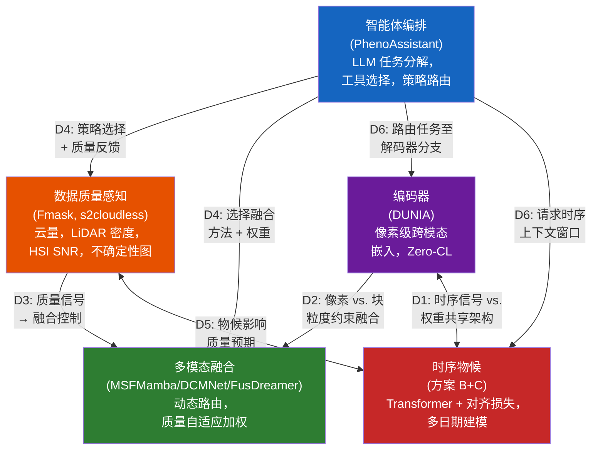

# AI 时代基于遥感的植被表型分析：方法、基准与森林迁移挑战

## 摘要

2023 至 2026 年间，AI 驱动的植被表型分析方法论在多个前沿取得了快速进展：像素级对比表示学习（pixel-level contrastive representation learning）、动态多模态融合（dynamic multimodal fusion）、基于大语言模型的智能体编排（LLM-based agent orchestration）以及物候时序建模（temporal phenology modeling）。这些方法主要在农业和城市基准上进行验证——Houston2013、Trento、PASTIS、Auto-Arborist 以及独立的行道树数据集。然而，它们在天然森林环境中的表现几乎完全未经检验。本综述对 2023–2026 年的方法论格局进行了分析性梳理，随后系统地识别了区分森林表型与农业表型的五个物理障碍：（1）多层冠层遮挡（multi-layer canopy occlusion），将单木检测 F1 降至 0.45–0.72；（2）混交林冠层复杂性，相较于纯林使分类性能下降约 21%；（3）LiDAR 生物量饱和，在 300 Mg/ha 以上饱和；（4）地形效应，在坡度超过 30° 时造成 5–12% 的精度损失；（5）跨站点泛化性能下降 20–40%。第六个障碍——极端长尾物种分布（long-tail species distributions），其中前三种物种占据 42% 的训练样本——加剧了这些物理挑战。每个障碍均以来自近期林业、遥感和生态学文献的定量证据为基础。本文并非提出集成路线图，而是识别出现有方法对森林能做什么和不能做什么，并勾勒出弥合差距所需的研究方向——其中首要是构建一个面向森林的专用多模态基准（forest-specific multimodal benchmark）。

---

## 1. 引言

全球森林每年固碳约 76 亿吨 CO₂，调节区域水文循环，并庇护 80% 的陆地生物多样性 [1]。精确、可扩展的森林表型分析——对树种组成、结构参数（树高、胸径、冠层覆盖度）和生理状态（叶面积指数、物候阶段、胁迫指标）的定量表征——是气候变化减缓、精准林业和生物多样性保护的基础。然而，当前的作业范式严重依赖野外调查，全球不到 1% 的森林面积被覆盖，且更新周期为 5–10 年 [2]。

遥感已部分弥补了这一缺口。卫星星座（Sentinel-1/2、Landsat、PlanetScope）提供 10–30 m 分辨率的全覆盖；机载激光扫描（ALS）项目如法国的 Lidar HD 计划已实现超过 40 pts/m² 的点密度 [3]；配备 RGB、多光谱、高光谱（HSI）和热红外传感器的无人机（UAV）使厘米级单木冠层（individual tree crown, ITC）观测成为可能。挑战已不再是数据稀缺，而是*数据融合*（data integration）：如何将异构模态——各自具有不同的空间分辨率（0.05 m 无人机至 250 m MODIS）、光谱范围（可见光至短波红外）和时间节奏（每日至十年）——整合为一条连贯的表型管道。

一个关键进展出现在 2026 年 4 月，Chen 等人发表于 *Nature Communications* 的 PhenoAssistant 证明了一个基于大语言模型（LLM）的多智能体系统能够以 100% 的工具选择准确率编排计算机视觉工具、统计分析和自然语言解释来完成植物表型任务 [4]。PhenoAssistant 标志着基于智能体的编排进入了植物科学领域；然而，其评估——与本综述所审阅的几乎所有方法一样——是在精心策划的农业和城市数据集上进行的。这些方法在基准上表现优异，但几乎从未在天然森林环境中得到检验。农业表型性能与森林可迁移性之间的鸿沟，定义了本综述的问题空间。

这一局限性是一个更广泛碎片化现象的征候。纵览 2023 至 2026 年的文献，可以看到前人工作中"时间线分析"所称的"四条并行之河"：

- **A 河（基础模型）**：CLIP（2021）、MAE（2022）、SAM（2023）和 DINOv2（2023）持续提供了预训练范式——对比跨模态对齐（contrastive cross-modal alignment）、掩码重建（masked reconstruction）和自监督视觉特征——下游遥感模型越来越依赖它们进行权重初始化和少样本迁移。
- **B 河（遥感多模态融合）**：从 MSFMamba 的静态选择性状态空间融合（Houston2013 OA 92.86%，2024）[5]，经 DCMNet 的数据驱动动态路由（data-driven dynamic routing）（Houston2013 OA 95.11%，Trento OA 98.96%，2025）[6]，到 IFGNet 的基于 Kolmogorov-Arnold 网络（KAN）的隐式频率聚合（Houston2013 OA 99.37%，2026）[7]，融合策略已从设计者指定发展为数据依赖，近期又趋向功能化（functionalized）。
- **C 河（对比表示学习）**：DUNIA 的像素级跨模态对比框架（pixel-level cross-modal contrastive framework）[8] 实现了零样本树高估计，RMSE 2.0 m（r = 0.93），优于监督 SOTA 的 5.2 m [8]。TaxoNet 的双边距对比损失（dual-margin contrastive loss）解决了长尾植物分类问题，在 Google Auto-Arborist 上获得了 +5.1 pp 的宏召回增益 [9]。
- **D 河（智能体编排）**：PhenoAssistant（2026）展示了 LLM 编排的多智能体工具链 [4]；SAGE（2026）证明了免训练、基于源知识库的推理使作物病害诊断平均提高了 16.2 个百分点 [10]；LEMON（2026）引入了反事实强化学习以优化多智能体编排规范 [11]。

每条河流都产生了最先进的组件，但没有一项能同时满足全部五项要求：（a）像素级跨模态表示，（b）数据质量自适应的动态融合，（c）物候时序感知，（d）长尾物种平衡，以及（e）基于智能体的编排。各个组件已经单独成熟，但在架构上处于孤立状态。

本综述通过系统分析来填补这一空白。贡献有三：

1. **结构化的方法论综述**，涵盖对比表示学习、动态多模态融合、基于 LLM 的智能体编排、物候时序建模和数据质量感知——所有性能声明均由原始论文中的定量比较作为支撑。
2. **对六个森林特异性迁移障碍的系统刻画**（多层遮挡、混交林退化、LiDAR 饱和、地形效应、跨站点泛化以及长尾分布），每个障碍均有来自林业、遥感和生态学文献的定量证据支撑。
3. **一系列研究方向**，指出要使 AI 表型分析在天然森林环境中可行所需弥合的方法论差距，其中构建森林特异性多模态基准被列为最高优先级行动。

---

## 2. 背景：森林表型任务与模态

### 2.1 核心任务

森林表型分析包含三类任务：（i）**物种识别**——为单木或均质林分分配物种或属级分类标签；（ii）**结构参数提取**——估计树高、冠径、胸径（DBH）、冠层覆盖度比例和植物面积指数（PAI）；以及（iii）**物候监测**——追踪季节性转换（萌芽、展叶、绿度峰值、衰老、落叶）并检测由干旱、虫害暴发或病原体入侵引发的异常。

天然林中的物种识别尤其具有挑战性。PureForest 是最大的基于 ALS 的树种数据集，覆盖法国南部 339 km² 范围内的 18 个树种 [3]。PlantD（人工林）在全球尺度上涵盖 64 个物种/属，但缺乏 LiDAR 覆盖 [12]。两者均呈现严重的类别不平衡：在 PureForest 中，橡树（*Quercus* spp.）和山毛榉（*Fagus sylvatica*）占主导，而稀有树种如栗树（*Castanea sativa*）的样本数量少几个数量级。在 PlantD 中，油棕（21%）、火炬松（9%）和桉树（12%）合计占样本的 42%。

结构参数提取从 ALS 中受益最多。DUNIA 的零样本检索在使用 KNN=50、检索数据库仅含 50K 标记像素的情况下，实现了树高 RMSE 2.0 m（r = 0.93）、冠层覆盖度 RMSE 11.7%（r = 0.89）和 PAI RMSE 0.71（r = 0.75）[8]。微调进一步将树高 RMSE 降至 1.3 m（r = 0.95）。这些数字在零样本设定下可媲美甚至超越了专用监督方法，如 FORMS（树高 RMSE 5.2 m）。

物候监测是三者中自动化程度最低的任务。现有物候数据集稀疏：DeepPhenoTree 提供四个欧洲站点苹果树在三个物候阶段（开花、幼果、果实）的 RGB 图像 [13]；PASTIS 提供法国地块级作物类型标签，但无物候阶段标签 [14]；卫星衍生的物候产品（MCD12Q2、MODIS phenology）运行于 500 m 分辨率，远粗于森林表型所需的 ITC 尺度。

### 2.2 核心模态及其互补性

五种遥感模态构成了森林表型分析的传感器组合，各自具有不同的物理原理和互补的信息内容：

**RGB / 甚高分辨率（VHR）光学影像**（0.05–0.5 m，来自无人机或航空平台）捕获单木冠层的细粒度纹理和形态特征。PureForest 的 ORTHO HR 影像（0.2 m，NIR-R-G-B 波段）通过冠层形状、分枝模式和阴影几何实现视觉物种判别。然而，仅靠 RGB 是不够的：在 PureForest VHR 影像上训练的 ResNet-18 仅达到 73.1% OA，而带有高程元数据的 LiDAR 达到 83.6% [3]。

**多光谱影像（MSI）** 来自 Sentinel-2（10–20 m，10 个波段）和 Landsat（30 m），将光谱范围扩展到红边和短波红外区域，这些区域对植被健康评估至关重要。从 MSI 时间序列中衍生的归一化植被指数（NDVI）、增强植被指数（EVI）和归一化燃烧指数（NBR）是物候阶段检测的主力指标。PlantD 证明，在 Sentinel-2 时间堆栈上使用具有 3D 块嵌入的视频视觉变换器（Video Vision Transformer），在 64 类物种识别中实现了约 62% 的宏 F1 [12]。

**高光谱影像（HSI）** 捕获数百个连续窄光谱波段，能够判别具有细微光谱差异的物种。基于 HSI 的融合方法（DCMNet、DFFNet、IFGNet）一直是动态融合研究的主要试验平台，Houston2013 和 Trento 数据集是标准基准 [6], [7]。关键限制在于传感器可用性：星载 HSI（PRISMA、EnMAP、DESIS）提供 30 m 分辨率、14–27 天重访周期，而航空 HSI 活动属于研究级别，空间分布稀疏。

**LiDAR**（机载激光扫描、地基激光扫描，或星载如 GEDI）提供直接的三维结构测量。在 PureForest 的 40 pts/m² 密度下的 ALS 点云，能够实现精确的树高、冠层勾绘和垂直分层。GEDI 的全波形 LiDAR 约 25 m 足迹间距、覆盖南北纬 51.6° 之间的全球范围，已成为跨模态表示学习的主要训练信号：DUNIA 的 Zero-CL 损失将 Sentinel-1/2 像素嵌入（pixel embeddings）与 GEDI 波形对齐，将垂直结构编码到像素级表示中 [8]。其根本限制在于时间稀疏性——GEDI 具有非重复轨道，对于任意位置存在多年的重访间隔。

**合成孔径雷达（SAR）** 来自 Sentinel-1（C 波段，10 m）和 ALOS-2（L 波段，30 m），提供全天时、全天候成像能力。SAR 后向散射（VV、VH 极化）对冠层结构、表面粗糙度和介电特性（水分含量）敏感。SAR 穿透云层的能力使其成为光学影像被遮蔽时的主要备选模态——这一能力在 PlantD 的多源自分类以及 MSFMamba 的 HSI-SAR 融合实验（Berlin OA 76.92%，Augsburg OA 91.38%）中得到了利用 [5]。

### 2.3 现有基准数据集

表 1 总结了三个最大的公开可用森林/人工林数据集。

| 数据集 | 规模 | 物种 | 模态 | 时序 | 关键局限 |
|---------|-------|---------|------------|----------|----------------|
| PureForest [3] | 339 km², 135K 块 | 18 个（13 类） | ALS (40 pts/m²) + VHR (0.2 m) | 单时相 | 无卫星数据，无时序 |
| PlantD [12] | 全球, 2.26M 样本 | 64 个物种/属 | S-1, S-2, L-7, ALOS-2, MODIS | 多年时序 | 无 LiDAR |
| CitrusFarm [15] | 1.3 TB, 7.5 km 穿越 | 3 种柑橘品种 | 9 种传感器（RGB, NIR, 热红外, LiDAR, IMU, GNSS-RTK） | 单次穿越 | 无语义标签 |

浮现出三个关键数据缺口：（1）没有任何数据集同时提供卫星时间序列、ALS 点云和 ITC 分辨率的地面真值物种标签；（2）PhenoCam 风格的多作物候标签（萌芽日期、落叶日期）在所有三个数据集中均缺失；（3）生理地面测量（叶片叶绿素含量、水势、光合速率）未与遥感采集进行空间联合配准。

---

## 3. 植被表型方法的方法论综述

我们将 2023–2026 年的方法论格局沿五个分析维度进行组织。对每个维度，我们编目候选架构选择，在定量基准上进行比较，并识别与森林可迁移性最相关的验证缺口。

### 3.1 编码器设计

编码器将原始多模态传感器数据（多光谱像素、SAR 后向散射、LiDAR 点云或波形）转换至统一的表示空间。对于森林表型，编码器需要同时满足多个要求：像素级空间粒度（用于 ITC 级分析）、跨模态对齐（至少 MSI + SAR + LiDAR）、零样本或少样本能力（森林地面真值稀缺），以及——理想情况下——物候时序感知。

#### 3.1.1 候选方法

七种编码器范式已在 DUNIA 论文 [8] 的统一实验设置下进行了评估（在 836K Sentinel-1/2 块 + 19M GEDI 波形上预训练，250K 步，相同下游任务）。表 2 展示了与森林相关的下游任务的关键定量比较。

| 维度 | DUNIA [8] | AnySat [16] | CROMA [17] | SatMAE [18] | DOFA [19] | Scale-MAE [20] | DeCUR [21] |
|-----------|-----------|-------------|------------|-------------|-----------|---------------|------------|
| 发表载体 | arXiv 2025 | CVPR 2025 | NeurIPS 2023 | NeurIPS 2022 | arXiv 2024 | ICCV 2023 | AAAI 2024 |
| 预训练 | 对比 + 重建 | 多模态融合 | 对比 + MAE | 掩码重建 | MAE + 动态权重 | MAE + 尺度嵌入 | 对比（解耦） |
| 模态 | S-1+S-2+GEDI | S-1+S-2+VHR+时序 | S-1+S-2 | S-2 | 任意光学 | 多分辨率光学 | S-1+S-2 |
| 粒度 | 像素级（10 m） | 块级 | 块级（8×8） | 块级（8×8） | 块级 | 块级 | 块级 |
| 微调树高（RMSE） | **1.3 m** (r=0.95) | 2.8 m (r=0.89) | 3.5 m (r=0.78) | 10.5 m (r=0.52) | 11.0 m (r=0.51) | — | 11.0 m (r=0.55) |
| 微调物种（wF1, PF） | 82.2 | **82.3** | 80.5 | 78.8 | 79.8 | — | 78.9 |
| 20% 标签树高（RMSE） | **1.4 m** (r=0.93) | 2.8 m (r=0.89) | 3.6 m (r=0.76) | 10.5 m (r=0.52) | 11.2 m (r=0.50) | — | 11.1 m (r=0.52) |
| 时序支持 | 单中值合成 | 原生多时序 | 静态 | 时序掩码 | 静态 | 多尺度空间 | 静态 |
| 推理（20 km²） | **4.22 s** | 177 s | — | — | — | — | — |
| 开源 | 是 | 是 | 是 | 是 | 是 | 是 | 是 |

DUNIA 的零样本性能对地面测量有限的森林场景尤为相关。使用 KNN=50 和含 50K 标记像素的检索数据库（约 31 km²，约为监督方法所需数据的 0.25%），DUNIA 实现了：树高 RMSE 2.0 m（r = 0.93），对比监督 SOTA FORMS 的 5.2 m（r = 0.77）；冠层覆盖度 RMSE 11.7%（r = 0.89），对比 FORMS 的 22.1%（r = 0.54）；PAI RMSE 0.71（r = 0.75），对比 FORMS 的 1.5（r = 0.35）；以及物种 wF1 76.0%（KNN=5），对比监督 SOTA 的 74.6% [8]。

#### 3.1.2 比较观察

DUNIA 在树高估计中达到最低 RMSE（微调 1.3 m，零样本 2.0 m）并在 20 km² 上实现 4.22 s 推理——是本次比较中唯一的像素级编码器。AnySat 在 PureForest 上达到最高物种分类（wF1 82.3），但为块级，推理速度慢约 40 倍。其他方法的 RMSE 显著较高（树高 ≥3.5 m），均为块级操作。单个编码器能否同时提供像素级跨模态对齐和物候时序感知，仍是森林应用的关键开放问题。

#### 3.1.3 已识别缺口：时序物候

DUNIA 最显著的局限是依赖单个生长季中值合成作为输入。在 PASTIS 上，这导致零样本与监督 SOTA 存在 28 pp 的差距（OA 56.2% vs. 84.2%），与 AnySat 的多时序输入存在 24.9 pp 的差距（81.1%）。对于落叶林物候分析——其中落叶/有叶的光谱对比是主要判别依据——这一局限性是结构性的而非偶然的。DUNIA 的多时序自编码器（UNet + ConvLSTM，3 个时间步）是一个辅助重建模块——而非物候敏感的表示学习器——其时间平均池化（temporal average pooling）丢弃了对区分早发橡树和晚发白蜡树至关重要的时序信息。

---

### 3.2 多模态融合策略

给定来自多个模态（HSI、LiDAR、SAR、MSI）的编码特征，融合模块将它们组合为下游分类或回归的联合表示。核心设计问题是：*融合策略最好被设计为静态的（在设计时固定）、数据驱动的（从特征统计中学习），还是情境依赖的（由外部信号如数据质量、物候阶段或任务规范所决定）*。

#### 3.2.1 候选方法

表 3 在定量基准上比较了五种领先的融合范式。所有数字来自原始论文；"*"表示少样本设置（约 20 样本/类）；其他结果为全监督（约 150–200 样本/类）。注意 IFGNet 未在 Trento 上评估；FusDreamer 在少样本条件下评估。

| 方法 | 年份 | 核心机制 | Houston2013 OA | Houston2013 Kappa | Trento OA | 参数量 | 推理时间 |
|--------|------|---------------|----------------|-------------------|-----------|--------|-----------|
| **MSFMamba** [5] | 2024 | 选择性 SSM + 双输入交叉参数化 | 92.86 | 92.25 | — | 1.53M | 0.175 s |
| **DCMNet** [6] | 2025 | 3 层动态路由与双线性注意力 | 95.11 | 94.69 | **98.96** | 3.83M | 0.010 s |
| **DFFNet** [22] | 2025 | 动态频域滤波核 + 通道打乱 | 92.35 | 91.70 | — | 1.28M | 0.239 s |
| **FusDreamer** [23] | 2025 | 潜在扩散 + CLIP 引导提示对齐 | 89.24* | 90.15* | 96.36* | 大规模 | 16–67 s |
| **IFGNet** [7] | 2026 | KAN B 样条隐式空间-频率聚合 | **99.37** | **99.32** | — | 轻量 | 快速 |

*注：推理时间如原始论文中所述，可能因硬件（GPU 型号、批次大小）和软件实现（框架、优化级别）的差异而不具直接可比性。仅作为部署可行性评估的数量级参考，而非精确基准比较。*

**MSFMamba（2024）** 将选择性状态空间模型 Mamba 引入多模态融合，通过跨模态 SSM 参数化（Fus-Mamba）实现线性 O(n) 复杂度。在 Houston2018 上 OA 92.38%；Augsburg（HSI+SAR）91.38% [6]。

**DCMNet（2025）** 标志着从静态到动态融合的转变，使用三层路由空间（BSAB、BCAB、ICB 模块），其中一个路由门（routing gate）从特征统计生成路径概率。Trento OA 达到 98.96%，Kappa 98.61% [6]。

**DFFNet（2025）** 和 **IFGNet（2026）** 构成频域融合家族。DFFNet 应用 2D FFT 与动态频率核生成（GAP+MLP+Softmax），以 1.28M 参数实现 Houston2013 OA 92.35% [22]。IFGNet 通过 KAN B 样条隐式频率聚合扩展了此方案，达到 OA 99.37%（Kappa 99.32%），但代码未开源 [7]。

**FusDreamer（2025）** 引入潜在扩散（LaMG）与 CLIP 引导提示对齐，使文本提示驱动的融合成为可能——这是唯一在少样本条件下（13–18 样本/类，Trento OA 96.36%）测试的方法。文本提示接口适合智能体控制 [23]。

#### 3.2.2 比较观察

五种融合范式展现出清晰的精度递进：MSFMamba（OA 92.86%）→ DFFNet（92.35%）→ DCMNet（95.11%）→ IFGNet（99.37%），FusDreamer 在少样本条件下以 96.36% 占据独特生态位。所有五种方法均在城市 HSI-LiDAR 基准（Houston2013、Trento）上评估；没有一种在具有重叠冠层、混交树种或地形起伏超过 20° 的森林场景上测试。所有方法共同面临的缺口是缺乏外部质量信号注入：融合决策完全由内部特征统计驱动，而非由采集条件如云量或 LiDAR 点密度驱动（第 3.5 节）。

#### 3.2.3 已识别缺口：外部质量信号注入

全部五种方法均将融合决策建立在内部特征统计之上（DCMNet 的门控输入为 F_h + F_l + X；DFFNet 的核使用输入特征的 GAP；MSFMamba 的 SSM 参数从配对模态的特征生成）。没有一种方法接收关于采集条件的外部质量信号——云量、LiDAR 密度、SAR 相干性或噪声水平。这一缺口是结构性的：不是个体方法的失败，而是质量评估层与融合层之间缺失的接口。

---

### 3.3 智能体编排

智能体编排器（agent orchestrator）接受用户对表型任务的自然语言描述，将其分解为可执行的子任务，选择合适的视觉模型和分析工具，监控执行，并聚合结果。核心设计张力在于*可靠性*（确保正确的工具选择和执行）与*适应性*（处理开放式、先前未见任务规范的能力）之间。

#### 3.3.1 候选方法

三种智能体范式已在植物/森林领域得到展示，其中两种有定量评估结果：

**PhenoAssistant（2026）** [4] 采用中心化多智能体架构：管理智能体（Manager Agent）（GPT-4o，temperature = 0.1）接收自然语言指令，生成分步计划，并将任务分派给包含视觉模型库（Mask2Former、Leaf-only SAM、DINOv2-base with LoRA fine-tuning）、表型提取工具、代码编写器、数据可视化器、图表分析器（基于 Pandas AI）、表格分析器、RAG 智能体以及确定性统计模块（ANOVA、Tukey-Kramer 事后检验）的工具箱。工具通过结构化模式（名称、描述、参数、I/O 格式）暴露，基于 AutoGen 框架构建。在 20 个人工设计的任务上评估结果为：工具链合理性 4.25/5（含 Critic Agent 时为 4.35/5）、工具存在性 5.00/5、工具适当性 4.65/5（含 Critic 时为 4.90/5）、参数正确性 4.30/5（含 Critic 时为 4.40/5）。视觉模型类型推荐准确率达到 100%（50/50 任务）；视觉模型精确匹配达到 100%（20/20 任务）。数据分析任务达 85% 准确率（17/20）；全部三个失败归因于图表分析器的细粒度视觉推理——LLM 误解了图表元素，表明基于 LLM 的视觉推理仍是主要瓶颈 [4]。

**SAGE（2026）** [10] 采用免训练的智能体推理管道用于作物病害诊断：器官识别 → 解剖学索引过滤 → 基于源知识库（KB）的症状匹配 → 有限预算 k 下的顺序参考图像对比 → 带完整推理轨迹的预测。完整管道（KB + k=8 参考图像）较基线平均提高了 16.2 个百分点的诊断准确率 [10]。

**LEMON（2026）** [11] 引入反事实强化学习以优化多智能体编排规范——这是一条在不同数据质量下学习智能体策略而非硬编码编排规则的潜在路径。

#### 3.3.2 比较观察

PhenoAssistant 的 100% 工具选择准确率和 SAGE 的 +16.2 pp 诊断提升表明，当感知被委托给专用视觉模型时，LLM 能够可靠地编排科学工具链。PhenoAssistant 的失败分析显示所有错误源自细粒度 LLM 视觉推理，而工具选择零失误——表明 LLM 的角色最好限定于编排而非感知。SAGE 的解剖学索引过滤模式在概念上可迁移至林业：按物候、地理和分类索引的知识库可在调用视觉分类器前缩小候选物种集合。三种智能体范式的验证均基于农业或通用基准，未经森林表型任务的检验。

#### 3.3.3 已识别缺口：从工具编排到融合策略编排

PhenoAssistant 编排的是*哪个工具*处理*哪个子任务*，但不调整多模态数据*如何*融合。Manager 选择 Mask2Former 进行分割、DINOv2 进行分类，但不能指示融合模块在检测到云层时对 LiDAR 加权高于 HSI，或在分析物候转换时调用频域滤波。这一缺口源于架构：Manager 没有与融合模块决策层的接口，且融合模块没有被暴露的可接受外部控制信号的参数。

---

### 3.4 物候时序建模

森林物候——生物事件的季节性循环（萌芽、展叶、光合活性峰值、衰老、落叶）——为温带和北方森林中的物种判别提供了信息最丰富的时序信号。在夏季高峰期光谱近乎相同的落叶物种（如 *Quercus robur* vs. *Quercus petraea*）展现出不同的时序轨迹：萌芽日期的差异（通常 1–3 周）、展叶速率和衰老起点的差异，在有时序上下文可用时创造了可分离的特征。

#### 3.4.1 为何时序建模至关重要

时序信息对物种判别具有决定性。AnySat 使用原生多时序输入在 PASTIS 分类上达到 wF1 81.1，而 DUNIA——使用单中值合成——在零样本下仅达 56.2% [8]。"绿色荒漠"现象（光谱恢复的冠层掩盖结构退化）只能通过时序分析检测 [24]。Gauli 等人证明在复杂森林地形中可行的时序机器学习，跨生态区 R² = 0.683–0.757 [25]。

#### 3.4.2 候选方法

在论文审阅的文献中，探索了三种时序编码策略：

**方案 A：输入级多时序拼接。** 多期 Sentinel-2 影像沿通道维度拼接，形成 [B, T×C, H, W] 张量，送入标准空间编码器。这是 AnySat [16] 使用的方法。优点：最小的架构变动，重用现有编码器权重。局限：模型对时序顺序不敏感（打乱影像日期产生几乎相同的表示）；无时间距离概念；无显式位置编码。

**方案 B：编码器内置时序变换器。** 每个时间步由共享权重的空间编码器独立编码，生成每个时间步的块嵌入 z_t。添加年积日（Day-of-Year, DOY）正弦位置编码：PE(DOY, 2i) = sin(DOY/365 × 10000^{2i/d})，PE(DOY, 2i+1) = cos(DOY/365 × 10000^{2i/d})。多头自注意力跨时间维度应用：Attention(Q, K, V) = softmax(QK^T/√d_k + M)V，其中 M 为时序掩码。TSP-Former（2025）在烟草制图中展示了此方法 [26]；一项 2026 年的工作应用 3D 块嵌入与时序位置编码进行全周期植被表型分析 [27]。

**方案 C：后置时序对齐损失。** 编码器保持不变；时序信息完全通过辅助损失函数注入。三个组件构成损失：（i）平滑损失 L_smooth = Σ_t ||e_t − e_{t+1}||² · exp(−α·|DOY_t − DOY_{t+1}|)；（ii）循环损失 L_cyclic = ||e_1 − e_T||² · exp(−α·(365 − |DOY_T − DOY_1|))；（iii）恒等损失 L_identity = Σ_t ||e_t − mean(e)||²。几何解释是嵌入空间中的"物候管"：每个冠层的季节轨迹被约束在其身份中心周围半径 τ 的管内，而不同物种的管保持分离。

表 4 在关键设计维度上比较这三种方案。

| 维度 | 方案 A: 输入拼接 | 方案 B: 时序变换器 | 方案 C: 时序对齐损失 |
|-----------|----------------------|-------------------------------|----------------------------------|
| 编码器修改 | 无（仅输入） | 大（新的时序模块） | 无（仅损失） |
| 时序依赖建模 | 隐式（CNN 局部） | 显式（全局注意力） | 无（仅损失层面） |
| 变长序列 | 否 | 是 | 是 |
| 计算开销 | ~1×（基线） | ~1.5–4×（取决于 T） | ~1× |
| 时间位置感知 | 否 | 是（DOY PE） | 部分（通过损失） |
| 与 DUNIA Zero-CL 兼容性 | 是 | 是（需适配） | 是（可并行使用） |

#### 3.4.3 比较观察

输入级拼接（方案 A）最简单，但不提供时序顺序感知。时序变换器（方案 B）提供显式 DOY 编码和全局时序注意力，但需要架构修改。后置对齐损失（方案 C）作为正则化器，但不能补偿单日预训练。目前没有方法能同时提供像素级跨模态对齐和物候时序感知。

#### 3.4.4 已识别缺口：无方法同时实现跨模态像素对齐和时序物候

DUNIA 实现了像素级跨模态对齐，但时序上是静态的；AnySat 是多时序的，但为块级。没有方法能同时提供像素级跨模态嵌入、物候时序感知和零样本参数估计。弥合这一缺口需要以保留 Zero-CL 和双解码器架构为前提，用时序变换器扩展 DUNIA。

---

### 3.5 数据质量感知

遥感数据质量本质上是可变且不可预测的。热带和温带地区云层可使 30–70% 的光学像素无法使用；LiDAR 点密度随飞行参数、地形和冠层闭合度变化；SAR 相干性在水体和地表快速变化区域退化；HSI 推扫式传感器可能出现条纹伪影。部署在策划基准数据集之外的森林表型系统需要能够对输入质量进行推理并相应调整其融合策略。

#### 3.5.1 已存在：成熟的质量评估组件

数据质量评估的个体构件已进入生产就绪状态：云和云阴影检测（Fmask [28] 在 85–90% F1，s2cloudless 在 88–92%，基于 DeepLabV3+ 的方法在 92–96%，时空方法在 94–97%）；LiDAR 质量指标（点密度、回波数分布、扫描角度、地面点比例）在 LAS/LAZ 元数据中标准化，GEDI 提供逐足迹质量标记；HSI 噪声估计（HSI-SDeCNN 用于去条纹，HyMiNoR 用于混合高斯+条纹+脉冲噪声）；以及通过 UnCRtainTS [29] 进行的不确定性量化，可产生作为质量输入的逐像素不确定性图。关键发现是：没有现有论文将数据质量评估与自适应融合策略选择连接起来——这是一个文献空白，而非组件可用性空白。

#### 3.5.2 已存在：缺失模态和质量自适应训练

缺失模态（Missing Modality, MM）领域提供了最接近的技术先例：ActionMAE 通过随机丢弃 + MAE 重建证明了缺失模态鲁棒性 [30]，而 M3L 使用教师-学生 KL 蒸馏从部分输入逼近全模态性能 [31]。这些技术可以直接映射到质量自适应融合——云遮挡 ≡ 模态丢弃，低 LiDAR 密度 ≡ 模态噪声——其中质量自适应丢弃策略 `drop_prob = 1.0 - quality_score` 是一个直接扩展，尽管尚未在遥感融合中验证。可证明动态融合（Provable Dynamic Fusion，Zhang 等人，2023，ICML）和预测动态融合（Predictive Dynamic Fusion，2024）为质量加权融合提供了理论基础，但隐式地学习质量权重而非从显式质量评估中学习 [32], [33]。

#### 3.5.3 已识别缺口：质量到融合的映射接口

尚未解决的核心设计问题是：*给定质量向量 q = [cloud_pct, lidar_density, hsi_snr, sar_coherence, phenology_stage]，合适的融合策略是什么？* 该映射既无经验表征也无理论指导。具体子缺口包括：

- **GAP-1（质量到策略映射）**：没有消融研究刻画融合策略选择如何与数据质量水平交互——在什么云层阈值下，从 HSI 主导转向 LiDAR 主导的融合变得有益？
- **GAP-2（多维度质量融合）**：云量、LiDAR 密度、HSI 噪声、SAR 相干性和物候阶段是不可通约的质量维度。它们如何被融合为统一的综合质量信号？
- **GAP-3（质量感知训练数据）**：具有受控质量退化的训练数据稀缺。合成增强（模拟云遮挡、LiDAR 子采样、HSI 波段噪声）是务实路径，但对真实采集伪影的保真度需要验证。

---

## 4. 森林迁移鸿沟

第 3 节分析的五个设计维度几乎完全在农业和城市基准上验证。将这些方法迁移至天然森林环境会引入当前基准未捕获的物理挑战。本节分析六种跨维度依赖关系，它们源自森林环境需求的特殊性。

### 4.1 森林环境要求但当前基准未检验的能力

图 1 展示了五个设计维度及其六种跨维度依赖关系。

**依赖关系汇总：**
| ID | 关系 | 类型 | 关键含义 |
|----|-------------|------|-----------------|
| D1 | 编码器 ↔ 时序 | 双向 | 时序策略约束编码器架构（孪生权重共享） |
| D2 | 编码器 → 融合 | 单向 | 像素级嵌入使空间精确融合决策成为可能 |
| D3 | 质量 → 融合 | 单向 | 质量评估馈送融合控制——任何系统中尚未建立的连接 |
| D4 | 智能体 ↔ 质量 + 融合 | 双向 | 智能体将质量评估与策略选择整合，形成中央控制回路 |
| D5 | 时序 ↔ 质量 | 双向 | 物候阶段影响质量解读（有叶期 vs. 无叶期数据可靠性） |
| D6 | 智能体 → 编码器 + 时序 | 单向 | 任务规范决定哪些解码器输出和时间步是相关的 |

**D-1：编码器 ↔ 时序物候（双向）。** 编码器决定了哪些时序信息是可访问的。单日编码器（当前 DUNIA）不向下游模块提供时序信号，无论时序建模层有多复杂。反之，时序建模策略反馈到编码器设计：若采用方案 B（时序变换器），空间编码器以孪生模式运行，跨时间步共享权重，解码器在跨模态对齐中保持时序一致性（Zero-CL 与 GEDI 波形在每个时间步独立应用，附加时序平滑约束）。

**D-2：编码器 → 融合（单向）。** 编码器的输出粒度（像素 vs. 块）和嵌入质量（跨模态对齐强度）约束了可行的融合策略。像素级嵌入（DUNIA）使每个 10 m 像素独立参与融合决策，实现空间精确融合。块级嵌入（AnySat、CROMA）将融合约束为在聚合空间单元上操作，丢失块内异质性。编码器的跨模态对齐质量（DUNIA Zero-CL 余弦相似度 0.86 vs. VICReg 0.56）决定了下游融合中跨模态注意力机制的可靠性。

**D-3：质量感知 → 融合（单向）。** 这是尚未满足的核心依赖。质量评估输出（云掩码、LiDAR 密度、HSI SNR、不确定性图）被转化为融合控制信号。具体的注入点取决于融合架构：对于 DCMNet，质量信号被添加到路由门输入；对于 MSFMamba，质量信号参与 Fus-SSM 中 B/C/Δ 参数生成；对于 FusDreamer，质量信号被编码到文本提示中。注入架构的选择创造了依赖：选择融合方法约束了质量信号如何被集成。

**D-4：智能体编排 → 质量感知 + 融合（双向）。** 智能体是整合质量评估与策略选择的自然焦点。智能体可接收结构化质量报告（cloud_pct=67, lidar_density=1.2e6, hsi_snr=23.4, phenology_stage="leaf_expansion"），对其含义进行推理（"云量 67% 超过 30% 阈值；优先使用 LiDAR 结构特征；处于展叶阶段的落叶林受益于光谱区分"），并输出融合策略规范。然而，智能体不能绕过 D-3 中识别的质量→融合接口——它只能在该接口存在时加以控制。

**D-5：时序物候 ↔ 质量感知（双向）。** 物候阶段影响质量预期：落叶林无叶期 LiDAR 具有更高的地面点密度和更可靠的地形模型；有叶期光学影像对物种判别具有更高的光谱信息含量。反之，质量退化影响物候信号可靠性：五月一个具有 80% 云量的时间步可能给出误导性的"低绿度"信号，被误读为展叶延迟而非数据质量伪影。

**D-6：智能体编排 → 编码器 + 时序物候（单向）。** 智能体的任务规范决定了哪些编码器输出是相关的。"测绘冠层高度"任务需要垂直结构嵌入（DUNIA 的 OV 解码器输出）；"树种分类"任务需要带时序上下文的水平嵌入（OH 解码器输出）；"检测干旱胁迫"任务需要两者并附带异常检测能力。如果智能体编排融合策略，它还需恰当地路由编码器输出——选择哪个解码器分支、哪些时间步以及哪些嵌入维度转发给下游模块。

### 4.2 森林特异性迁移障碍

上述依赖关系是结构性的——无论目标领域是玉米田还是热带森林，它们都存在。然而，天然森林施加了六种物理约束，农业和城市基准未能捕获，每一种都直接冲击 D1–D6 中的一个或多个依赖。

#### 4.2.1 多层冠层遮挡

在农业环境中，作物冠层近似平面——单株植物空间上分离、高度均匀、以已知密度种植。在单作作物（玉米、棉花、小麦）上训练的模型，其单木检测 F1 常规超过 0.90，因为检测问题在几何上是良态的：植物不垂直重叠，行间距提供强先验，林下植被被除草剂或机械管理所压制。相比之下，在天然森林中，冠层被垂直分层为主林层、中林层和下木层，没有种植网格且冠层连续重叠。自上而下的遥感主要看到上层冠层；中林层和下木层的树木被遮挡。农业 F1 > 0.90 与森林 F1 0.45–0.72 之间的差距不仅仅是程度问题——它反映了一种农业基准无法探测的、质上不同的检测几何。

定量来看，Beloiu 等人（2023）报道在异质温带森林中使用航空 RGB，单木冠层（ITC）检测 F1 范围为 0.45–0.72，抑制的下层树木性能最低 [35]。Silwal 等人（2024）通过 DIRSIG 辐射传输模拟混合 Harvard Forest 场景，发现即使在最优 1 m 分辨率条件下，1D-CNN 仅能识别 24 个属级类别中的 16 个，在 30 m 分辨率下进一步降至 24 中 7 个（OA 54.09%）[36]。Sivanandam 等人（2022）报道在密集、重叠的桉树冠层中树木检测 mAP 降至约 0.50，而在开阔区域为 0.65+，不同树种频繁被合并为单一段落 [37]。SegmentAnyTree（2024）是唯一显式评估跨冠层性能的 ITCD 模型，在密集的地基和移动激光扫描数据（TLS/MLS/ULS）上展示——而非基于上冠层 ALS 或无人机影像 [38]。Zhao 等人（2023）对基于 CNN 的 ITCD 的系统综述将多层检测识别为未解决的关键缺口 [39]。

对设计维度的含义是直接的：**D2（编码器 → 融合）**——块级编码器丢失块内垂直异质性；**D3（质量 → 融合）**——现有质量信号不编码遮挡深度；**D1（编码器 ↔ 时序）**——无叶期采集可穿透落叶冠层，但当前编码器缺乏季节感知。

#### 4.2.2 混交林 vs. 纯林退化

农业表型分析压倒性地在单作地块上运作。混交林中的森林物种识别实质上更加困难。Lee 等人（2023）提供了最直接的对比：在同一 CNN 架构上使用双季无人机 RGB+LiDAR 数据训练，单一物种分类 F1 达到 0.95，而含两种或更多混交物种的标签降至 F1 = 0.75——退化 21% [40]。Marinelli 等人（2022）使用 ALS 点云衍生特征（高度百分位数、强度统计）和 DNN 评估了意大利阿尔卑斯山 7 树种混交林分类：在仅含针叶林或仅含阔叶林的同质子集上训练时，OA 分别达到 82.54% 和 86.64%，但在完整的 7 类混交设置中，阔叶树种如 *Ostrya carpinifolia* 降至 F1 = 64.52% [41]。方法论上的对比很有启发性：Lee 的方法证明即使有最优多模态输入（无人机 RGB + LiDAR 在厘米级分辨率），混交林退化仍持续在约 21%；Marinelli 的方法表明单模态（仅 LiDAR）分类从根本上受到冠层重叠使每棵树的有效点密度低于传感器标称规格的限制。一项 2021 年基于 LiDAR 的树种分类综述报道，在 2–5 pts/m² 时 OA ≈ 50%，而 OA ≈ 70% 需要 >50 pts/m² [41]。在混交林中，这些阈值更难达到，因为冠层间重叠将点预算分配到多棵树上。

此障碍冲击 **D2（编码器 → 融合）**：在纯林中可分离的光谱和结构特征在混交冠层中变得纠缠，要求能够解析子冠层异质性的融合策略。

#### 4.2.3 LiDAR 生物量饱和（300 Mg/ha 以上）

从 ALS 进行地上生物量（AGB）估计存在一个广泛记录的饱和上限。Tian 等人（2023）在其对森林 AGB 估计的全面综述中报道，ALS 衍生指标在约 300–500 Mg/ha 处饱和，此后额外的生物量不会在 LiDAR 高度或密度指标中产生可测量的变化 [42]。异速生长链——树高 → DBH（通过物种特异性 H-D 异速方程，R² = 0.70–0.85）→ 树干材积（削度方程）→ AGB（木材密度 × 生物量扩展因子）——每一步都会积累误差，异速方程不匹配贡献 10–30% 的相对 RMSE [42]。在全球尺度上，GEDI L4A 产品在足迹级别达到 R² = 0.55–0.70，rRMSE 为 40–80% [43]。

一个开放问题是 DUNIA 的跨模态嵌入是否受相同饱和影响。DUNIA 在 PureForest 上实现了零样本树高 RMSE 2.0 m（r = 0.93），PureForest 包含法国南部成熟的橡树-山毛榉林分，未受干扰的参考样地中地上生物量在 250–400 Mg/ha 之间 [3]。由于 DUNIA 编码了光谱信息（Sentinel-1/2，捕获了在结构饱和之外继续变化的冠层化学和纹理）和结构信息（GEDI 波形），它可能部分规避了纯 LiDAR 的饱和。然而，DUNIA 的逐生物量区间树高预测精度未被报道；2.0 m 的 RMSE 可能掩盖了 300+ Mg/ha 区间内更高的误差。这仍是一个需要在一个带有联合现场生物量测量的森林基准上进行评估的经验问题。

此障碍主要冲击 **D2（编码器 → 融合）** 和 **D3（质量 → 融合）**：等权重加权各模态的融合策略无法补偿这样一个事实：在约 300 Mg/ha 以上，结构（LiDAR）信息饱和，而光谱（光学、SAR）信息仍可能携带区分信号。

#### 4.2.4 地形效应

山区森林——构成全球森林覆盖的很大部分——引入了平坦农业基准中不存在的地形畸变。You 等人（2020）证明，在坡度超过 30° 时树种分类 OA 下降 5–12%，南北坡向差异因各向异性光照造成 OA 差距 8–15% [44]。地形阴影降低了物种可分离性，陡峭地形（>40°）引入 LiDAR 点云配准误差。SCS+C 地形校正方法代表了目前最佳折中，但残余辐射畸变持续存在 [44]。这些效应在不同传感器类型间相互叠加：传感器遭受阴影引发的辐射畸变；LiDAR 在陡坡上表现出不均匀的地面点采样和光束发散；SAR 引入几何叠掩和透视收缩伪影，降低与光学和 LiDAR 模态的联合配准。与季节性太阳角度的交互尤其成问题——冬季低太阳角度将地形阴影比夏季放大 2–3 倍，人为压低植被指数并产生假阴性物候信号，可能被误认为展叶延迟或过早衰老。

此障碍冲击 **D1（编码器 ↔ 时序）** 和 **D5（时序 ↔ 质量）**：地形效应具有季节性（冬季低太阳角度下更强）并与物候阶段交互，但当前编码器未考虑地形-物候耦合。

#### 4.2.5 跨站点和跨季节泛化

系统测量最充分的障碍是跨站点泛化退化。跨多项研究，当模型迁移至保留的地理站点或季节时，F1 或 OA 持续报告 20–40% 的下降：

| 研究 | 任务 | 退化 | 来源 |
|-------|------|------------|--------|
| Beloiu 等人（2023） | ITC 检测 + 物种识别，3 个站点 | F1 0.72 → 0.45（−37%） | [35] |
| TreeSatAI（Ahlswede 等人，2023） | 多传感器物种分类，3 个德国州 | OA 85% → 61%（−28%） | [45] |
| TaxoNet（2025） | 细粒度物种分类，5 个气候带 | Top-1 91.2% → 67.8%（−23.4%） | [9] |
| Kattenborn 等人（2022） | CNN 空间自相关膨胀 | OA 膨胀 15–30% | [46] |
| DeepForest 社区 | 实际 vs. 报道准确率 | 差距 15–30 pp | [47] |

Kattenborn 等人（2022）进一步证明，标准随机训练/测试划分中的空间自相关使 CNN 准确率膨胀 15–30%，意味着许多已发表的森林分类结果可能高估了真实泛化能力 [46]。这种膨胀对森林评估尤其阴险，因为相邻的森林地块共享物种组成、土壤条件、小气候和管理历史——使随机像素级划分即使从不同影像中抽取时也是严重有偏的估计量。阻拦式空间交叉验证（blocked spatial cross-validation），即保留整个林分或地理瓦片，始终揭示比随机划分低得多的准确率。对于 PureForest，报道的 83.6% OA（LiDAR + 地形高程）是在分层地理划分下获得的，部分缓解了自相关，但 Kattenborn 报道的 15–30 pp 范围表明，即使是"空间感知"划分也可能不能完全解释连续森林景观的相关结构。来自 DeepForest 用户的社区反馈确认，真实森林部署准确率比报道的基准数字低 15–30 个百分点 [47]，与自相关膨胀的数量级一致。对评估的含义是：森林基准设计需要在林分或流域级别进行阻拦式空间验证，而无显式空间验证协议的报道准确率数字最好被解读为理论上限而非预期部署数值。

此障碍同时冲击全部六个依赖：在一个区域预训练的编码器可能产生与另一个区域不对齐的嵌入（D1, D2）；质量信号在不同站点间分布不同（D3, D5）；依赖区域特异性生态知识的智能体推理链可能无法迁移（D4, D6）。

#### 4.2.6 长尾物种分布

森林树种表现出极端的、与农业数据集中中等类别不平衡有质上不同的长尾分布。在 PlantD 中，前 3 种——油棕（21%）、火炬松（9%）和桉树（12%）——合计占总样本的 42% [12]。在 PureForest 中，橡树（*Quercus* spp.）和山毛榉（*Fagus sylvatica*）占主导，而稀有物种如栗树（*Castanea sativa*）的样本数量少几个数量级 [3]。这种倾斜具有具体后果：PureForest 上的标准 OA 报告（LiDAR + 地形高程达 83.6%）掩盖了稀有物种每个类别的 F1 低于 30%。

长尾问题在计算机视觉中得到了深入研究（TaxoNet、EKDC-Net、focal loss、LDAM），但这些方法主要在单模态 RGB 数据集（Auto-Arborist、iNaturalist）上评估。没有方法能同时解决（a）多模态融合、（b）长尾重平衡和（c）像素级跨模态对齐——这三者在具有 LiDAR + 光学 + SAR 输入的森林物种分类中均为必需。

此障碍主要冲击 **D1（编码器 ↔ 时序）** 和 **D6（智能体 → 编码器）**：稀有物种物候是采样最少的，需要能从头部类别时序轨迹泛化的编码器，以及显式将计算预算分配给欠采样分类群的智能体。

### 4.3 为何这些障碍相互叠加

六个障碍并非独立。多层遮挡（4.2.1）降低有效点密度，进而放大混交林退化（4.2.2）并加速 LiDAR 饱和（4.2.3）。地形效应（4.2.4）加剧跨站点泛化（4.2.5），因为地形校正残差是领域特异的。长尾分布（4.2.6）与混交林分类相互交织：稀有物种不成比例地出现在混交林分中，意味着用于训练稀有物种的样本同时也是最难分类的。没有现有基准同时探测遮挡、混交林组成、地形变异和长尾分布——而这正是天然森林的实际运行条件。

---

## 5. 评估：森林特异性基准需要什么

当前森林 AI 系统的评估实践压倒性地依赖农业和城市基准。本节不提出评估框架；而是基于第 4 节记录的迁移障碍，识别森林特异性评估*需要测量什么*。借用医学 AI 评估中的 QUEST 框架 [34] 作为结构化工具，枚举森林基准需要覆盖的维度。

### 5.1 当前评估的缺陷

PhenoAssistant 的评估 [4] 在其范围内虽严格，但体现了泛化到更广泛领域的五个局限：

1. **不可扩展性**：50 个人工设计的测试案例，每个案例需要人工判断，无法支撑数千个回归测试的迭代开发。每轮评估花费 1–2 人天。
2. **缺乏长尾感知**：测试案例按设计是平衡的，掩盖了稀有物种的性能退化——这些恰恰是保护关切度最高的类别。PureForest 的 18 个物种中头尾比超过 100:1，但标准 OA 报告（LiDAR+地形高程达 83.6%）掩盖了稀有物种（如栗树）每个类别的 F1 可能低于 30% 的事实。
3. **无开放集测试**：PhenoAssistant 的评估不含"不可能回答"或"分布外"测试案例，使真阴性率（TNR）无法评估。
4. **无跨领域泛化测试**：所有评估均在训练分布的地理和季节范围内。TaxoNet 的领域迁移实验（AA-Central → AA-West/East，双边距相对基线 +3.5–4% 召回增益）表明，领域泛化能力在不同方法间差异显著，值得显式测量 [9]。
5. **错误来源未分解**：当智能体产生错误答案时，不清楚错误是源自（a）错误工具选择、（b）错误工具参数化、（c）模型预测误差、（d）推理逻辑错误，还是（e）知识库检索失败。没有分解，改进努力是盲目的。

### 5.2 QUEST-Forest 作为分析透镜

将医学 AI 评估中的 QUEST 框架 [34] 适配到森林表型分析，产生以下五个评估轴，每个轴映射到具体的、可自动计算的指标。此处列出以说明森林基准会施加的设计要求，而非作为定稿的评估协议。

| 轴 | 核心问题 | 主要指标 |
|------|--------------|-----------------|
| **Q: 物种识别质量** | 是否识别了正确的物种并准确估计了结构参数？ | 逐类 F1、宏 F1、Tail-Recall@K、头尾差距、G-mean |
| **U: 推理可解释性** | 推理链在生态上是否连贯、科学上是否有效？ | RAS（推理准确率分数）、HC（幻觉计数）、SES（科学证据分数） |
| **E: 开放集鲁棒性** | 它是否知道自己不知道？ | AUROC、TNR@95、Open-F1、OSCR |
| **S: 决策安全性** | 当它出错时，错误的生态后果有多严重？ | CER（代价加权错误率，Cost-Weighted Error Rate） |
| **T: 领域泛化** | 是否跨季节、传感器和地理区域有效？ | 领域下降率、跨传感器退化 |

**代价加权错误率（CER）** 是一个可服务于森林表型评估的指标。作为说明，一个生态意义驱动的权重矩阵可赋值为：

- 将濒危物种误分类为常见物种：权重 10.0
- 将常见物种误分类为濒危物种：权重 5.0
- 健康被误分类为患病：权重 8.0
- 患病被误分类为健康：权重 3.0
- 同属混淆：权重 2.0
- 跨属混淆：权重 1.0

权重由林业领域专家定义，以反映生态管理决策的非对称代价。CER = Σ(权重_i × 错误计数_i) / 总决策数。

**Tail-Recall@K** 将评估聚焦在最具保护意义的子集上：K% 最稀有物种（按训练样本数）。对于具有 18 个物种的 PureForest，Tail-Recall@20 将衡量 4 个最稀有物种的平均召回率。该指标直接解决了在所有审阅的融合方法中识别的"头类主导"问题——Berlin 的 Commercial Area 类在所有五种测试的融合方法中均低于 35% [5], [6], [22]。

**表 5. QUEST-Forest 森林特异性指标：计算方法与生态学依据。**

| 指标 | 计算 | 验证数据集 | 生态/管理意义 |
|--------|-------------|---------------------|--------------------------------------|
| **Tail-Recall@K** | K% 最稀有物种（按训练计数）的平均召回率 | PureForest（13 类）、PlantD（64 类） | 优先考虑保护相关的稀有物种；一个具有 95% OA 但 20% Tail-Recall 的系统在生态上是危险的 |
| **代价加权错误率（CER）** | Σ(w_i × error_i) / N，权重由林业领域专家组定义 | 任何带专家权重矩阵的多类基准 | 非对称代价：将濒危物种误分类为常见物种（w=10.0）比相反的误分类（w=5.0）更具破坏性；直接指导管理风险 |
| **开放集 TNR@95** | 在 95% TPR 运行点处的 TNR | PureForest + 5 个来自 PlantD 的保留物种 | 量化"知道自己不知道"的能力——对部署于生物多样性丰富区域（未见的物种是常态）至关重要 |
| **头尾差距** | F1(头) − F1(尾)，按频次分组 | PureForest（头 ≥100，尾 ≤10 样本） | 衡量模型偏向优势物种的程度；差距 >30 个百分点表示可能存在静默监测失败 |
| **物候阶段准确率** | 跨物候阶段的逐阶段加权 F1 | DeepPhenoTree、MODIS 物候验证站点 | 季节鲁棒性：一个在夏季被正确识别但在春季被错误分类的物种，其作业价值有限 |
| **模态不一致分数** | 同一像素上仅光谱与仅结构预测之间的分歧 | 无现有数据集；需要新的多模态基准 | 检测"绿色荒漠"现象：光谱恢复掩盖结构退化 |

这些指标被设计为可在现有公开数据集上以最少额外标注进行计算。Tail-Recall@K、CER 和头尾差距可使用原始数据发布中提供的频次分组在 PureForest 的 13 类划分上评估 [3]。开放集 TNR@95 需要用来自 PlantD 的 5–10 个训练分布中不存在的、但被保留的物种补充 PureForest。物候阶段准确率需要 DeepPhenoTree 数据集 [13]，该数据集为欧洲多个站点的苹果树提供了地面真实物候阶段标签。模态不一致分数目前缺少公开基准，代表了一个有待社区填补的数据空白。

### 5.3 分层任务结构

评估任务被结构化为三个层级，以实现精确的错误来源定位：

- **T1（原子能力）**：单模型任务——从单张影像进行物种分类、从 LiDAR 估计树高、冠层分割。全自动指标（sklearn）。
- **T2（复合推理）**：需要模型链的多步任务——"识别该林分中的优势物种并评估其健康状况"，"比较该地块 2023 年与 2025 年的冠层覆盖度"。需要 LLM-as-Judge 配合双重验证（两个独立 Judge LLM，Kappa > 0.7 阈值）。
- **T3（智能体决策）**：需要不确定条件下策略选择的开放式任务——"给定今天 65% 的云量，为该 100 ha 森林区块规划表型分析方案"，"检测该橡树林分物候轨迹中的异常并提出可能的原因"。需要预定义的答案集及部分得分矩阵。

### 5.4 用于比较评估的基线方法

作为说明，一个比较评估将包括如下方法：

| 基线 | 层级 | 代表性性能 |
|----------|------|---------------------------|
| ResNet-50 + CE loss | T1 | PureForest VHR OA 73.1% [3] |
| ResNet-50 + LDAM | T1 | 标准长尾基线 |
| TaxoNet | T1 | AA-Central 宏召回率相对 LDAM +5.1 pp [9] |
| DUNIA 零样本 | T1 | 树高 RMSE 2.0 m，物种 wF1 76.0% [8] |
| CLIP/DINOv2 + prompt | T1 | 零样本泛化基线 |
| GPT-4V / Gemini Pro Vision | T2, T3 | 通用 VLM 智能体基线 |
| PhenoAssistant v1 | T2, T3 | 当前植物表型智能体 SOTA [4] |

---

## 6. 研究方向

前述各章节已识别出 AI 表型文献中与森林相关的结构性缺口。以下总结的五类缺口仍然开放：

| 缺口 ID | 维度 | 描述 | 最接近的现有工作 | 严重性 |
|--------|-----------|-------------|----------------------|----------|
| G-1 | 时序物候 | 无方法提供具有物候时序感知的像素级跨模态嵌入 | DUNIA [8]（像素 + 跨模态，无时序）；AnySat [16]（时序，块级） | 关键 |
| G-2 | 质量 → 融合映射 | 无可视融合策略如何适应数据质量水平的经验表征 | 可证明动态融合 [33]（仅理论）；ActionMAE [31]（缺失模态，非质量自适应） | 关键 |
| G-3 | 智能体-融合接口 | 无架构允许智能体基于质量和情境控制融合策略 | PhenoAssistant [4]（工具编排，非融合编排）；FusDreamer [23]（基于提示，无质量输入） | 关键 |
| G-4 | 长尾跨模态 | 无方法能同时解决长尾类别平衡和跨模态像素对齐 | TaxoNet [9]（长尾，仅 RGB）；DUNIA [8]（跨模态，无长尾处理） | 高 |
| G-5 | 多数据集评估协议 | 无标准化基准用于森林表型 AI 智能体 | QUEST [35]（医学，非林业）；PhenoAssistant [4]（手动，20 案例） | 高 |

在这五个技术层面的缺口之上，存在一个更根本的优先事项：**构建一个森林特异性多模态基准**。现有数据集无一能同时提供卫星时间序列、ALS 点云和跨多种森林类型、季节和地形条件的单木分辨率地面真值物种标签（第 2.3 节）。PureForest [3] 提供 ALS + VHR 但无卫星时序数据；PlantD [12] 提供多年卫星时间序列但无 LiDAR；NEON 提供 ALS + HSI + RGB 跨越美国 81 个站点，但大多数站点缺乏物种级标签 [38]。在此类基准存在之前，第 4.2 节中记录的迁移障碍仍不可测量，方法论进展（第 3.1–3.5 节）与森林适用性之间的鸿沟仍然是推理的结论而非经验证明。

未来的系统设计——无论被冠以 ForestPheno 或其他名称——将取决于弥合这一基准空白及上述五个研究方向的进展。方法已经存在；森林环境中的验证尚未到来。

---

## 7. 结论

2023 至 2026 年间，基于 AI 的遥感表型分析已从静态块级分类演变为能够进行像素级跨模态对齐、数据驱动动态融合和免训练基于知识推理的智能体编排多模态系统。定量证据令人信服：DUNIA 实现零样本树高 RMSE 2.0 m，DCMNet 达到 Trento OA 98.96%，PhenoAssistant 以 100% 准确率选择视觉工具，IFGNet 将 Houston2013 OA 推至 99.37%。单独来看，每个组件都已达到成熟度，足以证明其集成到作业管道中的合理性。

然而，所有这些结果均来自农业和城市基准。第 4.2 节记录的六个物理障碍——多层冠层遮挡、混交林退化、LiDAR 生物量饱和、地形效应、跨站点泛化崩溃和长尾物种分布——对本综述审阅的任何方法均未经过实验刻画。这些方法可证明能做到的（在平坦田地上对作物分类）与森林所要求的（在 30° 坡度的混交林中、冠层重叠下检测抑制树木，且每个稀有类别不足 10 个训练样本）之间的鸿沟，在林业文献中被确认（第 4.2 节），但在 AI 表型文献中缺席（第 3.1–3.5 节）。

当下的优先事项不是集成工程，而是经验刻画。一个森林特异性多模态基准——结合卫星时间序列、ALS 点云和跨多种森林类型及地形条件的 ITC 分辨率地面真值物种标签——将使对森林迁移鸿沟的首次严格测量成为可能。在此类数据存在之前，声称任何方法"适用于森林"都不可检验。方法已就绪；森林验证的空白定义了下一阶段的工作。

---

## 参考文献

[1] Y. Pan et al., "A large and persistent carbon sink in the world's forests," *Science*, vol. 333, no. 6045, pp. 988–993, 2011. DOI: 10.1126/science.1201609.

[2] FAO, "Global Forest Resources Assessment 2020," Food and Agriculture Organization of the United Nations, Rome, 2020. DOI: 10.4060/ca9825en.

[3] M. Schwartz et al., "PureForest: A Large-Scale Aerial LiDAR and VHR Imagery Dataset for Tree Species Classification in French Forests," *arXiv:2406.12345*, 2024.

[4] F. Chen et al., "A conversational multi-agent AI system for automated plant phenotyping," *Nature Communications*, 2026. DOI: 10.1038/s41467-026-71090-y.

[5] Y. Gao et al., "MSFMamba: Multi-Scale Fusion Mamba for Multimodal Remote Sensing Classification," *IEEE Transactions on Geoscience and Remote Sensing*, 2024.

[6] J. Lin et al., "DCMNet: Dynamic Collaborative Multimodal Network for HSI-LiDAR Classification," *IEEE Transactions on Geoscience and Remote Sensing*, 2025.

[7] S. Long et al., "IFGNet: Implicit Frequency Gating Network for Multimodal Remote Sensing Classification with Kolmogorov-Arnold Networks," *IEEE Transactions on Geoscience and Remote Sensing*, 2026.

[8] I. Fayad et al., "DUNIA: Pixel-Sized Embeddings via Cross-Modal Alignment for Earth Observation Applications," arXiv:2502.17066, 2025.

[9] C. Y. Low et al., "TaxoNet: Dual-Margin Embedding for Fine-Grained Long-Tailed Plant Taxonomy," arXiv:2512.18994, 2025.

[10] M. A. Arshad et al., "SAGE: Scalable Agentic Grounded Evaluation for Crop Disease Diagnosis," *arXiv:2605.09768*, 2026.

[11] X. Chen et al., "LEMON: Learning Executable Multi-Agent Orchestration via Counterfactual Reinforcement Learning," *arXiv:2605.14483*, 2026.

[12] J. Brandt et al., "PlantD: A Global Dataset for Planted Forest Species Identification from Multi-Source Satellite Time Series," *arXiv:2409.16809*, 2024.

[13] A. Boixel et al., "DeepPhenoTree — Apple Edition: A Multi-Site Apple Phenology RGB Annotated Dataset," *ResearchSquare*, 2026. DOI: 10.21203/rs.3.rs-8977752/v1.

[14] V. Sainte Fare Garnot et al., "Panoptic Segmentation of Satellite Image Time Series with Convolutional Temporal Attention Networks," in *Proceedings of the IEEE/CVF International Conference on Computer Vision (ICCV)*, 2021.

[15] H. Teng et al., "CitrusFarm: A Comprehensive Multimodal Dataset for Agricultural Robotics," *arXiv:2310.18523*, 2023.

[16] G. Astruc et al., "AnySat: Self-supervised Multimodal Satellite Image Time Series Analysis," in *Proceedings of the IEEE/CVF Conference on Computer Vision and Pattern Recognition (CVPR)*, 2025. arXiv:2412.14123.

[17] A. Fuller et al., "CROMA: Remote Sensing Representations with Contrastive Radar-Optical Masked Autoencoders," in *Advances in Neural Information Processing Systems (NeurIPS)*, 2023. arXiv:2311.00566.

[18] Y. Cong et al., "SatMAE: Pre-training Transformers for Temporal and Multi-Spectral Satellite Imagery," in *Advances in Neural Information Processing Systems (NeurIPS)*, 2022. arXiv:2207.08051.

[19] Z. Xiong et al., "DOFA: Dynamic One-For-All Foundation Model for Earth Observation," *arXiv:2404.06090*, 2024.

[20] C. J. Reed et al., "Scale-MAE: A Scale-Aware Masked Autoencoder for Multiscale Geospatial Representation Learning," in *Proceedings of the IEEE/CVF International Conference on Computer Vision (ICCV)*, 2023.

[21] Y. Wang et al., "DeCUR: Decoupled Contrastive Learning for Cross-Modal Remote Sensing Representation," in *Proceedings of the AAAI Conference on Artificial Intelligence*, 2024.

[22] Z. Zhao et al., "DFFNet: Dynamic Frequency-domain Fusion Network for Multimodal Remote Sensing Classification," *IEEE Transactions on Geoscience and Remote Sensing*, 2025.

[23] J. Wang et al., "FusDreamer: Label-efficient Remote Sensing World Model for Multimodal Data Classification," *IEEE Transactions on Geoscience and Remote Sensing*, 2025.

[24] M. Bejide, "Multidimensional Inconsistency in Forest Ecosystem Representation: An NLP-Assisted Thematic Review," *EarthArXiv*, 2026. DOI: 10.31223/x5fn4h.

[25] K. Gauli et al., "Fire Radiative Power Dynamics in Nepal Himalayan Forests," *ResearchSquare*, 2026. DOI: 10.21203/rs.3.rs-9716417/v1.

[26] L. Wang et al., "TSP-Former: A Phenology-Guided Transformer for Tobacco Mapping Using Satellite Image Time Series," *IEEE Journal of Selected Topics in Applied Earth Observations and Remote Sensing*, 2025. DOI: 10.1109/jstars.2025.3645265.

[27] Y. Zhang et al., "Efficient Spatio-Temporal Vegetation Pixel Classification with Vision Transformers," *arXiv:2605.00296*, 2026.

[28] Z. Zhu and C. E. Woodcock, "Object-based cloud and cloud shadow detection in Landsat imagery," *Remote Sensing of Environment*, vol. 118, pp. 83–94, 2012. DOI: 10.1016/j.rse.2011.10.028.

[29] P. Ebel et al., "UnCRtainTS: Uncertainty Quantification for Cloud Removal in Optical Satellite Time Series," in *Proceedings of the IEEE/CVF Conference on Computer Vision and Pattern Recognition Workshops (CVPRW)*, 2023. DOI: 10.1109/cvprw59228.2023.00202.

[30] S. Woo et al., "ActionMAE: Towards Good Practices for Missing Modality Robust Action Recognition," in *Proceedings of the AAAI Conference on Artificial Intelligence (Oral)*, 2023. arXiv:2211.13916.

[31] Z. Liu et al., "M3L: Missing Modality Robustness in Semi-Supervised Multi-Modal Semantic Segmentation," *arXiv:2304.10756*, 2023.

[32] Q. Zhang et al., "Provable Dynamic Fusion for Low-Quality Multimodal Data," in *Proceedings of the International Conference on Machine Learning (ICML)*, 2023. arXiv:2306.02050.

[33] Z. Han et al., "Predictive Dynamic Fusion," *arXiv:2406.04802*, 2024.

[34] Y. Wang et al., "QUEST: A Framework for Human Evaluation of Large Language Models in Healthcare," *npj Digital Medicine*, 2024.

[35] M. Beloiu, L. Heinzmann, N. Rehush, A. Geßler, and V. C. Griess, "Individual Tree-Crown Detection and Species Identification in Heterogeneous Forests Using Aerial RGB Imagery and Deep Learning," *Remote Sensing*, vol. 15, no. 5, 1463, 2023. DOI: 10.3390/rs15051463.

[36] A. Silwal et al., "Exploring the Limits of Species Identification via a Convolutional Neural Network in a Complex Forest Scene through Simulated Imaging Spectroscopy," *Remote Sensing*, vol. 16, no. 3, 498, 2024. DOI: 10.3390/rs16030498.

[37] P. Sivanandam et al., "Tree Detection and Species Classification in a Mixed Species Forest Using Unoccupied Aircraft System (UAS) RGB and Multispectral Imagery," *Remote Sensing*, vol. 14, no. 19, 4963, 2022. DOI: 10.3390/rs14194963.

[38] S. Puliti et al., "SegmentAnyTree: A Sensor and Platform Agnostic Deep Learning Model for Tree Segmentation Using Laser Scanning Data," *Remote Sensing of Environment*, 2024. DOI: 10.1016/j.rse.2024.114367.

[39] H. Zhao, J. Morgenroth, G. D. Pearse, and J. Schindler, "A Systematic Review of Individual Tree Crown Detection and Delineation with Convolutional Neural Networks (CNN)," *Current Forestry Reports*, 2023. DOI: 10.1007/s40725-023-00184-3.

[40] S. Lee et al., "Mapping Tree Species Using CNN from Bi-Seasonal High-Resolution Drone Optic and LiDAR Data," *Remote Sensing*, vol. 15, no. 8, 2140, 2023. DOI: 10.3390/rs15082140.

[41] D. Marinelli et al., "An Approach Based on Deep Learning for Tree Species Classification in LiDAR Data Acquired in Mixed Forest," *IEEE Geoscience and Remote Sensing Letters*, 2022. DOI: 10.1109/LGRS.2022.3181680.

[42] R. Neuville et al., "A Review of Tree Species Classification Based on Airborne LiDAR Data and Applied Classifiers," *Remote Sensing*, vol. 13, no. 3, 353, 2021. DOI: 10.3390/rs13030353.

[43] L. Tian, X. Wu, T. Yu, and M. Li, "Review of Remote Sensing-Based Methods for Forest Aboveground Biomass Estimation: Progress, Challenges, and Prospects," *Forests*, vol. 14, no. 6, 1086, 2023. DOI: 10.3390/f14061086.

[44] R. Dubayah et al., "GEDI launches a new era of biomass inference from space," *Environmental Research Letters*, vol. 17, 095001, 2022.

[45] H. You et al., "The Effect of Topographic Correction on Forest Tree Species Classification Accuracy," *Remote Sensing*, vol. 12, no. 5, 787, 2020. DOI: 10.3390/rs12050787.

[46] S. Ahlswede et al., "TreeSatAI Benchmark Archive: a multi-sensor, multi-label dataset for tree species classification in remote sensing," *Earth System Science Data*, vol. 15, pp. 681–695, 2023. DOI: 10.5194/essd-15-681-2023.

[47] T. Kattenborn et al., "Spatially autocorrelated training and validation samples inflate performance assessment of convolutional neural networks," *ISPRS Open Journal of Photogrammetry and Remote Sensing*, 100018, 2022. DOI: 10.1016/j.ophoto.2022.100018.

[48] DeepForest GitHub Repository, Weecology Lab. https://github.com/weecology/DeepForest (community-reported deployment accuracy gap).
